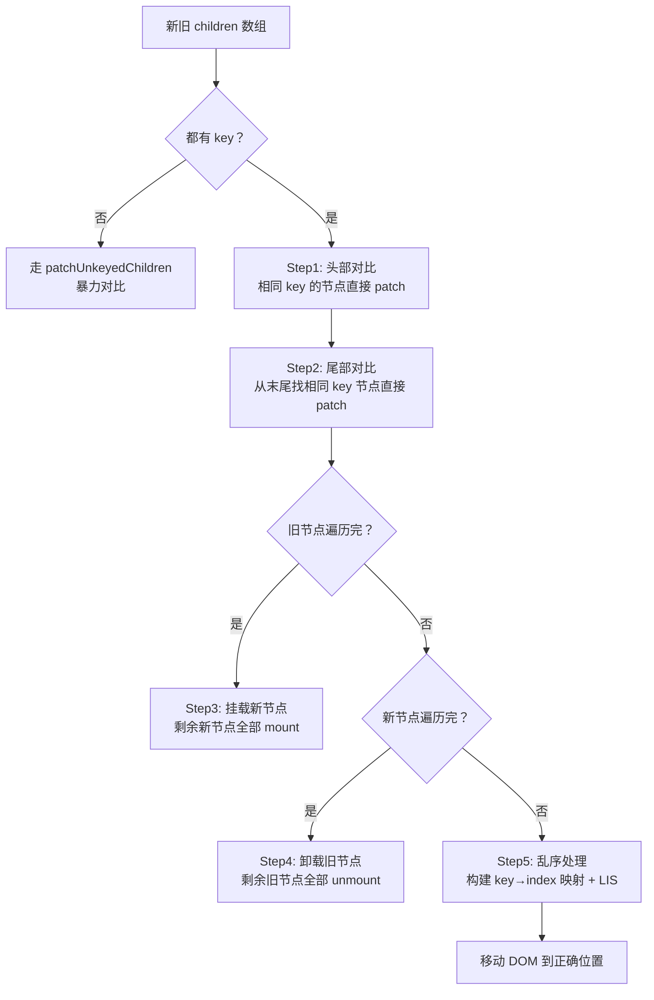

# Diff / Patch

> 面试官问"v-for 为什么需要 key"，顺着这条线能问到 LIS 手写。Vue3 的 Diff 已经不再是 Vue2 那套双端对比了，这是一个核心区分点。

## 一句话总结

Vue3 Diff 通过 **Block Tree 跳过静态节点** + **PatchFlag 标记动态类型** + **5 步法处理子节点** + **LIS 最小化移动**，将 Diff 的实际性能优化到接近 O(动态节点数)。核心思路：编译器告诉运行时要对比什么，运行时就不需要盲比了。注意：LIS 算法理论复杂度为 O(n log n)，但 Block Tree + PatchFlag 让大部分场景跳过静态内容，实际接近 O(动态节点数)。

## 核心机制

### 1. 编译时优化：Block Tree + PatchFlag

这是 Vue3 Diff 快的关键 —— **把运行时的工作提前到编译时做**。

```html
<!-- 编译前 -->
<div>
  <h1>{{ title }}</h1>
  <p>static text</p>
  <span :class="cls">{{ count }}</span>
</div>

<!-- 编译后（简化表示） -->
<div>
  <h1>{{ title }}</h1>          <!-- PatchFlag: TEXT -->
  <p>static text</p>            <!-- 无 PatchFlag，被 hoist 成常量 -->
  <span :class="cls">{{ count }}</span> <!-- PatchFlag: CLASS | TEXT -->
</div>
```

编译器生成一个 `dynamicChildren` 数组，在 diff 时**只遍历动态子节点**，静态节点直接复用。这被称为 **Block Tree** 或 **靶向更新**。

```ts
// 编译产物中的 openBlock / createBlock
// Block 节点会收集所有动态子孙节点到 dynamicChildren
const vnode = createBlock('div', null, [
  createVNode('h1', { text: ctx.title }, null, PatchFlags.TEXT),
  createVNode('span', { class: ctx.cls, text: ctx.count }, null, PatchFlags.CLASS | PatchFlags.TEXT),
])
// vnode.dynamicChildren = [h1, span] — 静态 p 不在其中
```

### 2. patchKeyedChildren 五步法

面试时必须能说出这 5 步。这是 Vue3 相比 Vue2 双端对比的最大改进。



**Step 5 乱序处理详细过程**：

```ts
// 伪代码：patchKeyedChildren 的核心逻辑
function patchKeyedChildren(c1: VNode[], c2: VNode[]) {
  let i = 0, e1 = c1.length - 1, e2 = c2.length - 1

  // Step 1: 头部对比 — 从头开始找相同 key
  while (i <= e1 && i <= e2 && c1[i].key === c2[i].key) {
    patch(c1[i], c2[i])  // 递归更新
    i++
  }
  // Step 2: 尾部对比 — 从尾开始找相同 key
  while (i <= e1 && i <= e2 && c1[e1].key === c2[e2].key) {
    patch(c1[e1], c2[e2])
    e1--; e2--
  }
  // Step 3:  旧节点已遍历完 → 新节点剩余的全部挂载
  if (i > e1) { while (i <= e2) mount(c2[i++]) }
  // Step 4:  新节点已遍历完 → 旧节点剩余的全部卸载
  else if (i > e2) { while (i <= e1) unmount(c1[i++]) }
  // Step 5:  乱序处理
  else {
    // 5a: 为新节点建 key→index 映射
    const keyToNewIndex = new Map()
    for (let j = i; j <= e2; j++) keyToNewIndex.set(c2[j].key, j)

    // 5b: 遍历旧节点，找出可复用的
    const toBePatched = e2 - i + 1
    const newIndexToOldIndex = new Array(toBePatched).fill(0)

    for (let j = i; j <= e1; j++) {
      const newIndex = keyToNewIndex.get(c1[j].key)
      if (newIndex !== undefined) {
        newIndexToOldIndex[newIndex - i] = j + 1  // 记录旧位置
        patch(c1[j], c2[newIndex])                 // 复用并更新
      } else {
        unmount(c1[j])                              // key 不在新列表中，删除
      }
    }

    // 5c: LIS 计算最少移动
    const lis = getSequence(newIndexToOldIndex)
    // 5d: 倒序遍历，挂载新节点 / 移动复用节点
    // ...
  }
}
```

### 3. LIS（最长递增子序列）：为什么能减少 DOM 移动

核心思想：**找出那些在新旧数组中相对顺序已经正确的节点，保留它们不动，只移动其余节点**。

```ts
// 例：旧 [a, b, c, d, e, f, g] → 新 [a, b, e, c, d, h, f, g]
// 经过头尾对比后剩余中间部分
// 旧中间部分:  [c, d, e]       新中间部分:  [e, c, d, h]
// newIndexToOldIndex: [5, 3, 4, 0]   (存"旧索引+1"，0 专门表示新节点需要挂载)
//      含义: e在旧数组位置4→存5, c在2→存3, d在3→存4, h是新的(0)
// 递增子序列: 值 [3, 4] 对应索引 (1, 2) —— 即 c, d 相对顺序是对的
// 不需要移动 c, d；移动 e 到前面；挂载 h
```

```ts
// 手写简化版 LIS（贪心 + 二分，O(n log n)）
function getSequence(arr: number[]): number[] {
  const result = [0]                    // 递增子序列的索引栈
  const prev = arr.slice()              // 每个元素的前驱索引

  for (let i = 1; i < arr.length; i++) {
    if (arr[i] === 0) continue          // 0 表示新增节点，跳过
    const last = result[result.length - 1]
    if (arr[i] > arr[last]) {           // 比栈顶大，直接入栈
      prev[i] = last
      result.push(i)
    } else {                            // 二分查找替换位置
      let l = 0, r = result.length - 1
      while (l < r) {
        const mid = (l + r) >> 1
        if (arr[result[mid]] < arr[i]) l = mid + 1
        else r = mid
      }
      if (arr[i] < arr[result[l]]) {
        prev[i] = result[l - 1] || 0
        result[l] = i
      }
    }
  }
  // 回溯构建最终序列
  let len = result.length, last = result[len - 1]
  while (len-- > 0) {
    result[len] = last
    last = prev[last]
  }
  return result
}

// getSequence([5, 3, 4, 0]) → [1, 2]（c, d 的索引），表示 c,d 不用移动
```

## 编译时优化

> 面试中"Vue3 为什么比 Vue2 快"的第二层答案——PatchFlag、Block Tree、静态提升。

Vue3 编译器的三项核心优化，让 Diff 从"遍历整个模板"变为"只遍历动态节点"：

### PatchFlag — 靶向更新

编译时给每个带有动态绑定的 vnode 打上 PatchFlag——一个数字标记位，告诉运行时"这个节点有哪些东西会变"：

| Flag | 值 | 含义 |
|------|---|------|
| TEXT | 1 | 文本内容动态 |
| CLASS | 2 | class 动态 |
| STYLE | 4 | style 动态 |
| PROPS | 8 | 非 class/style 的动态属性 |
| FULL_PROPS | 16 | 有动态 key 的属性 |
| HYDRATE_EVENTS | 32 | 有事件监听 |
| STABLE_FRAGMENT | 64 | 子节点顺序稳定 |
| KEYED_FRAGMENT | 128 | 子节点有 key |

多个 flag 通过位运算组合：`1 | 2 | 4 = 7`。运行时只需 `vnode.patchFlag & PatchFlags.CLASS` 判断是否比对该项。

### Block Tree — 跳过静态子树

每个 Block 额外维护一个 `dynamicChildren` 数组——只收集所有动态后代节点到 flat list。Diff 时直接遍历 `dynamicChildren`，跳过整个静态子树。

```
Vue2 Diff:  遍历整棵树——静态节点也逐个比对
Vue3 Diff:  遍历 dynamicChildren flat array——只更新动态节点
           静态节点通过"静态提升"提到 render 外，永不参与 Diff
```

### 静态提升 — 减少 createVNode

```javascript
// Vue2 render：每次 re-render 都重新创建静态 VNode
function render() {
  return h('div', [
    h('span', 'static text')  // ← 每次都创建新的 VNode 对象
  ])
}

// Vue3 render：静态 VNode 提到 render 函数外——只创建一次
const _hoisted_1 = h('span', 'static text')  // ← 提到外面！
function render() {
  return h('div', [_hoisted_1])  // ← 复用同一个 VNode 引用
}
```

大量静态节点的页面——静态提升减少 30%+ 的 VNode 创建 + GC 开销。

### 预字符串化 — 连续静态节点合并

```javascript
// 连续 20 个静态 <li> 编译为一个 innerHTML
const _hoisted_1 = '<li>A</li><li>B</li>...<li>T</li>'
// 一次 innerHTML 操作替代 20 个 createVNode + DOM 插入
```

## 深度拓展

### 追问1：Vue2 双端对比 vs Vue3 五步法

Vue2 使用 **双指针从两端向中间收拢**（oldStart/oldEnd/newStart/newEnd 四个指针同时移动）。优点是不需要 Map 映射，内存小；缺点是无法利用编译优化，且某些极端情况（如头部移动到尾部）需要更多操作。

Vue3 五步法**先处理头尾相同节点（大多数场景的真实情况）**，再处理中间乱序部分。加上编译时的 PatchFlag 和 Block Tree，实际 Diff 量远小于 Vue2。

### 追问2：为什么有 key 比没 key 快？

没 key 时 Vue3 走 `patchUnkeyedChildren`，只能**按位置逐个对比**。如果列表头部插入了一个元素，后面的所有节点都会被认为"变了"，全部更新一遍。有 key 时走 `patchKeyedChildren`，通过 key 精确匹配复用，能准确识别"头部插入"这种场景，只更新新增节点。

```html
<!-- 无 key：插头部 → 全部重新 patch -->
<!-- 旧 [A, B, C]  新 [D, A, B, C] -->
<!-- 对比: A≠D 更新, B≠A 更新, C≠B 更新, 挂载 C -->

<!-- 有 key：插头部 → 只挂载 D -->
<!-- 旧 [A(k1), B(k2), C(k3)]  新 [D(k4), A(k1), B(k2), C(k3)] -->
<!-- 对比: k4 新挂载, k1/k2/k3 直接复用（头尾对比+Map匹配） -->
```

## 项目实战

```html
<!-- 1. 表格列表用唯一 id 做 key -->
<el-table :data="tableData" row-key="id">
  <!-- row-key 确保行更新时精确 Diff，不会错位 -->
</el-table>

<!-- 2. v-for 和 v-if 不要同时使用 -->
<!-- ❌ Vue3 中 v-if 优先级更高，v-for 的变量在 v-if 中可能未定义 -->
<!-- ✅ 用 computed 过滤后再 v-for -->
<template v-for="item in activeItems" :key="item.id">
  <ListItem :data="item" />
</template>

<!-- 3. 递归组件也必须设置稳定的 key -->
<template v-for="node in treeData" :key="node.id">
  <TreeNode :data="node" />
</template>
```

```ts
// 4. 列表数据的不可变更新模式（配合 Diff 最大化复用）
// ✅ 不要原地修改，创建新引用
function updateItem(id: string, updates: Partial<Item>) {
  tableData.value = tableData.value.map(item =>
    item.id === id ? { ...item, ...updates } : item
  )
}

// ❌ 原地修改 —— 引用不变，但 key 相同，patch 时会更细致对比字段，依然正确但语义不清
// tableData.value.find(i => i.id === id)!.status = 'done'
```

## 易错点

**❌ Vue3 Diff 和 React Diff 一样**
Vue3 用 LIS 算法最小化移动（贪心保留相对顺序正确的节点），React 只做右移（从左到右，找到就复用，否则挂载+删除）。Vue3 的 DOM 移动次数更少。

**❌ key 用 index 没问题**
有副作用：当列表顺序改变（排序、筛选、删除头部元素）时，index 对应的数据已经变了，但 key 不变，导致 Diff 复用错误节点的 DOM，可能出现 input 输入内容错位、动画异常等问题。必须用 `item.id`。

**❌ Block Tree 是运行时优化**
Block Tree 的决策发生在**编译时**——哪些节点是动态的、Block 边界在哪，由编译器确定并生成 `openBlock`/`createBlock` 调用；`dynamicChildren` 数组本身是 render 函数执行时收集填充的，但运行时只是按编译器的指令消费，不做任何"分析"。

**❌ v-if 和 v-for 里面的动态节点都会被外层 Block 收集**
**结构性指令（`v-if`/`v-for`）会创建新的 Block 边界**：
- `v-if` 内部是一个**独立 Block**——其 `dynamicChildren` 只收集自己内部的动态节点，**不会被外层 Block 的 `dynamicChildren` 收集到**
- `v-for` 的每一项也是一个**独立的 Fragment Block**——列表项内部的动态节点属于该项自己的 Block
- 嵌套 `v-if` 的 Block Tree 是树状结构——父级 Block 只知道自己有子 Block，但子 Block 内部的动态节点由子 Block 自己管理

```html
<!-- 外层 Block -->
<div>
  <span>{{ title }}</span>          <!-- 被外层 dynamicChildren 收集 ✓ -->
  <div v-if="show">
    <span>{{ subtitle }}</span>     <!-- 不在外层 dynamicChildren 中，属于 v-if 自己的 Block ✗ -->
  </div>
</div>
```

**为什么这样设计**：当 `show` 从 `true` 变为 `false` 时，`v-if` 的 Block 整个被移除——不需要逐个检查内部动态节点。如果外层 Block 的 `dynamicChildren` 也指向了 `subtitle` 节点，节点被移除后外层数组会出现悬空引用。

**另外提醒：`v-if` 和 `v-for` 不要同标签使用**——但原因不在 Block Tree：Vue3 中 `v-if` 优先级高于 `v-for`，同标签时 `v-if` 拿不到 `v-for` 的 item 变量（报错/undefined）；即使能跑，每次渲染也要先遍历全列表再逐个判断。正确做法是用 computed 先过滤，或用 `<template>` 分层包裹。

## 面试信号

| 面试官问 | 你的回答深度 | 信号含义 |
|---------|------------|---------|
| "v-for 为什么需要 key" | Diff 算法 + patchKeyedChildren | 基础关 |
| "Vue3 Diff 和 Vue2 区别" | 双端对比→五步法 + 编译优化 | 进阶关 |
| "有 key 和无 key 性能差多少" | 能用代码模拟说明 | 实战关 |
| "最小化 DOM 移动怎么做到的" | LIS 算法原理 + 可手写 | 高阶关 |
| "手写 LIS" | 贪心+二分 O(n log n) | 定级关 |

## 相关阅读

- [Renderer](./renderer.md) — patch 函数的宿主，如何驱动真实 DOM
- [响应式原理](./reactivity.md) — 数据变更如何触发 Diff
- [KeepAlive](./keepalive.md) — Diff 到 KeepAlive 组件时的特殊处理
- [全链路渲染流程](./vue3-full-pipeline.md) — Diff/Patch 在整条更新链路中的位置

## 更新记录

- 2026-07：完整填充（Phase 2），加入 patchKeyedChildren 流程图、LIS 手写、Vue2 vs Vue3 对比
