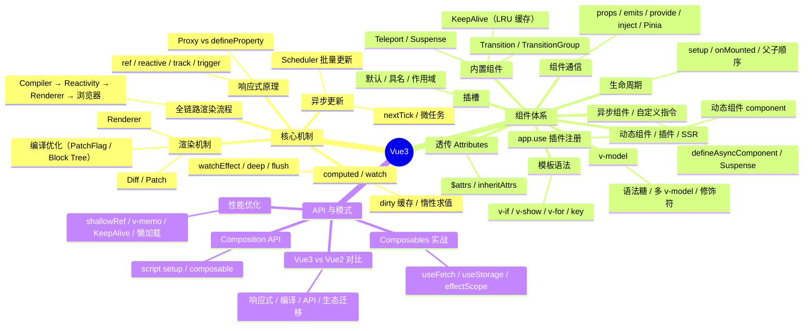

# Vue3 知识地图

## 推荐学习顺序

### 一、核心机制（理解 Vue3 怎么工作）

1. ⭐⭐⭐⭐⭐ [Vue3 vs Vue2 对比](./vue3-vs-vue2.md)
2. ⭐⭐⭐⭐⭐ [响应式原理](./reactivity.md)
3. ⭐⭐⭐⭐⭐ [computed / watch](./computed-watch.md)
4. ⭐⭐⭐⭐   [nextTick](./nextTick.md)
5. ⭐⭐⭐     [Scheduler](./scheduler.md)
6. ⭐⭐⭐⭐⭐ [Diff / Patch](./diff-patch.md)
7. ⭐⭐⭐     [Renderer](./renderer.md)
8. ⭐⭐⭐⭐⭐ [全链路渲染流程](./vue3-full-pipeline.md)

### 二、组件开发（日常写组件需要的知识）

9.  ⭐⭐⭐⭐⭐ [组件通信](./component-communication.md)
10. ⭐⭐⭐⭐⭐ [v-model 原理](./v-model.md)
11. ⭐⭐⭐⭐   [条件/列表渲染](./template-syntax.md)
12. ⭐⭐⭐     [透传 Attributes](./fallthrough-attrs.md)
13. ⭐⭐⭐     [异步组件/自定义指令](./async-components.md)
14. ⭐⭐⭐     [动态组件/插件/SSR](./dynamic-components-plugins-ssr.md)
15. ⭐⭐⭐⭐   [插槽深入](./slots-deep.md)
16. ⭐⭐⭐⭐   [生命周期](./lifecycle.md)
17. ⭐⭐⭐⭐   [KeepAlive](./keepalive.md)
18. ⭐⭐       [Teleport / Suspense](./teleport-suspense.md)
19. ⭐⭐⭐     [Transition 动画](./transition-animation.md)

### 三、模式与优化（进阶）

20. ⭐⭐⭐⭐   [Composition API](./composition-api.md)
21. ⭐⭐⭐⭐   [Composables 实战](./composables-practice.md)
22. ⭐⭐⭐⭐   [性能优化 Checklist](./vue3-performance.md)

## 知识点索引

| 知识点 | 频率 | 难度 | 手写 | 状态 |
|--------|------|------|------|------|
| [Vue3 vs Vue2 对比](./vue3-vs-vue2.md) | ⭐⭐⭐⭐⭐ | 中级 | — | draft |
| [响应式原理](./reactivity.md) | ⭐⭐⭐⭐⭐ | 高级 | — | reviewed |
| [computed / watch](./computed-watch.md) | ⭐⭐⭐⭐⭐ | 中级 | — | reviewed |
| [nextTick](./nextTick.md) | ⭐⭐⭐⭐ | 中级 | [✅](./nextTick.md) | reviewed |
| [Scheduler](./scheduler.md) | ⭐⭐⭐ | 高级 | — | reviewed |
| [Diff / Patch](./diff-patch.md) | ⭐⭐⭐⭐⭐ | 高级 | [✅ LIS](./diff-patch.md) | reviewed |
| [Renderer](./renderer.md) | ⭐⭐⭐ | 高级 | — | reviewed |
| [全链路渲染流程](./vue3-full-pipeline.md) | ⭐⭐⭐⭐⭐ | 高级 | — | draft |
| [组件通信](./component-communication.md) | ⭐⭐⭐⭐⭐ | 中级 | — | reviewed |
| [v-model 原理](./v-model.md) | ⭐⭐⭐⭐⭐ | 中级 | — | reviewed |
| [条件/列表渲染](./template-syntax.md) | ⭐⭐⭐⭐ | 初级 | — | draft |
| [透传 Attributes](./fallthrough-attrs.md) | ⭐⭐⭐ | 中级 | — | draft |
| [异步组件/自定义指令](./async-components.md) | ⭐⭐⭐ | 中级 | — | draft |
| [动态组件/插件/SSR](./dynamic-components-plugins-ssr.md) | ⭐⭐⭐ | 中高级 | — | draft |
| [插槽深入](./slots-deep.md) | ⭐⭐⭐⭐ | 中级 | — | reviewed |
| [生命周期](./lifecycle.md) | ⭐⭐⭐⭐ | 初级 | — | reviewed |
| [KeepAlive](./keepalive.md) | ⭐⭐⭐⭐ | 高级 | — | reviewed |
| [Teleport / Suspense](./teleport-suspense.md) | ⭐⭐ | 初级 | — | reviewed |
| [Transition 动画](./transition-animation.md) | ⭐⭐⭐ | 中级 | — | draft |
| [Composition API](./composition-api.md) | ⭐⭐⭐⭐ | 中级 | — | reviewed |
| [Composables 实战](./composables-practice.md) | ⭐⭐⭐⭐ | 中级 | — | reviewed |
| [性能优化 Checklist](./vue3-performance.md) | ⭐⭐⭐⭐ | 高级 | — | draft |

## 相关阅读

- [Vue Router 知识地图](../VueRouter/index.md) — 路由守卫、动态路由、history vs hash
- [Pinia 知识地图](../Pinia/index.md) — 状态管理、defineStore、持久化
- [面试题库：Vue3](../面试题库/Vue3.md) — 19 道 Vue3 高频真题
- [面试题库：Vue Router](../面试题库/VueRouter.md) — 7 道路由高频真题
- [面试题库：Pinia](../面试题库/Pinia.md) — 7 道状态管理高频真题
- [面试回答：Vue3 响应式](../面试回答/Vue3/reactivity.md) — 8 篇 Vue3 逐字回答稿
- [全链路渲染流程](./vue3-full-pipeline.md) — 从模板编译到屏幕更新的全景串联

## 更新记录

- 2026-07-13：新增 [全链路渲染流程](./vue3-full-pipeline.md)——串联 Compiler/Reactivity/Scheduler/Renderer/Diff/Patch/生命周期/nextTick/浏览器渲染管线
- 2026-07-12：sidebar 顺序同步学习顺序三组
- 2026-07-11：学习顺序三组分组（核心机制→组件开发→模式与优化）；mindmap 缩并为 3 大分支（17→3 一级节点）；补全新增文件的 mindmap 节点
- 2026-07-05：初始创建
