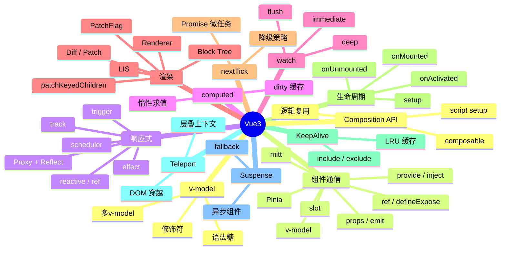

# Vue3 知识地图

## 推荐学习顺序

1. ⭐⭐⭐⭐⭐ [响应式原理](./reactivity.md)
2. ⭐⭐⭐⭐⭐ [组件通信](./component-communication.md)
3. ⭐⭐⭐⭐⭐ [v-model 原理](./v-model.md)
4. ⭐⭐⭐⭐⭐ [computed / watch](./computed-watch.md)
5. ⭐⭐⭐⭐⭐ [Diff / Patch](./diff-patch.md)
6. ⭐⭐⭐⭐   [nextTick](./nextTick.md)
7. ⭐⭐⭐⭐   [生命周期](./lifecycle.md)
8. ⭐⭐⭐⭐   [Composition API](./composition-api.md)
9. ⭐⭐⭐⭐   [KeepAlive](./keepalive.md)
10. ⭐⭐⭐     [Renderer](./renderer.md)
11. ⭐⭐⭐     [Scheduler](./scheduler.md)
12. ⭐⭐      [Teleport / Suspense](./teleport-suspense.md)
13. ⭐⭐⭐⭐⭐ [Vue3 vs Vue2 对比](./vue3-vs-vue2.md)
14. ⭐⭐⭐⭐   [插槽深入](./slots-deep.md)
15. ⭐⭐⭐⭐   [Composables 实战](./composables-practice.md)
16. ⭐⭐⭐     [Transition 动画](./transition-animation.md)
17. ⭐⭐⭐⭐   [性能优化 Checklist](./vue3-performance.md)

## 知识点索引

| 知识点 | 频率 | 难度 | 手写 | 状态 |
|--------|------|------|------|------|
| [响应式原理](./reactivity.md) | ⭐⭐⭐⭐⭐ | 高级 | — | reviewed |
| [组件通信](./component-communication.md) | ⭐⭐⭐⭐⭐ | 中级 | — | filled |
| [v-model 原理](./v-model.md) | ⭐⭐⭐⭐⭐ | 中级 | — | filled |
| [computed / watch](./computed-watch.md) | ⭐⭐⭐⭐⭐ | 中级 | — | reviewed |
| [Diff / Patch](./diff-patch.md) | ⭐⭐⭐⭐⭐ | 高级 | [✅ LIS](./diff-patch.md) | reviewed |
| [nextTick](./nextTick.md) | ⭐⭐⭐⭐ | 中级 | [✅](./nextTick.md) | reviewed |
| [生命周期](./lifecycle.md) | ⭐⭐⭐⭐ | 初级 | — | reviewed |
| [Composition API](./composition-api.md) | ⭐⭐⭐⭐ | 中级 | — | reviewed |
| [KeepAlive](./keepalive.md) | ⭐⭐⭐⭐ | 高级 | — | reviewed |
| [Renderer](./renderer.md) | ⭐⭐⭐ | 高级 | — | reviewed |
| [Scheduler](./scheduler.md) | ⭐⭐⭐ | 高级 | — | reviewed |
| [Teleport / Suspense](./teleport-suspense.md) | ⭐⭐ | 初级 | — | reviewed |
| [Vue3 vs Vue2 对比](./vue3-vs-vue2.md) | ⭐⭐⭐⭐⭐ | 中级 | — | draft |
| [插槽深入](./slots-deep.md) | ⭐⭐⭐⭐ | 中级 | — | reviewed |
| [Composables 实战](./composables-practice.md) | ⭐⭐⭐⭐ | 中级 | — | reviewed |
| [Transition 动画](./transition-animation.md) | ⭐⭐⭐ | 中级 | — | draft |
| [性能优化 Checklist](./vue3-performance.md) | ⭐⭐⭐⭐ | 高级 | — | draft |

## 相关阅读

- [Vue Router 知识地图](../VueRouter/index.md) — 路由守卫、动态路由、history vs hash
- [Pinia 知识地图](../Pinia/index.md) — 状态管理、defineStore、持久化
- [面试题库：Vue3](../面试题库/Vue3.md) — 17 道 Vue3 高频真题
- [面试题库：Vue Router](../面试题库/VueRouter.md) — 7 道路由高频真题
- [面试题库：Pinia](../面试题库/Pinia.md) — 7 道状态管理高频真题
- [面试回答：Vue3 响应式](../面试回答/Vue3/reactivity.md) — 9 篇 Vue3 逐字回答稿

## 更新记录

- 2026-07-11：补"相关阅读"区——链向 VueRouter/Pinia/题库/回答稿
- 2026-07-05：初始创建
