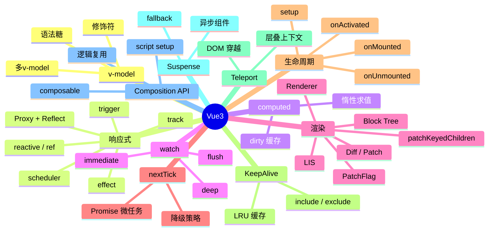

# Vue3 知识地图

## 推荐学习顺序

1. ⭐⭐⭐⭐⭐ [响应式原理](./reactivity.md)
2. ⭐⭐⭐⭐⭐ [v-model 原理](./v-model.md)
3. ⭐⭐⭐⭐⭐ [computed / watch](./computed-watch.md)
4. ⭐⭐⭐⭐⭐ [Diff / Patch](./diff-patch.md)
5. ⭐⭐⭐⭐   [nextTick](./nextTick.md)
6. ⭐⭐⭐⭐   [生命周期](./lifecycle.md)
7. ⭐⭐⭐⭐   [Composition API](./composition-api.md)
8. ⭐⭐⭐⭐   [KeepAlive](./keepalive.md)
9. ⭐⭐⭐     [Renderer](./renderer.md)
10. ⭐⭐⭐     [Scheduler](./scheduler.md)
11. ⭐⭐      [Teleport / Suspense](./teleport-suspense.md)

## 知识点索引

| 知识点 | 频率 | 难度 | 手写 | 状态 |
|--------|------|------|------|------|
| [响应式原理](./reactivity.md) | ⭐⭐⭐⭐⭐ | 高级 | — | reviewed |
| [v-model 原理](./v-model.md) | ⭐⭐⭐⭐⭐ | 中级 | — | filled |
| [computed / watch](./computed-watch.md) | ⭐⭐⭐⭐⭐ | 中级 | — | reviewed |
| [Diff / Patch](./diff-patch.md) | ⭐⭐⭐⭐⭐ | 高级 | [✅ LIS](./diff-patch.md) | reviewed |
| [nextTick](./nextTick.md) | ⭐⭐⭐⭐ | 中级 | [✅](./nextTick.md) | reviewed |
| [生命周期](./lifecycle.md) | ⭐⭐⭐⭐ | 初级 | — | reviewed |
| [Composition API](./composition-api.md) | ⭐⭐⭐⭐ | 中级 | — | reviewed |
| [KeepAlive](./keepalive.md) | ⭐⭐⭐⭐ | 高级 | — | reviewed |
| [Renderer](./renderer.md) | ⭐⭐⭐ | 高级 | — | reviewed |
| [Scheduler](./scheduler.md) | ⭐⭐⭐ | 高级 | — | reviewed |
| [Teleport / Suspense](./teleport-suspense.md) | ⭐⭐ | 初级 | — | reviewed |
