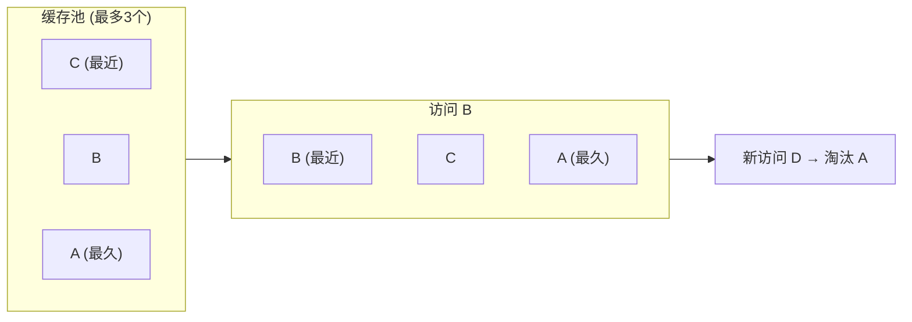

# KeepAlive

> 后台管理系统的多标签页体验好坏，基本取决于 KeepAlive 用得对不对。它的本质不是"缓存 DOM"，而是"缓存组件实例 + VNode 树"。

## 一句话总结

KeepAlive 是 Vue3 内置的抽象组件，通过 **缓存组件实例的 VNode**（而非 DOM 节点本身），使被切换走的组件不销毁，在 LRU 策略控制下保留组件状态和子树，切回来时直接复用缓存的实例。

## 核心机制

### 1. 它缓存的是什么？

不是 DOM。**缓存的是 VNode（虚拟节点）**，而 VNode 上挂载了组件的实例（`vnode.component`），实例上又挂载了响应式数据（`instance.setupState`）。所以切走时组件实例不被卸载，数据状态就保留了。

```ts
// 简化版 KeepAlive 内部逻辑（源码: packages/runtime-core/src/components/KeepAlive.ts）
const KeepAliveImpl = {
  __isKeepAlive: true,
  setup(props, { slots }) {
    const cache = new Map<string, VNode>()    // 缓存池：key → VNode
    const keys = new Set<string>()           // 记录插入顺序（LRU 用）

    return () => {
      const vnode = slots.default?.()[0]      // 取默认插槽的第一个子 VNode
      if (!vnode) return null

      const key = vnode.key ?? vnode.type     // 缓存的 key

      // include / exclude 过滤（注意：真实源码按“组件 name”匹配，不是按 key——
      // 这也是被缓存组件需要 name 选项/defineOptions({ name }) 的原因）
      if (exclude.includes(key) || (include.length && !include.includes(key))) {
        return vnode                          // 不缓存，直接返回
      }

      const cached = cache.get(key)
      if (cached) {
        // 命中缓存
        vnode.component = cached.component    // 把旧的组件实例挂到新 VNode 上
        vnode.shapeFlag |= ShapeFlags.COMPONENT_KEPT_ALIVE  // 标记为缓存恢复
        keys.delete(key); keys.add(key)       // LRU: 移到最"新"位置
      } else {
        cache.set(key, vnode)
        keys.add(key)
        // LRU 淘汰：真正移除缓存项时需执行完整的组件卸载流程
        // 真实源码中调用的是 unmount(vnode, ...)，它会递归执行：
        //   1. 递归卸载所有子组件（patch(unmount) 遍历 subtree）
        //   2. 清理组件上的所有 effect（包括 render effect、watch、computed）
        //   3. 触发 onUnmounted 生命周期钩子
        //   4. 从父 DOM 树中移除对应元素（如有）
        //   5. 清理 provide/inject 依赖链
        //   6. 释放组件实例的引用，等待 GC 回收
        // 以下 props.onUnmounted?.() 只是示意，真实源码远不止于此
        if (max && keys.size > max) {
          const oldestKey = keys.values().next().value
          keys.delete(oldestKey)
          const oldVNode = cache.get(oldestKey)
          oldVNode?.component?.props?.onUnmounted?.()
          cache.delete(oldestKey)
        }
      }

      vnode.shapeFlag |= ShapeFlags.COMPONENT_SHOULD_KEEP_ALIVE
      return vnode
    }
  }
}
```

### 2. LRU 淘汰策略



**LRU 实现**：用 `Set`（按插入顺序迭代）维护访问顺序。每次命中缓存时 delete + add 把它放回最后。超过 `max` 时删除第一个（即最久未使用的）。

### 3. 缓存组件额外的生命周期

```ts
// KeepAlive 内的组件感知自己被缓存/激活
onActivated(() => {
  refreshData()   // 每次切回标签页时刷新
})
onDeactivated(() => {
  pausePolling()  // 切走时停止轮询
})
```

`onActivated` 在 `onMounted` 之后调用（首次挂载时也触发），以及在从缓存恢复时触发。

## 深度拓展

### 追问1：缓存后 DOM 去哪了？

组件失活时**并不会执行卸载**，而是被 `deactivate` 流程整体**移动（move）到一个隐藏的存储容器**（内存中的 `storageContainer`，一个不在文档里的 div）——DOM 子树原样保留、组件实例不销毁。再次切回时，`processComponent` 检测到 `COMPONENT_KEPT_ALIVE` 标记，**跳过创建实例和 mount**，直接走 `activate` 流程把存储容器里的 DOM 原样移回父容器，再 patch 一下可能变化的 props。所以整个过程没有 DOM 的销毁重建，只有两次 `insertBefore` 级别的移动。

### 追问2：KeepAlive 和 Teleport 同时使用

Teleport 组件的内容被渲染到 `document.body` 等目标位置。如果 Teleport 在 KeepAlive 内部，切换时 Teleport 的目标 DOM 会被移除，恢复时重新插入到目标位置 —— 这是正常的。

但反过来，如果 KeepAlive 在 Teleport 内部，缓存行为不受影响，只是缓存的 DOM 在目标容器而非父组件内。

### 追问3：内存压力与 max 值的权衡

KeepAlive 的缓存不只是一份 VNode 的浅拷贝，它持有完整的组件实例引用链：

- **响应式数据**：组件内所有 `ref`/`reactive` 状态及其深层对象
- **子组件树**：被缓存组件的整个子组件实例树（递归持有）
- **副作用上下文**：watch、computed、render effect 等

**一个看似简单的列表页组件，其实例内存占用可能达到 5-20MB**（取决于数据量和子组件复杂度）。设置 `max=50` 意味着极端情况下可能占用 250MB-1GB 内存。

**实践建议**：
- 后台管理系统的标签页缓存建议 `max` 不超过 10-15
- 移动端 H5 应更保守（3-5），移动设备内存敏感
- 对于数据量大的组件，切走时手动清理部分数据（在 `onDeactivated` 中释放大数据集，`onActivated` 中重新加载），而不是完全依赖缓存
- Chrome DevTools 的 Memory 面板可以拍摄堆快照，搜索 "VNode" 或组件名来评估单个缓存项的实际内存占用

## 项目实战

```html
<!-- 1. 多标签页模式：结合动态组件 -->
<router-view v-slot="{ Component }">
  <keep-alive :include="cachedViews" :max="10">
    <component :is="Component" :key="route.fullPath" />
  </keep-alive>
</router-view>

<!-- 2. 搜索页 + 列表 + 详情页模式 -->
<keep-alive>
  <router-view v-if="route.meta.keepAlive" />
</keep-alive>
<router-view v-if="!route.meta.keepAlive" />
```

```ts
// 3. Pinia 管理缓存标签页
const useTabsStore = defineStore('tabs', () => {
  const visitedViews = ref<Tab[]>([])
  const cachedViews = computed(() =>
    visitedViews.value.filter(t => t.meta?.keepAlive !== false).map(t => t.name)
  )
  return { visitedViews, cachedViews }
})

// 4. 表单填写页切换不丢失数据 —— KeepAlive 天然支持
// 只要确保 :key 稳定，表单的响应式数据会在组件实例中保留
```

## 易错点

**❌ KeepAlive 缓存的是 DOM 节点**
准确说法：缓存的核心是 VNode 和组件实例（状态、effect 都在实例上）。DOM 子树在失活时被移动到隐藏的存储容器中保留，激活时原样移回——不销毁也不重建，但"缓存"这个行为的主体是组件实例而非 DOM。

**❌ onUnmounted 在 KeepAlive 组件隐藏时执行**
不会。KeepAlive 组件失活时执行的是 `onDeactivated`，`onUnmounted` 只在缓存被淘汰或手动销毁时才执行。**忘记清理定时器 → 应该放 onDeactivated 还是 onUnmounted？如果组件只在切标签时隐藏（KeepAlive），放 onDeactivated 就够了；如果可能被直接销毁，两个都要放。**

**❌ KeepAlive 不需要 key**
`vnode.key` 是 KeepAlive 识别缓存的唯一标识。不设 key 时 Vue 会用组件 type 作为 fallback，导致同一组件的不同实例共享缓存，出现数据错乱。特别是 `<component :is>` 动态组件时必须设 `:key`。

## 面试信号表

| 面试官问 | 下一问大概率是 |
|----------|-------------|
| "KeepAlive 的原理是什么" | 追问缓存 vnode 到 cache Map 里、activated/deactivated 的生命周期 |
| "KeepAlive 怎么决定缓存哪些组件" | 追问 include/exclude/max 三个 props 的工作机制 |
| "缓存的组件太多了怎么办" | 追问 max 属性 + LRU 算法的淘汰策略 |
| "KeepAlive 和路由怎么配合" | 追问 keep-alive 嵌套 router-view 的 include 动态绑定 |

## 相关阅读

- [Diff / Patch](./diff-patch.md) — KeepAlive 的激活/失活如何影响 patch 流程
- [生命周期](./lifecycle.md) — onActivated / onDeactivated 钩子详解
- [Composition API](./composition-api.md) — 封装 useKeepAlive hook

## 更新记录

- 2026-07：完整填充（Phase 2），加入 LRU 简化源码、缓存机制详解、多标签页实战
