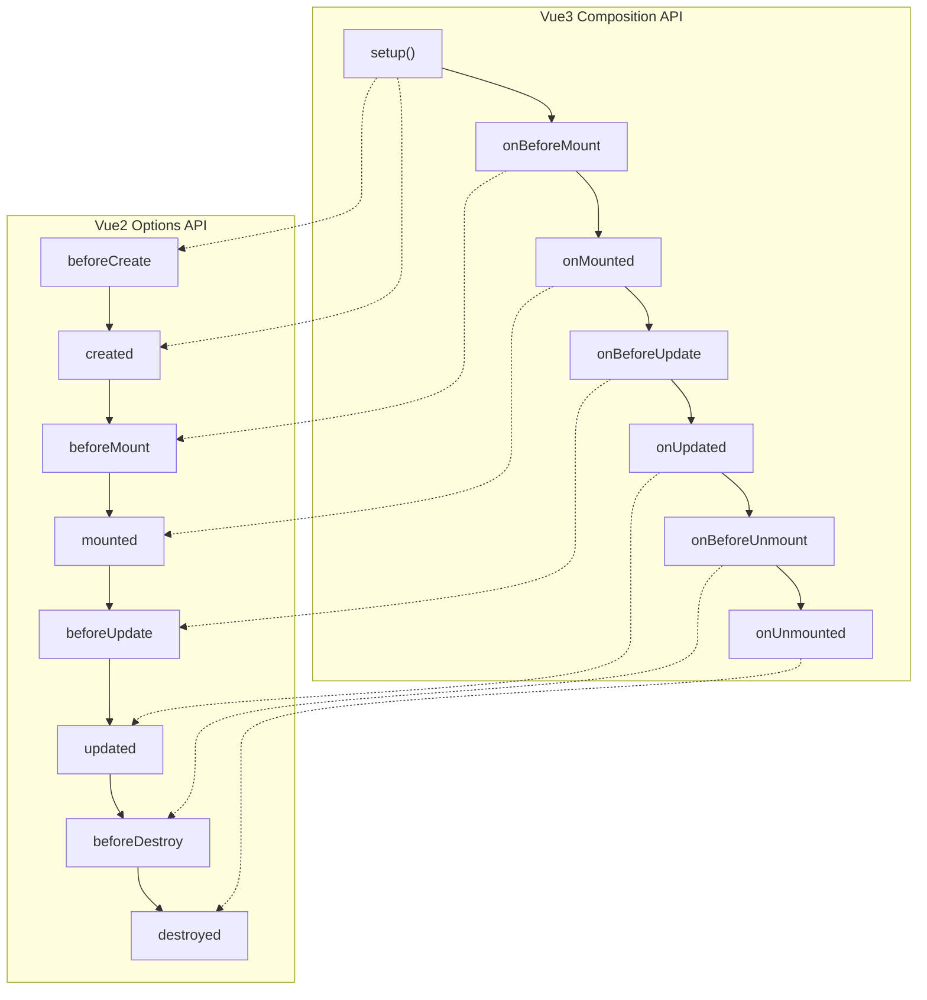
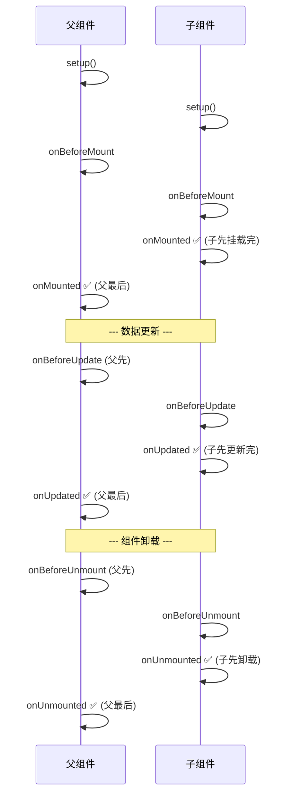

# 生命周期

> 初级面试题，但 80% 的人说不清父子组件执行顺序。关键不在于记住 8 个钩子的名字，而在于理解"挂载是从子到父，更新是从父到子"。

## 一句话总结

Vue3 的生命周期钩子是组件从**创建、挂载、更新到卸载**全过程的回调函数。Composition API 版本取消了 `beforeCreate` 和 `created`（setup 本身就是这个阶段），其余钩子以 `onXxx` 的形式存在。

## 核心机制

### 1. Vue2 vs Vue3 生命周期对照



**关键变化**：
- `setup()` **替代** `beforeCreate` + `created`（在初始化 props 后、解析完所有 Options API 选项前执行）
- `beforeDestroy` / `destroyed` 改名为 `onBeforeUnmount` / `onUnmounted`（语义更清晰）
- 新增 `onRenderTracked` / `onRenderTriggered`：调试用的钩子，追踪哪些依赖触发了重新渲染

### 2. 父子组件生命周期执行顺序



**记忆口诀**：挂载/更新都是**子先完成，父后完成**；卸载前钩子**父先触发，子后触发**。

### 3. onErrorCaptured：错误边界

```ts
// 子组件报错不会让整个页面白屏
onErrorCaptured((err, instance, info) => {
  console.error('子组件错误:', err)
  error.value = err.message
  return false  // 阻止错误继续向上传播
})
```

## 深度拓展

### 追问1：为什么取消了 beforeCreate / created？

在 Options API 中，`beforeCreate` 和 `created` 的主要用途是初始化非响应式数据和调用 API。但有了 `setup()` 之后，这两个钩子的逻辑直接写在 `setup` 函数体内即可 —— **setup 的执行时机就在 beforeCreate 和 created 之间**。保持它们只会造成 API 冗余。

### 追问2：KeepAlive 的额外生命周期

```ts
// 被 KeepAlive 包裹的组件有额外两个钩子
onActivated(() => {
  // 组件被激活（从缓存恢复）
  refreshData()       // 每次切回来刷新数据
})
onDeactivated(() => {
  // 组件被停用（放入缓存）
  clearTimer()        // 清理定时器
})
```

注意：`onUnmounted` 在 KeepAlive 组件**被缓存时不会触发**，只有在缓存被淘汰或手动清除时才触发。

### 追问3：SSR 时哪些生命周期不执行？

服务端渲染时，**只有 `beforeCreate`、`created`、`setup`** 会在服务端执行（Vue2 中）。`onMounted`、`onUpdated`、`onUnmounted` 等涉及 DOM 的钩子只在客户端执行。

## 项目实战

```ts
// 1. onMounted：初始化图表、获取数据
onMounted(async () => {
  const res = await fetchUserList()
  userList.value = res.data
  // ECharts 必须在 DOM 就绪后初始化
  chartInstance = echarts.init(chartRef.value!)
})

// 2. onUnmounted：清理资源（忘记清理是内存泄漏的第一大原因）
let timer: number
onMounted(() => { timer = setInterval(pollStatus, 5000) })
onUnmounted(() => { clearInterval(timer) })
// 图表实例、事件监听、WebSocket 连接同理

// 3. onBeforeRouteUpdate：路由参数变化但组件复用时
// （同一个 /user/:id 组件，从 /user/1 跳到 /user/2）
onBeforeRouteUpdate((to) => {
  fetchUserDetail(to.params.id)
})

// 4. 权限检查用路由守卫，不用生命周期
// ❌ 在 onMounted 里检查权限，检查前页面已经渲染了一瞬间
// ✅ 在 router.beforeEach 中拦截，渲染前就完成判断
router.beforeEach((to) => {
  if (!store.hasPermission(to.meta.permission)) {
    return '/403'
  }
})
```

## 易错点

**❌ setup 中不能用生命周期**
setup 中可以使用 **Composition API 版本**的生命周期钩子：`onMounted`、`onUnmounted` 等。但不能用 Options API 的 `mounted`、`destroyed`。

**❌ onMounted 中获取的数据 render 时已经可用**
`onMounted` 在首次渲染之后才执行，所以模板首次渲染时数据还未返回。对于需要首次渲染展示的数据，应该在 `setup` 中直接发起请求（或使用 Suspense + `async setup`）。

**❌ onUnmounted 中访问 ref 一定是安全的**
如果父组件被卸载导致子组件也跟着卸载，ref 值可能已经不可用。对有 DOM 操作（如 `ref.value?.removeEventListener`），用可选链是个好习惯。

## 面试信号表

| 面试官问 | 下一问大概率是 |
|----------|-------------|
| "Vue3 的生命周期有哪些" | 追问 setup 替代了 beforeCreate 和 created 的时机 |
| "onMounted 能拿到 DOM 吗" | 追问和 nextTick 的关系——mounted 时 DOM 已创建但不保证子组件已挂载 |
| "onBeforeUnmount 做什么" | 追问清理定时器、事件监听、observer 的必要性 |
| "父子组件生命周期的执行顺序" | 追问父 beforeMount→子 mount→父 mounted 的嵌套顺序 |

## 相关阅读

- [KeepAlive](./keepalive.md) — onActivated / onDeactivated 的额外钩子
- [Composition API](./composition-api.md) — setup 和生命周期的关系
- [响应式原理](./reactivity.md) — 生命周期钩子内部如何处理响应式

## 更新记录

- 2026-07：完整填充（Phase 2），加入父子组件顺序 Mermaid、三端差异、项目实战
