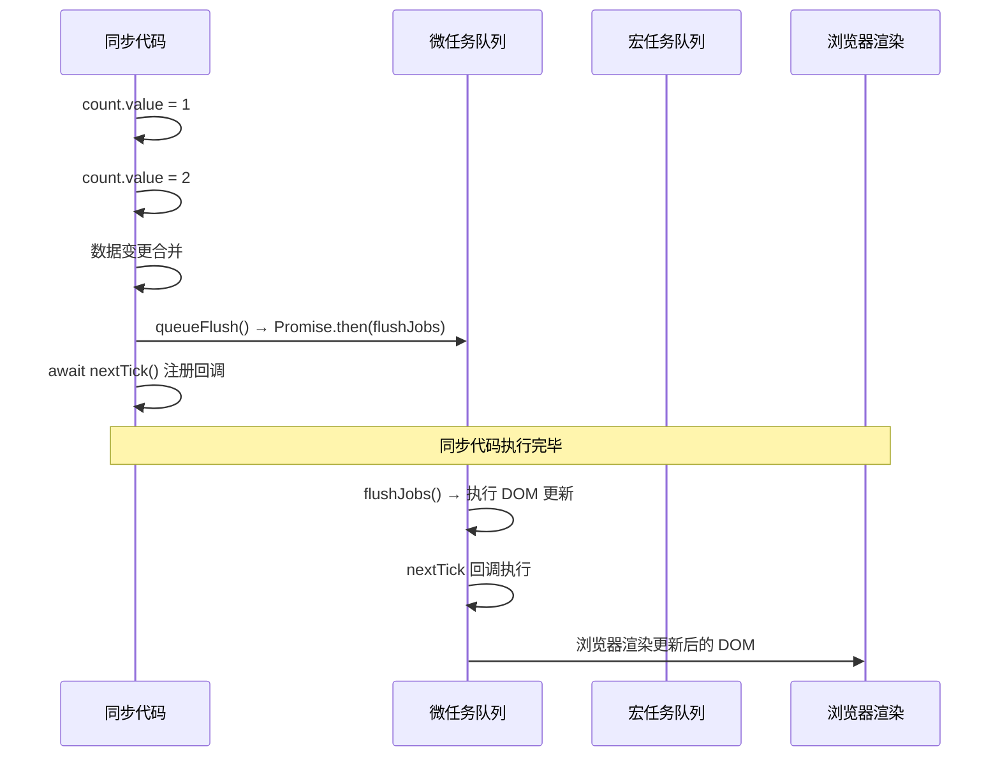

# nextTick

> "数据变了但 DOM 没更新怎么办" —— 这是每个 Vue 开发者都踩过的坑。nextTick 就是答案。

## 一句话总结

nextTick 把回调延迟到**下次 DOM 更新循环结束之后**执行。它的本质是让回调在同一个 Event Loop tick 的微任务队列中执行，确保此时所有同步数据变更触发的 DOM 更新都已经完成。

## 核心机制

### 1. 为什么 DOM 更新是异步的？

```ts
// 你写了三行代码，但只触发一次 DOM 更新
count.value++        // 触发 effect，把更新任务入队（不入微任务队列，先进 scheduler 的 queue）
name.value = 'vue'   // 又触发 effect，合并到同一个更新任务
message.value = 'hi' // 还是同一个更新任务
// → scheduler 在同一个 tick 结束后清空队列，执行一次 DOM 更新
```

Vue3 的 scheduler 维护了一个更新队列，多次数据变更**被合并成一个更新任务**。这个任务在**当前同步代码执行完后**通过微任务（Promise.then）执行。这就是"批量异步更新"。

### 2. nextTick 的降级策略

```ts
// 简化版源码（packages/runtime-core/src/scheduler.ts）
const resolvedPromise = Promise.resolve() as Promise<any>
let currentFlushPromise: Promise<void> | null = null

// nextTick 的入队逻辑
function nextTick(fn?: () => void): Promise<void> {
  const p = currentFlushPromise || resolvedPromise
  return fn ? p.then(fn) : p
}

// scheduler 更新队列的清空
function queueFlush() {
  if (!isFlushing && !isFlushPending) {
    isFlushPending = true
    currentFlushPromise = resolvedPromise.then(flushJobs)
  }
}
```

Vue3 直接使用 `Promise.resolve().then()` 而不降级，因为 Vue3 放弃了 IE11 支持。Vue2 才需要降级链：`Promise → MutationObserver → setImmediate → setTimeout`。

### 3. nextTick 和 Event Loop 的关系



## 深度拓展

### 追问1：为什么 Vue3 不需要降级了？

Vue3 的 `package.json` 里 `browserslist` 不支持 IE11。96%+ 的浏览器原生支持 Promise，不再需要 MutationObserver 等兜底方案。这简化了源码，也避免了不同降级路径的微任务/宏任务执行时机的微妙差异。

### 追问2：nextTick 和 requestAnimationFrame 的区别

| 维度 | nextTick | requestAnimationFrame |
|------|----------|----------------------|
| 时机 | 本次 Event Loop 的微任务阶段 | 下一次浏览器渲染之前（渲染步骤的专属回调，既非微任务也非典型宏任务） |
| 触发 | 数据变更 → scheduler → 微任务 | 浏览器帧刷新 |
| 用途 | 获取更新后的 DOM | 动画/视觉变化 |

**实际上在多数场景 `nextTick` 回调执行时 DOM 已经更新但浏览器还未渲染**。如果需要在浏览器渲染后操作（如测量布局），应该用 `requestAnimationFrame`。

### 追问3：多次调用 nextTick 的执行顺序

```ts
nextTick(() => console.log(1))
nextTick(() => console.log(2))
count.value++
nextTick(() => console.log(3))
// 输出: 1, 2, 3   （所有 nextTick 回调依次入队，DOM 更新完毕后按顺序执行）
```

所有 `nextTick` 的回调都在同一个 `Promise.then` 链上，按注册顺序执行。

## 手写实现

```ts
// 简化版 nextTick
const queue: (() => void)[] = []
let pending = false

function nextTick(fn?: () => void): Promise<void> {
  return new Promise((resolve) => {
    queue.push(() => {
      fn?.()
      resolve()
    })
    if (!pending) {
      pending = true
      Promise.resolve().then(flushQueue)
    }
  })
}

function flushQueue() {
  pending = false
  const copy = queue.slice()
  queue.length = 0
  copy.forEach(fn => fn())
}
```

## 项目实战

```ts
// 1. 数据更新后操作 DOM（如消息列表滚动到底部）
async function sendMessage(text: string) {
  messages.value.push({ text, time: Date.now() })
  await nextTick()
  // 此时 DOM 中的新消息已经渲染
  scrollContainer.value!.scrollTop = scrollContainer.value!.scrollHeight
}

// 2. 动态渲染后初始化 ECharts
async function initChart(data: ChartData) {
  chartData.value = data
  await nextTick()
  // <div ref="chartRef"> 已经在 DOM 中了
  const chart = echarts.init(chartRef.value!)
  chart.setOption(/* ... */)
}

// 3. 获取子组件 ref（结合 onMounted）
onMounted(async () => {
  await nextTick()
  childRef.value?.focus()   // 子组件的 input 已挂载
})

// 4. 表单验证后聚焦第一个错误字段
async function submitForm() {
  const errors = validate()
  if (errors.length) {
    errorFields.value = errors.map(e => e.field)
    await nextTick()
    document.querySelector(`[data-field="${errors[0].field}"]`)?.focus()
  }
}
```

## 易错点

**❌ nextTick 一定在 DOM 更新之后执行**
如果调用 nextTick 时没有任何待处理的响应式更新，nextTick 的回调仍然会在微任务中执行，但此时 DOM 没有变化。nextTick 不保证"一定发生了 DOM 更新"，只保证"如果有待处理的更新，它们在 nextTick 之前已经完成"。

**❌ onMounted 中不需要 nextTick**
`onMounted` 在组件挂载到 DOM 后调用，但**子组件可能尚未全部挂载**。如果你需要访问子组件的 DOM 或 ref，仍需要 `nextTick`。

**❌ 修改数据后一定需要 nextTick 才能读 DOM**
只有在需要获取**本次更新后**的 DOM 属性（offsetHeight、scrollTop 等）或操作刚渲染的元素时才需要 nextTick。普通的数据读取不需要。

## 面试信号表

| 面试官问 | 下一问大概率是 |
|----------|-------------|
| "nextTick 的原理是什么" | 追问微任务优先与 Vue2 的降级策略（Promise→MutationObserver→setImmediate→setTimeout） |
| "什么时候必须用 nextTick" | 追问 DOM 更新是异步的——改了 data 立刻读 DOM 还是旧值 |
| "nextTick 和 setTimeout(fn,0) 哪个先执行" | 追问微任务 vs 宏任务的执行顺序 |
| "Vue3 为什么不用宏任务做 nextTick" | 追问渲染时机在宏任务之间——flush 若放宏任务，浏览器可能先渲染一帧旧状态 |

## 相关阅读

- [响应式原理](./reactivity.md) — 数据变更如何触发 effect
- [Scheduler](./scheduler.md) — nextTick 和 scheduler 的协同机制
- [Event Loop](../JavaScript/event-loop.md) — 宏任务/微任务的基础知识
- [全链路渲染流程](./vue3-full-pipeline.md) — nextTick 在整条更新链路中的位置

## 更新记录

- 2026-07：完整填充（Phase 2），加入手写实现、rAF 对比、项目实战
