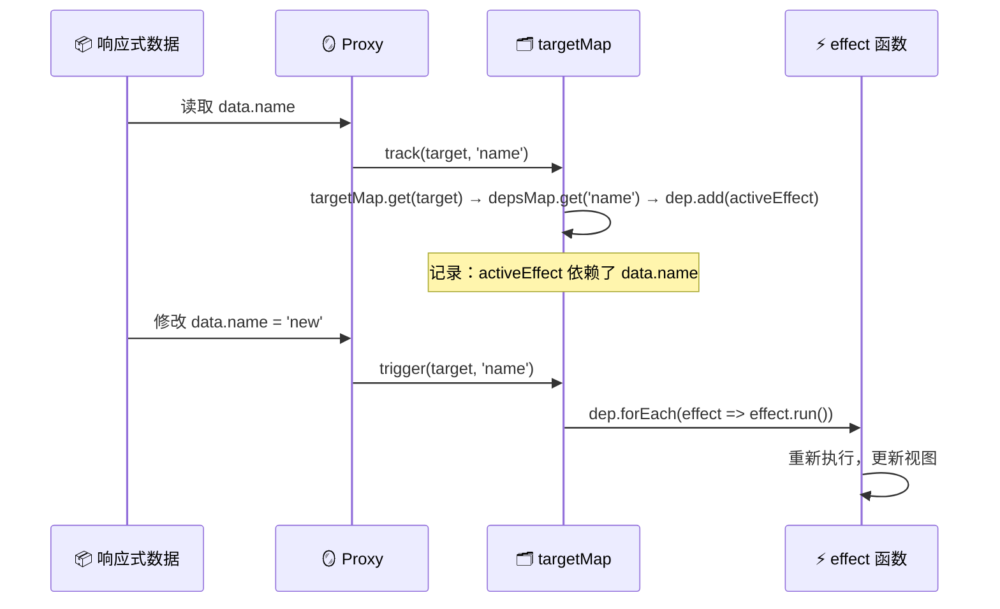

# 响应式原理

> 面试频率最高，没有之一。回答深度直接决定级别定位。

## 一句话总结

Vue3 响应式的本质是 **数据变更自动触发视图更新** —— 通过 `Proxy` 拦截对象操作，`Reflect` 保证原始行为，`effect/track/trigger` 三件套实现"谁读了数据就记住谁，数据变了就叫谁重新执行"。整个架构可以概括为：**data -> Proxy（get/track）-> effect 注册 -> Proxy（set/trigger）-> effect 重新执行 -> 视图更新**。

## 核心机制

面试官问你"Vue3 响应式怎么实现的"，你要在 2 分钟内把这 4 个点串起来：

### 1. reactive 和 ref 的底层是同一套东西

```ts
// reactive: Proxy 包裹整个对象
function reactive<T extends object>(target: T): T {
  if (target['__v_isReactive']) return target
  return new Proxy(target, mutableHandlers)
}

// ref: class 存取器（getter/setter）实现 track/trigger，值为对象时内部委托给 reactive
class RefImpl<T> {
  private _value: T
  public readonly __v_isRef = true
  constructor(value: T) {
    this._value = toReactive(value)   // 基本类型直接存，对象转 reactive
  }
  get value() {
    track(this, 'value')              // 读时收集依赖
    return this._value
  }
  set value(newVal) {
    if (hasChanged(this._value, newVal)) {
      this._value = toReactive(newVal)
      trigger(this, 'value')          // 写时派发更新
    }
  }
}
```

**关键结论：`reactive` 只能代理对象，`ref` 通过 class 存取器统一了 track/trigger 机制——值为基本类型时走 getter/setter，值为对象时内部委托给 reactive（Proxy）。**

### 2. Proxy 拦截了什么

Vue3 的 `mutableHandlers` 拦截了 5 个操作：

| 拦截方法 | 触发时机 | Reflect 的作用 |
|---------|---------|---------------|
| `get(target, key, receiver)` | 读取属性 | 保持 `this` 指向 Proxy（对象里有 getter 时不丢 this） |
| `set(target, key, value, receiver)` | 设置属性 | 返回布尔值表示是否成功（严格模式兼容） |
| `deleteProperty(target, key)` | `delete obj.key` | 同样返回成功/失败 |
| `has(target, key)` | `key in obj` | 拦截 `in` 操作符 |
| `ownKeys(target)` | `Object.keys()` / `for...in` | 拦截遍历，触发 `ITERATE_KEY` 收集 |

```ts
// 简化版 get handler（源码 core: packages/reactivity/src/baseHandlers.ts）
function createGetter() {
  return function get(target, key, receiver) {
    if (key === ReactiveFlags.IS_REACTIVE) return true   // 内部标记位
    const result = Reflect.get(target, key, receiver)     // 用 Reflect 保证 this
    track(target, key)                                     // 依赖收集
    if (isObject(result)) return reactive(result)          // 深度递归代理（惰性！）
    return result
  }
}
```

**`Reflect.get(target, key, receiver)` 最关键的作用**：当 target 里有 `get name() { return this.first + this.last }` 这种访问器时，`receiver` 确保 `this` 指向 proxy 而不是原始对象，这样访问 `this.first` 时依然能触发 track。

### 3. track/trigger/effect 三者关系



数据结构是 **WeakMap -> Map -> Set** 三层嵌套：

```ts
// 全局依赖中心
const targetMap = new WeakMap<object, Map<string | symbol, Set<ReactiveEffect>>>()
// targetMap:  { 原始对象 → depsMap }
// depsMap:    { 属性名   → dep(Set<effect>) }
// dep:        Set<ReactiveEffect>
```

为什么是 WeakMap？当响应式对象不再被引用时，WeakMap 的 key 弱引用可以让 GC 自动回收，不产生内存泄漏。

### 4. effect 的本质：把函数变成"响应式函数"

```ts
// 简化版 effect（完整版在 packages/reactivity/src/effect.ts）
class ReactiveEffect {
  fn: Function
  deps: Dep[] = []              // 记录自己被哪些 dep 收集了
  parent: ReactiveEffect | undefined

  run() {
    this.parent = activeEffect   // 嵌套 effect 用栈保存父级
    activeEffect = this
    const result = this.fn()     // 执行期间，所有被读的响应式数据会 track 到 this
    activeEffect = this.parent
    return result
  }
}

function effect(fn: Function) {
  const _effect = new ReactiveEffect(fn)
  _effect.run()                  // 首次执行，完成依赖收集
  return _effect
}
```

`activeEffect` 是一个全局变量，指向当前正在执行的 effect。执行 `fn()` 期间，所有被读取的响应式属性都会通过 `track()` 把 `activeEffect` 收集到自己的 dep 里。这就是"自动依赖收集"的本质。

## 深度拓展

### 追问1：Vue2 defineProperty vs Vue3 Proxy

| 维度 | Vue2 | Vue3 |
|------|------|------|
| 新增属性 | 检测不到，需要 `Vue.set` | Proxy 天然支持 |
| 数组索引 | 检测不到 `arr[0] = 1` | 天然支持 |
| 数组 length | 检测不到 | 天然支持 |
| delete | 检测不到 `delete obj.key` | `deleteProperty` 拦截 |
| 性能 | 初始化时递归遍历所有属性 | 惰性代理，用到才代理 |
| Map/Set/WeakMap/WeakSet | 不支持 | 原生支持 |

**核心差异**：Vue2 劫持的是"属性"，Vue3 代理的是"整个对象"。Vue3 在 `get` 里做懒代理 —— 只有当访问到子对象时才 `reactive(result)`，而不是初始化时深遍历。

### 追问2：为什么用 Reflect？

三个理由：
1. **`receiver` 参数修正 this 指向**（最重要），上文已解释
2. **返回值的一致性**：`Reflect.set` 返回 boolean，与 Proxy 的 set trap 要求一致；而 `target[key] = value` 在严格模式下赋值失败会抛异常
3. **与 Proxy trap 一一对应**：Proxy 的 13 种拦截方法都能在 Reflect 上找到同名静态方法，语义统一

```ts
// 没有 Reflect 的写法（有 bug）
set(target, key, value) {
  target[key] = value        // ❌ 如果 target 有 setter 且用了 this，this 指向 target 而非 proxy
}
// 用 Reflect
set(target, key, value, receiver) {
  return Reflect.set(target, key, value, receiver)  // ✅ receiver 是 proxy 本身
}
```

### 追问3：shallowRef / shallowReactive 什么时候用？

原理：跳过深度响应式转换。当你有一个**大对象且只关心顶层引用变化**时用它们。

```ts
// chunk 场景：大文件分片上传，只需要 slice 引用变了就更新进度条
const chunks = shallowRef<Blob[]>([])  // 不深层代理每个 Blob
chunks.value = [...chunks.value, newChunk]  // 触发更新
// 如果用 ref，每个 Blob 对象都会被递归代理，浪费性能
```

### 追问4：readonly 怎么实现的？

本质是另一个 Proxy，`set` 和 `deleteProperty` 里直接报警告，不执行 trigger。
`readonly(reactive(obj))` 返回的是同一个原始对象的只读代理，内部共享 `targetMap` 的依赖收集。

### 追问5：Vue3 如何拦截数组变异方法（高频追问）

Vue3 对 7 种会改变原数组的方法做了拦截：`push`、`pop`、`shift`、`unshift`、`splice`、`sort`、`reverse`。

在创建响应式数组时，Vue3 会用包装后的方法**覆盖**数组原型上的对应方法：

```ts
// 简化逻辑（源码: packages/reactivity/src/arrayInstrumentations.ts）
const arrayInstrumentations: Record<string, Function> = {}

;['push', 'pop', 'shift', 'unshift', 'splice', 'sort', 'reverse'].forEach(key => {
  arrayInstrumentations[key] = function (...args: any[]) {
    // 1. 执行期间暂停依赖追踪（避免 push 读取 length 时重复 track）
    pauseTracking()
    // 2. 调用原生方法
    const res = Array.prototype[key].apply(this, args)
    // 3. 恢复追踪
    resetTracking()
    return res
  }
})
```

**为什么需要暂停追踪？** 以 `push` 为例：`push` 内部会读取 `length` 属性来判断插入位置，还会设置新的索引和 `length`。如果不暂停追踪，`push` 执行过程中的 `get`（读 length）和 `set`（写新索引、写 length）都会触法 track/trigger，造成多余的副作用执行和潜在的无限循环。

**面试关键点**：Vue2 通过重写 `Array.prototype` 上的 7 个方法 + 让 `__proto__` 指向包装对象来实现；Vue3 同样重写了这 7 个方法，但直接在 Proxy 的 get trap 里判断 key 是否为变异方法名，命中则返回包装后的版本。核心进步在于：Vue3 不需要关心 `arr[0] = x` 和 `arr.length = n` 的拦截 —— Proxy 已经天然支持了，Vue2 做不到。

### 追问6：toRaw / markRaw 的使用场景

```ts
import { toRaw, markRaw, reactive, ref } from 'vue'

// toRaw：获取 Proxy 背后的原始对象，脱离响应式系统
const obj = reactive({ count: 1 })
const raw = toRaw(obj)
raw.count = 2        // 不会触发任何更新（绕开了 Proxy）
// 场景：需要把数据传给第三方库（如 ECharts、Map 实例），避免深度代理造成的性能开销和死循环

// markRaw：标记一个对象，使其永远不会被 reactive 转为响应式代理
const hugeData = markRaw({ /* 有大量静态数据的对象 */ })
const state = reactive({ list: hugeData })
// state.list 是原始对象，不会被深层代理
// 场景：含有大量不可变配置数据、第三方类实例（如 axios 实例）、或者自身带有循环引用的数据
```

**核心区别**：`toRaw` 是"退出" —— 先变成响应式的，再找回原始对象；`markRaw` 是"禁止" —— 一开始就标记它不可被代理，后续任何 `reactive()` 调用都会跳过它。

## 项目实战

```ts
// 1. 全局配置用 reactive（一次性定义、不需要解构）
export const useAppStore = defineStore('app', () => {
  const config = reactive({ theme: 'light', locale: 'zh', sidebarCollapsed: false })
  function toggleSidebar() { config.sidebarCollapsed = !config.sidebarCollapsed }
  return { config, toggleSidebar }
})

// 2. 表单数据推荐 ref（单独字段、需要解构传给子组件）
const formData = ref({ name: '', email: '' })
// template 中可以直接 v-model="formData.name"（ref 自动解包）

// 3. 表格数据更新：替换整个数组才能触发更新
const tableData = ref<Item[]>([])
// ✅ 正确：创建新数组引用
tableData.value = tableData.value.map(item =>
  item.id === id ? { ...item, status: 'done' } : item
)
// ✅ ref().value 返回的是 Proxy 代理数组
// push/pop/splice 等 7 种变异方法已被 Vue3 拦截重写，会自动触发 trigger
tableData.value.push(newItem)       // ✅ 可触发更新

// ❌ 注意：Proxy 可以拦截索引赋值 arr[0] = x（比 Vue2 强），但 ref() 代理数组的索引
// 赋值实际上走的是数组 Proxy 的 set trap，是能触发 trigger 的
tableData.value[0] = newItem        // ✅ 同样可触发更新（Proxy set trap 拦截了索引赋值）

// 真正的区别：reactive() 数组 vs ref() 数组
const arr1 = reactive([1,2,3])
arr1[0] = 99                        // ✅ 触发（Proxy 拦截索引 set）
arr1.push(4)                        // ✅ 触发（变异方法被拦截）

const arr2 = ref([1,2,3])
arr2.value[0] = 99                  // ✅ 触发（.value 拿到 Proxy 数组，同上）
arr2.value.push(4)                  // ✅ 触发（同上）
// 只有 arr2 = ref([1,2,3]) 后重新赋值整个 .value 才能通过 ref 自身的 set value() 触发

// 4. Pinia 本质上就是 reactive + computed
// Pinia 的 state 内部调用 reactive()，getters 是 computed()
const store = useCounterStore()
store.count++  // 直接修改，触发响应式，因为 Pinia 内部就是 reactive
```

## 易错点

**❌ `reactive` 解构后丢失响应式**
```ts
const state = reactive({ count: 1, name: 'vue' })
const { count, name } = state  // count 现在是 1（基本类型），失去响应式
count = 2  // 不会触发更新
// ✅ 用 toRefs 保持响应式连接
const { count, name } = toRefs(state)
```

**❌ 直接替换 reactive 整个对象**
```ts
let state = reactive({ count: 1 })
state = reactive({ count: 2 })  // ❌ state 变量本身变了，但 template/effect 里引用的是旧 proxy
// ✅ 方案1：用 ref 包裹；方案2：Object.assign(state, newObj)
```

**❌ ref 在 `<script setup>` 中不需要 `.value`**
`<script setup>` 在编译时做了自动解包，`ref` 在 template 里可以直接写 `count` 而不是 `count.value`。但在 JS/TS 代码里必须 `.value`。

**❌ `reactive` 不能代理基本类型**
```ts
const count = reactive(1)  // ❌ Proxy 只能代理对象
// Vue3 内部会报警告：value cannot be made reactive: 1
```

## 面试信号

问"Vue3 为什么比 Vue2 快"时，你的回答骨架：
1. **响应式层面**：Proxy 替代 defineProperty，减少初始化递归开销，懒代理
2. **编译层面**：Block Tree + PatchFlag，跳过静态节点 diff
3. **Diff 层面**：5 步法 + LIS，O(n) 级别的最长递增子序列
4. **运行层面**：组件实例化更快（编译器为每个子组件生成结构单调一致的调用路径，运行时引擎利用单态缓存 + 静态提升，避免运行时反复解析属性链）

## 相关阅读

- [computed / watch](./computed-watch.md) — 依赖 track/trigger 的实战应用
- [Diff / Patch](./diff-patch.md) — 响应式数据变更最终驱动视图更新的路径
- [Scheduler](./scheduler.md) — trigger 之后的调度层，批量异步更新
- [Composables 实战](./composables-practice.md) — effectScope 如何支撑 composable 的自动清理
- [Renderer](./renderer.md) — effect 执行后如何更新 DOM

## 更新记录

- 2026-07：完整填充（Phase 2），加入 Mermaid 全链路图、源码简化实现、项目实战
