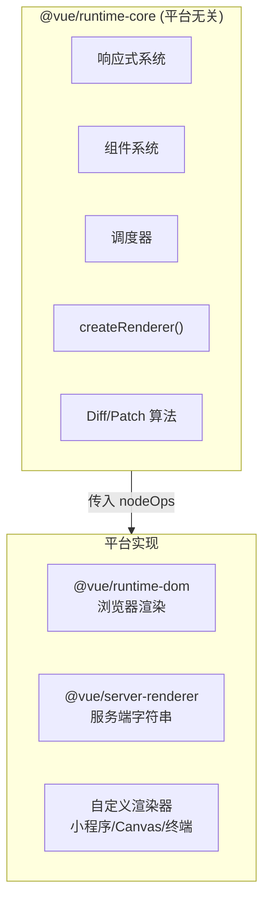

# Renderer

> 这个点能回答好，说明你对 Vue3 架构有全局理解。大部分面试者只知道"Vue 更新 DOM"，不知道 Vue 其实**不关心渲染的目标是什么**。

## 一句话总结

Vue3 的 Renderer 是**平台无关的渲染引擎**，通过 `createRenderer( nodeOps )` 注入平台特定的 DOM 操作，实现了运行时（响应式 + 组件系统）和渲染目标（DOM / Canvas / 小程序 / 终端）的完全解耦。

## 核心机制

### 1. createRenderer：自定义渲染器的工厂函数

```ts
// 核心架构（源码: packages/runtime-core/src/renderer.ts）
function createRenderer(options: RendererOptions) {
  const {
    createElement,   // 创建元素: document.createElement (DOM) 或 new Element (Canvas)
    insert,          // 插入节点: parent.insertBefore (DOM)
    remove,          // 移除节点: parent.removeChild (DOM)
    patchProp,       // 更新属性: el.setAttribute / el.addEventListener (DOM)
    setElementText,  // 设置文本: el.textContent (DOM)
    // ... 等等
  } = options

  // ========== 平台无关的 patch 逻辑 ==========
  function patch(n1, n2, container, ...) {
    // 类型不同 → 卸载旧的、挂载新的
    // 类型相同 → 根据 shapeFlag 分发
    //   - ELEMENT → processElement  (再细分: 创建/更新/卸载)
    //   - COMPONENT → processComponent (再细分: 挂载/更新)
    //   - TEXT → processText
    //   - FRAGMENT → processFragment
    //   - TELEPORT → processTeleport
  }

  function mountElement(vnode, container, ...) {
    const el = createElement(vnode.type)   // ← 平台相关
    // 设置 props, 递归 patch children
    insert(el, container)                  // ← 平台相关
  }

  return {
    render(vnode, container) { /* 首次渲染入口 */ },
    hydrate(vnode, container) { /* SSR 注水入口 */ }
  }
}

// ========== DOM 渲染器：Vue3 默认导出 ==========
const renderer = createRenderer({
  createElement: (tag) => document.createElement(tag),
  insert: (child, parent, anchor) => parent.insertBefore(child, anchor || null),
  remove: (child) => { const p = child.parentNode; p && p.removeChild(child) },
  patchProp: (el, key, prev, next) => {
    if (key.startsWith('on')) {
      // 事件处理: addEventListener / removeEventListener
    } else if (key === 'class') {
      el.className = next
    } else if (key === 'style') {
      // style 对象 diff
    } else {
      el.setAttribute(key, next)
    }
  },
  // ...
})
```

### 2. 为什么要把 Renderer 抽离出来？



三个关键收益：
1. **SSR 复用**：`@vue/server-renderer` 和 `@vue/runtime-dom` 共享同一套组件/Diff 逻辑，只是 `nodeOps` 不同
2. **跨平台**：小程序渲染器（如 uni-app）、Canvas 渲染器、终端 UI 渲染器都基于 `createRenderer`
3. **测试**：单元测试中可以注入 mock 的 `nodeOps`，不依赖真实 DOM

### 3. renderer 和 compiler 的关系

**Compiler（编译器）** 把 template 编译成 VNode 创建函数（`render` 函数），**Renderer（渲染器）** 把 VNode 变成真实 DOM。两者通过 **VNode 数据结构** 解耦：

```
Template → [Compiler] → render() → VNode → [Renderer] → DOM
```

这也是为什么可以只用 `h()` 函数而不用 template —— 你手动构造 VNode，直接交给 Renderer。

## 深度拓展

### 自定义渲染器实战：概念代码

```ts
// 把 Vue 组件渲染到 Canvas
const canvasRenderer = createRenderer({
  createElement(type) {
    // 不是 document.createElement，而是创建一个绘图指令对象
    return { type, props: {}, children: [] }
  },
  insert(child, parent) {
    parent.children.push(child)
  },
  patchProp(el, key, prev, next) {
    el.props[key] = next
    // 触发重绘
    redrawCanvas()
  },
  setElementText(el, text) {
    el.text = text
    redrawCanvas()
  },
  // 没有 parentNode.removeChild，而是标记为待删除
  remove(child) { /* ... */ },
})

// 使用：在 Canvas 环境中运行 Vue 的响应式和组件系统
canvasRenderer.createApp({
  data: () => ({ count: 0 }),
  template: `<rect :x="count * 10" y="0" width="50" height="50" />`
}).mount('#canvas')
```

## 项目实战

后台管理系统通常不需要自定义渲染器，但理解它有助于：
- 理解**Vue DevTools** 的工作方式（它本质上是 hook 进了 renderer）
- 理解**单元测试中 Vue Test Utils** 的 `mount()` 实现（内部 mock 了 DOM 操作）
- 理解**uni-app / Taro** 等跨端框架的 Vue3 适配（它们提供了小程序平台的 nodeOps）

## 面试信号表

| 面试官问 | 下一问大概率是 |
|----------|-------------|
| "Vue3 的渲染器做了什么" | 追问 patch 函数——创建、更新、卸载三种操作的统一入口 |
| "虚拟 DOM 和真实 DOM 怎么同步" | 追问挂载（mount）和更新（patch）的两阶段流程 |
| "SSR 的渲染器和 DOM 渲染器有什么区别" | 追问 createSSRApp 生成的 renderer 输出 HTML 字符串而非 DOM 操作 |
| "自定义渲染器怎么用" | 追问 createRenderer 传入自定义 nodeOps 实现跨平台渲染 |

## 相关阅读

- [Diff / Patch](./diff-patch.md) — patch 函数是 Renderer 的核心
- [响应式原理](./reactivity.md) — Renderer 如何消费响应式数据变更
- [Scheduler](./scheduler.md) — Renderer 如何与异步任务调度协作

## 更新记录

- 2026-07：完整填充（Phase 2），加入架构图、createRenderer 简化源码、Canvas 渲染器概念代码
