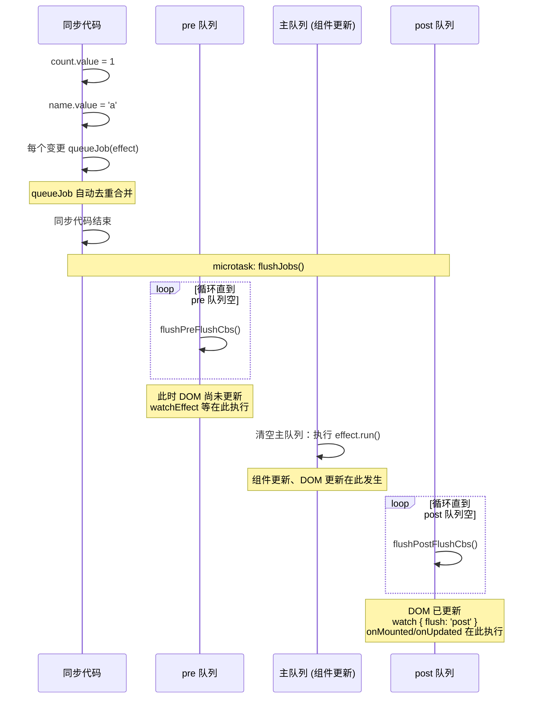

# Scheduler

> 面试官问"修改三个数据会触发几次更新"，答"一次" —— 这是正确答案，但你能说清"怎么做到一次"的才加分。Scheduler 就是这个"怎么做到"的答案。

## 一句话总结

Scheduler 是 Vue3 的**异步任务协调器**，负责把同一个 tick 内的多次响应式变更合并为一次更新 —— 本质是一个**微任务队列管理器**，管理 effect 的执行时机（pre/post/sync）和执行顺序。

## 核心机制

### 1. 任务队列的设计

```ts
// 简化版源码（packages/runtime-core/src/scheduler.ts）

// pre 队列：DOM 更新前执行（watchEffect、onBeforeUpdate）
const pendingPreFlushCbs: SchedulerJob[] = []
// 主队列：组件更新 effect
const queue: SchedulerJob[] = []
// post 队列：DOM 更新后执行（watch { flush: 'post' }, onMounted, onUpdated）
const pendingPostFlushCbs: SchedulerJob[] = []

let isFlushing = false             // 正在清空队列中
let isFlushPending = false         // 清空操作已入队（微任务），等待执行
let currentFlushPromise: Promise<void> | null = null

function queueJob(job: SchedulerJob) {
  // 去重：同一个 job 不会重复入队
  if (!queue.includes(job)) {
    queue.push(job)
    queueFlush()
  }
}

function queueFlush() {
  if (!isFlushing && !isFlushPending) {
    isFlushPending = true
    currentFlushPromise = Promise.resolve().then(flushJobs)
  }
}
```

### 2. 三种队列的执行顺序



**为什么需要三个队列？**

- **pre 队列**：组件 DOM 更新**之前**需要执行的任务（例如 watchEffect 在数据变化后立刻更新 ref 依赖的 DOM 无关逻辑）
- **主队列**：组件 effect 的实际执行，会触发 patch 和真实 DOM 操作
- **post 队列**：DOM 更新**之后**需要执行的任务（例如获取更新后的 scrollHeight、调用第三方库更新图表）

### 3. nextTick 和 scheduler 的关系

```ts
function nextTick(fn?: () => void): Promise<void> {
  const p = currentFlushPromise || Promise.resolve()
  return fn ? p.then(fn) : p
}
```

`nextTick` 的回调挂在 `currentFlushPromise` 的 `.then` 链上。因为 `flushJobs` 本身就是 `Promise.resolve().then(flushJobs)`，所以 nextTick 的回调**必然在 flushJobs 完成后**执行。这就是"nextTick 保证在 DOM 更新之后"的底层原因。

## 深度拓展

### 追问1：pre/post 队列的实际应用

```ts
// watch 的 flush 选项控制回调在哪个队列执行
watch(source, callback, { flush: 'pre' })   // 默认，DOM 更新前
watch(source, callback, { flush: 'post' })  // DOM 更新后
watch(source, callback, { flush: 'sync' })  // 同步执行（不通过 scheduler，每次变化立即执行）
```

`onMounted` / `onUpdated` 这些生命周期钩子实际上就是被注册到 post 队列中的。

### 追问2：组件更新在哪个队列？

组件自身的渲染 effect（重新执行 render 函数 + patch）在**主队列**中。`onBeforeUpdate` 在 **pre 队列**，`onUpdated` 在 **post 队列**。

### 追问3：递归更新防护

```ts
// scheduler 有防止无限递归更新的机制
// 同一个 effect 在一次 flush 中最多执行 100 次（递归检查）
function flushJobs() {
  let flushIndex = 0
  while (flushIndex < queue.length) {
    const job = queue[flushIndex]
    job()   // effect.run() 可能触发新的 queueJob，导致 queue 动态增长
    flushIndex++
  }
  // flush 过程中又有新的 job 入队 → 继续清空，但有递归上限
}
```

如果你在两个 `watch` 中互相修改对方监听的数据，Vue 会在递归超过上限时抛出警告：`Maximum recursive updates exceeded`。

## 项目实战

```ts
// 1. 多个数据同时变更只触发一次更新 —— scheduler 自动做
// 这三个赋值在同一个同步 tick 中
store.config.theme = 'dark'
store.config.locale = 'en'
store.config.sidebar = true
// → 最终只触发 1 次组件的 render 函数重新执行

// 2. watchEffect 的 flush 选项
watchEffect(() => {
  // 默认 flush: 'pre' —— 在 DOM 更新前执行
  console.log('count changed:', count.value)
})

watchEffect(() => {
  const height = containerRef.value?.offsetHeight  // 需要读 DOM 属性
}, { flush: 'post' })  // 必须在 DOM 更新后执行，否则读到旧值

// 3. 调试响应式更新时机
import { onUpdated, nextTick } from 'vue'
onUpdated(() => {
  // 在 post 队列，此时 DOM 已是最新
  console.log('Updated DOM:', document.querySelector('.foo')?.textContent)
})
```

## 面试信号表

| 面试官问 | 下一问大概率是 |
|----------|-------------|
| "Vue3 的调度器做了什么" | 追问把同步任务拆成微任务队列、按优先级执行 |
| "为什么不是每次数据变化都立即更新" | 追问批量更新——同一个 tick 内的多次修改合并为一次 DOM 更新 |
| "scheduler 和 React 的 fiber 有什么区别" | 追问 Vue 精确更新（依赖追踪）vs React 粗粒度（整树 diff） |
| "nextTick 和 scheduler 是什么关系" | 追问 nextTick 是调度器的对外接口——等当前队列清空后执行回调 |

## 易错点

1. **scheduler 不是独立的线程** —— Vue3 的调度器是主线程上的任务队列管理，不是真正的多线程。不要把 scheduler 和 Web Worker 的概念搞混
2. **nextTick 不等同于 scheduler** —— nextTick 是暴露给用户的 API，scheduler 是内部实现。很多人面试时说"nextTick 就是调度器"——不是，nextTick 是调度器的一个出口
3. **effect 的执行顺序不是 FIFO** —— scheduler 会给 effect 分优先级——computed effect > 普通 watcher > 组件渲染 effect。pre 选项的 watch 在 DOM 更新前执行
4. **不要在 watch 里无限修改数据** —— watch 回调里改了数据又触发 watch，形成死循环。scheduler 会把连续修改合并为一次更新，但逻辑上仍然是死循环，需要用条件守卫

## 相关阅读

- [响应式原理](./reactivity.md) — effect 的 scheduler 如何注册到调度器
- [nextTick](./nextTick.md) — nextTick 的 Promise 链与 scheduler 的关系
- [computed / watch](./computed-watch.md) — computed/watch 的 flush 选项详解

## 更新记录

- 2026-07：完整填充（Phase 2），加入三队列 Mermaid 流程图、递归防护、flush 选项详解
