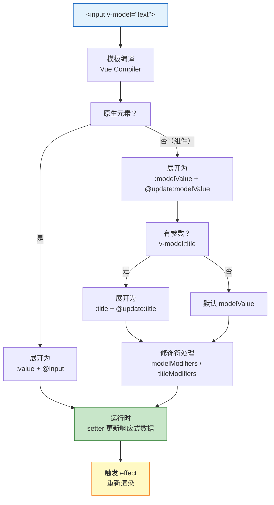

# v-model 原理

> v-model 是 Vue 面试中"看起来都懂，但一问就倒"的高频考点。今天从语法糖展开、组件通信到自定义修饰符，一次性讲透。

## 一句话总结

**v-model 是 prop + event 的语法糖。原生元素上默认对应 `value` + `input` 事件；组件上默认对应 `modelValue` prop + `update:modelValue` 事件。Vue3 支持多个 v-model 绑定和自定义修饰符，Vue2 的 `.sync` 修饰符被合并到 v-model 中。**

---

## 核心机制

### 1. 原生元素的 v-model

`<input v-model="text">` 等价于：

```vue
<input
  :value="text"
  @input="text = $event.target.value"
/>
```

不同表单元素的默认绑定不同：

| 元素 | 绑定的 prop | 监听的事件 |
|------|------------|-----------|
| `<input type="text">` / `<textarea>` | `value` | `input` |
| `<input type="checkbox">` | `checked` | `change` |
| `<input type="radio">` | `checked` | `change` |
| `<select>` | `value` | `change` |

### 2. 组件的 v-model

`<Child v-model="value">` 等价于：

```vue
<Child
  :modelValue="value"
  @update:modelValue="value = $event"
/>
```

子组件中通过 `props.modelValue` 接收值，通过 `emit('update:modelValue', newValue)` 触发更新：

```vue
<script setup>
const props = defineProps(['modelValue'])
const emit = defineEmits(['update:modelValue'])

function onChange(e) {
  emit('update:modelValue', e.target.value)
}
</script>
```

### 3. 多个 v-model（Vue3 新增）

`<Child v-model:title="title" v-model:content="content">` 等价于：

```vue
<Child
  :title="title"
  :content="content"
  @update:title="title = $event"
  @update:content="content = $event"
/>
```

参数化 v-model 让你可以在一个组件上绑定多个值，替代了 Vue2 中 `v-model` + `.sync` 的组合方式。

### 4. 内置修饰符

Vue3 提供三个内置修饰符：

- **`.lazy`**：监听 `change` 事件而非 `input` 事件——用户输入完、失焦后才更新。适合搜索框等不需要实时响应的场景
- **`.number`**：自动用 `parseFloat()` 转换输入值为数字。如果无法解析，返回原始字符串
- **`.trim`**：自动去除输入值首尾空格

修饰符可以链式使用：`<input v-model.lazy.trim="text">`

### 5. 自定义修饰符

组件内通过 `props` 的 `modelModifiers` 对象接收修饰符：

```vue
<script setup>
const props = defineProps({
  modelValue: String,
  modelModifiers: { default: () => ({}) }
})

const emit = defineEmits(['update:modelValue'])

function emitValue(value) {
  if (props.modelModifiers.uppercase) {
    value = value.toUpperCase()
  }
  emit('update:modelValue', value)
}
</script>
```

使用时：`<Child v-model.uppercase="text">`。对于带参数的 v-model，修饰符名变为 `titleModifiers`：`<Child v-model:title.uppercase="text">`。

---

## v-model 编译展开流程图



---

## 深度拓展

### 追问1：v-model 和 .sync 的区别（Vue2 vs Vue3）

| 维度 | Vue2 | Vue3 |
|------|------|------|
| v-model | 仅支持一个，prop 固定为 `value`，事件固定为 `input` | 支持多个，默认 `modelValue` + `update:modelValue` |
| .sync | 额外修饰符，`<Child :title.sync="t">` = `:title` + `@update:title` | **已移除**，功能合并到 v-model |
| 自定义 prop/event | 需要 `model: { prop, event }` 选项 | 通过参数化 v-model：`v-model:title` |

在 Vue3 中，`v-model:xxx` 的语法完全覆盖了 Vue2 `.sync` 的能力。所以如果你在面试中说"v-model 和 .sync 的区别"，一定要分 Vue2 和 Vue3 两个语境。

### 追问2：v-model 是双向绑定，Vue 的响应式系统也是双向绑定吗？

Vue 的响应式系统是**单向数据流**：数据变化 → 视图更新。v-model 的"双向绑定"本质也是单向数据流——它只是帮你自动写了 `:value`（数据→视图）和 `@input`（视图→数据），并没有改变数据流的方向。**真正的双向绑定**（如 AngularJS 的 dirty checking）是数据和视图之间互相监听、循环更新。

### 追问3：表单组件封装时，v-model 的最佳实践

1. **用 `computed` + get/set 封装**（适合简单场景）：

```vue
<script setup>
const props = defineProps(['modelValue'])
const emit = defineEmits(['update:modelValue'])

const model = computed({
  get: () => props.modelValue,
  set: (val) => emit('update:modelValue', val)
})
</script>
```

2. **处理异步校验**：在 emit 之前 await 校验结果，校验不通过则不 emit
3. **避免直接修改 props**：必须通过 emit 更新，否则报 `Avoid mutating a prop directly` 警告

---

## 项目实战

**场景：封装一个带校验、格式化、自定义修饰符的 Input 组件**

```vue
<script setup>
const props = defineProps({
  modelValue: [String, Number],
  modelModifiers: { default: () => ({}) }
})
const emit = defineEmits(['update:modelValue'])

function handleInput(e) {
  let value = e.target.value
  // .trim 修饰符
  if (props.modelModifiers.trim) value = value.trim()
  // .uppercase 自定义修饰符
  if (props.modelModifiers.uppercase) value = value.toUpperCase()
  emit('update:modelValue', value)
}
</script>

<template>
  <input :value="modelValue" @input="handleInput" />
</template>
```

---

## 易错点

- **"v-model 是真正的双向绑定"**：不是。它只是 prop + event 的语法糖，数据流仍然是单向的（父→子通过 prop，子→父通过事件）。
- **"组件中可以直接修改 v-model 的值"**：不能。`props.modelValue` 是只读的，必须通过 `emit('update:modelValue')` 通知父组件修改。
- **"v-model:title 中的 title 是 prop 名"**：对也不全对。它既是 prop 名（`title`），也决定了事件名（`update:title`）和修饰符 prop 名（`titleModifiers`）。
- **"Vue3 去掉了 .sync"**：是的，但功能合并到了 v-model 中，`v-model:title` 等价于 Vue2 的 `:title.sync`。

---

## 相关阅读

- [响应式原理](./reactivity.md) —— v-model 背后的响应式系统如何工作
- [Composition API](./composition-api.md) —— `<script setup>` 中 defineProps/defineEmits 的用法
- [Pinia 状态管理](../Pinia/defineStore.md) —— 跨组件共享状态的另一种方式

---

## 更新记录

- 2026-07-06：完成完整内容，覆盖原生/组件 v-model、多 v-model、修饰符、Vue2 vs Vue3 差异（Phase 2）
