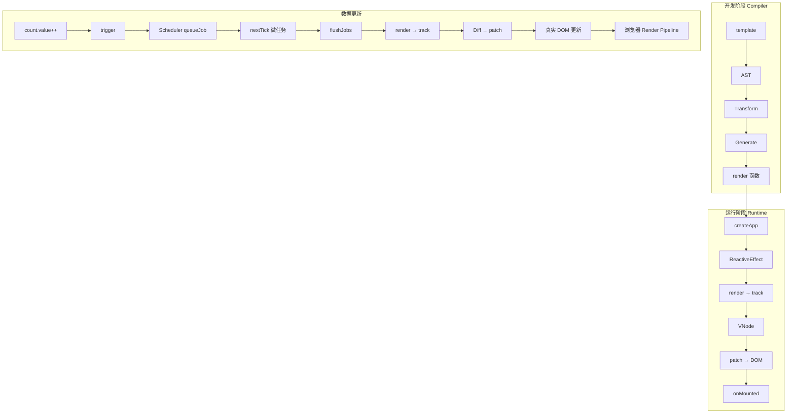

# Vue3 全链路渲染流程

> 面试中"数据变了屏幕上怎么更新"这个问题的终极答案。从 `template` 到 `屏幕像素`，分 7 个阶段逐层打通，每一层都能指出关键源码位置。



---

## 一、模板编译（Compiler）

> 详见：[diff-patch.md](./diff-patch.md) 编译优化章节

编译在**构建时**完成（Vite 用 `@vue/compiler-sfc`）。分三步：

### 1. Parse（解析）

模板字符串 → **AST 抽象语法树**。

```html
<div id="app">{{ count }}</div>
```

解析为：`ElementNode(tag: 'div')` → `AttributeNode(id: 'app')` → `InterpolationNode(content: 'count')`

### 2. Transform（转换）

对 AST 做**编译优化**——这是 Vue3 比 Vue2 快的核心原因：

| 优化 | 作用 | 机制 |
|------|------|------|
| **静态节点提升**（HoistStatic） | 避免重复创建不变节点 | 静态 vnode 提到 render 外，每次渲染复用同一个引用 |
| **PatchFlag 标记** | Diff 时跳过不需要比的属性 | 动态内容用 bit 位标记（`1`=TEXT、`2`=CLASS、`4`=STYLE、`8`=PROPS） |
| **Block Tree** | 只 diff 动态节点 | 动态节点收集到 `dynamicChildren` 数组，静态节点直接跳过 |
| **预字符串化** | 静态 HTML 直接变字符串 | 连续静态节点拼接成一个字符串，`innerHTML` 一次性插入 |
| **缓存事件处理函数** | 避免子组件无意义更新 | `onClick` 被 `_cache[0]` 缓存，传给子组件的是同一个引用 |

### 3. Generate（代码生成）

AST → **render 函数字符串**。

```js
// 编译产物
function render(_ctx, _cache) {
  return (_openBlock(), _createElementBlock("div", { id: "app" }, [
    _toDisplayString(_ctx.count),     // PatchFlag.TEXT = 1
  ], 1 /* TEXT */))
}
```

`_openBlock()` 开启 Block——其子节点中的动态节点会被收集到 `dynamicChildren`，后续 Diff 时直接跳过静态节点。

---

## 二、应用初始化

> 详见：[composition-api.md](./composition-api.md)、[reactivity.md](./reactivity.md)

```ts
// 入口
const app = createApp(App)
app.mount('#app')
```

### 具体步骤

1. **`createApp(App)`** → 创建 App 实例，注册全局组件/指令/插件
2. **`app.mount('#app')`** → 进入 Runtime 阶段
3. **`createComponentInstance()`** → 创建组件内部实例（含 props 槽位、slots、emit 等）
4. **`setupComponent()`** 三步：

```
initProps()    → 解析 props 到实例
initSlots()    → 初始化插槽（处理父组件传入的 slot 内容）
setup()        → 执行 <script setup> 或 setup() 函数
                  在这里创建 ref() / reactive() / computed() / watch()
```

5. **创建 `ReactiveEffect`**——组件的 render 被包装为 effect：

```ts
// packages/runtime-core/src/renderer.ts (简化)
const effect = new ReactiveEffect(
  componentUpdateFn,  // 即 renderComponentRoot → patch
  () => queueJob(instance.update)  // scheduler：数据变更时走异步队列
)
instance.update = effect.run.bind(effect)
```

> 关键：`instance.update` 既是首次渲染的入口，也是后续更新的入口。同一个 effect 对象贯穿组件整个生命周期。

---

## 三、首次渲染

> 详见：[renderer.md](./renderer.md)、[diff-patch.md](./diff-patch.md)、[lifecycle.md](./lifecycle.md)

### 1. effect.run → render

```ts
effect.run()                          // 首次执行
  └── componentUpdateFn()
    └── renderComponentRoot(instance) // 执行组件的 render 函数
      └── render(_ctx, _cache)        // 编译产物
```

### 2. render 内部触发依赖收集

```ts
// render 函数中读取 count.value →
// Proxy get → track(target, 'value')
// 把当前 effect 存入 targetMap.get(target).get('value')
// 结构：WeakMap<target, Map<key, Set<effect>>>
```

**依赖收集发生在 render 执行过程中**——不是独立阶段。每次 render 执行，哪些响应式数据被读了，哪些就被自动建立依赖。

### 3. VNode → DOM

```
render() 执行完毕 → 返回 VNode（一个 JS 对象描述 DOM 结构）
  └── patch(null, vnode, container)    // 首次渲染：旧节点为 null
    └── processElement / processComponent / processFragment
      └── 为每个元素 createElement、setAttribute、insert…
        └── 子组件递归 mount
```

### 4. onMounted

```ts
// DOM 插入页面后触发
// 此时 ref 可访问真实 DOM、ECharts 可初始化
onMounted(() => {
  // ref.value 指向真实 DOM 节点
  // 可以读取尺寸、绑定第三方库
})
```

> mounted 触发顺序：**子组件先 mounted，父组件后 mounted**（因子组挂载是父组件的子步骤）。

---

## 四、数据变更 → trigger

> 详见：[reactivity.md](./reactivity.md)

```ts
count.value++  // 等价于 count.value = count.value + 1
```

1. **set** → 触发 `RefImpl` 的 `set value(newVal)`：

```ts
set value(newVal) {
  if (hasChanged(this._value, newVal)) {  // 新旧值不同才触发
    this._value = toReactive(newVal)
    trigger(this, 'value')                 // ← 派发更新
  }
}
```

2. **`trigger(target, key)`** → 从依赖表找到此数据的 Set\<ReactiveEffect\>：

```
targetMap.get(target) → depsMap.get(key) → Set<ReactiveEffect>
```

3. **遍历 effect 集合**，检查每个 effect 是否有 `scheduler`：

```ts
// packages/reactivity/src/effect.ts (简化)
effect.scheduler
  ? effect.scheduler()  // 有 scheduler → 走自定义调度
  : effect.run()        // 无 scheduler → 立即执行
```

- 组件渲染 effect → **有 scheduler**（走异步队列）
- computed effect → **有 scheduler**（设置 dirty 标记，惰性求值）
- `watchEffect` → 可选配置
- `watch` callback → **有 scheduler**（`doWatch` 创建 effect 时传入 scheduler 回调——在 scheduler 中执行 `effect.run()` 获取新值、调用用户 callback，并处理 `onCleanup` 清理函数）

---

## 五、异步调度（Scheduler）

> 详见：[nextTick.md](./nextTick.md)、[scheduler.md](./scheduler.md)

### 步骤

```
trigger → effect.scheduler()
  └── queueJob(job)
    ├── 检查去重：job 已在队列中？ → 跳过
    ├── 检查 flushing：正在执行队列？ → 按 id 排序插入
    └── 否则：push + queueFlush()

queueFlush()
  └── Promise.resolve().then(flushJobs)  // ← 微任务
```

**去重是关键**——同一次 tick 内修改 10 次 `count.value`，组件只重新渲染一次：

```ts
const queue = new Set<Job>()  // 或数组 + find 去重
let isFlushing = false

function queueJob(job: SchedulerJob) {
  if (!queue.includes(job)) {          // ① 已入队不重复
    queue.push(job)
    queueFlush()                       // ② 异步执行
  }
}

function queueFlush() {
  if (!isFlushing && !isFlushPending) {
    isFlushPending = true
    Promise.resolve().then(flushJobs)  // ③ 微任务延迟
  }
}
```

### nextTick

```ts
import { nextTick } from 'vue'

count.value++
// DOM 尚未更新——此处读取 DOM 拿到旧值

await nextTick()
// DOM 已更新——flushJobs 执行完了
```

nextTick = `Promise.resolve()` 包装——它把回调排到同一轮微任务中，flushJobs 之后执行。

> Vue3 直接用 Promise.then，**不存在** Vue2 的 MutationObserver/setImmediate/setTimeout 降级链。

---

## 六、Diff + Patch

> 详见：[diff-patch.md](./diff-patch.md)

`flushJobs` 执行时，遍历 job 队列，每个 job 就是 `instance.update`（即 `effect.run()`）。

### 1. 重新执行 render

```ts
// componentUpdateFn 内部的更新分支
const nextTree = renderComponentRoot(instance)  // 新 VNode
patch(prevTree, nextTree, container)            // 比对新旧
prevTree = nextTree                              // 缓存旧树
```

render 再次执行 → 再次读取响应式数据 → 再次 `track()`——**依赖关系始终保持最新**（解决条件渲染中依赖变化的问题）。

### 2. Diff 算法

```
patch(oldVNode, newVNode)
  ├── type 不同？ → 卸载旧节点 + 挂载新节点（不需要 diff）
  ├── type 相同 + 静态？ → 复用 DOM，跳过子节点
  ├── type 相同 + 动态？ → 进入具体 diff：
  │     └── 有 dynamicChildren（BlockTree）？
  │           ├── 是 → 只 diff dynamicChildren 数组（O(n)，n=动态节点数）
  │           └── 否 → 传统全量 diff
  └── 属性 diff → 根据 PatchFlag 只比较被标记的动态属性
```

**Block Tree 是关键优化**——传统 Diff 遍历整棵 vnode 树，Block Tree 的 `dynamicChildren` 直接跳到动态节点：

```ts
// 传统 diff：遍历所有子节点
for (let i = 0; i < oldChildren.length; i++) { … }

// Block Tree diff：只 diff 动态节点
for (let i = 0; i < newVNode.dynamicChildren.length; i++) {
  patch(oldChildren[i], newVNode.dynamicChildren[i], container)
}
```

### 3. Patch

找到变化的节点后，执行**最小 DOM 操作**：

```
更新文本节点   → el.textContent = newValue
更新属性       → el.setAttribute / el.removeAttribute
移动节点       → insertBefore（复用 DOM，不重建）
删除节点       → 先触发 onBeforeUnmount → removeChild → onUnmounted
插入新节点     → mount → patch(null, newVNode, container)
```

> PatchFlag 让属性比较跳过静态属性——`<div id="static" :class="dynamic">` 只比 class，不比 id。

---

## 七、浏览器渲染管线

> 详见：[../浏览器/render-process.md](../浏览器/render-process.md)、[../浏览器/reflow-repaint.md](../浏览器/reflow-repaint.md)

Vue 更新完 DOM 后，**浏览器**接管剩余工作：

```
DOM 变更
  │
  ▼
Style（样式计算）
  │  重新计算 CSS 规则匹配，生成 ComputedStyle
  │  受影响的属性：color / font-size / background 等
  ▼
Layout（布局 / 回流）
  │  重新计算元素位置和尺寸
  │  受影响的属性：width / height / padding / position / display
  ▼
Paint（绘制）
  │  将每个元素绘制到位图
  │  受影响的属性：color / background / box-shadow / border
  ▼
Composite（合成）
  │  GPU 将多个图层合成为最终画面
  │  可单独触发的属性：transform / opacity（合成层，跳过 Layout+Paint）
  ▼
屏幕像素发生变化 🎉
```

**性能要点**：`transform` 和 `opacity` 只触发 Composite——Vue Transition 动画能 60fps 的原因就是优先使用这两个属性。

---

## 全景时间线

```
t=0ms  用户修改 count.value++
t=0ms  Proxy set → trigger → scheduler → queueJob（同步）
t=0ms  Promise.resolve().then(flushJobs)（注册微任务，当前同步代码继续）
t=0ms  ──────── 同步代码执行完毕 ────────
t=0ms  微任务队列：flushJobs()
  └── effect.run() → render() → track() → patch(oldVNode, newVNode)
    └── 只更新文本节点：el.textContent = '新值'（~0.01ms）
t=0ms  onUpdated() 触发
t=0ms  nextTick 回调执行
t=0ms  ──────── JS 空闲 ────────
t~16ms 浏览器 Style → Layout → Paint → Composite（如果受影响）
t~16ms 屏幕变化可见 🎉
```

> 从数据变更到 DOM 更新完成，**同一帧内完成**（`< 16ms`）。更新是异步的（微任务），但快到你无法察觉。

---

## 关键源码索引

| 模块 | 源码包 | 关键文件 |
|------|--------|---------|
| Compiler | `@vue/compiler-core` | `parse.ts`、`transform.ts`、`codegen.ts` |
| Reactivity | `@vue/reactivity` | `reactive.ts`、`ref.ts`、`effect.ts`、`dep.ts` |
| Scheduler | `@vue/runtime-core` | `scheduler.ts` |
| Renderer | `@vue/runtime-core` | `renderer.ts` |
| Diff | `@vue/runtime-core` | `renderer.ts` (patchChildren/processFragment) |
| VNode | `@vue/runtime-core` | `vnode.ts` |

## 相关阅读

- [模板编译优化](./diff-patch.md#编译时优化) — PatchFlag / Block Tree 详解
- [响应式原理](./reactivity.md) — track/trigger + 三层依赖结构
- [Diff / Patch](./diff-patch.md) — 算法全过程 + 五种场景
- [nextTick](./nextTick.md) — 微任务时序 + 使用场景
- [Scheduler](./scheduler.md) — 异步队列 + 去重机制
- [生命周期](./lifecycle.md) — mounted/updated/unmounted 触发时机
- [Composition API](./composition-api.md) — setup 与 effect 的关系
- [性能优化 Checklist](./vue3-performance.md) — 从渲染链路拧性能
- [浏览器渲染流程](../浏览器/render-process.md) — Style/Layout/Paint/Composite
- [重绘/回流](../浏览器/reflow-repaint.md) — 避免渲染性能陷阱

## 更新记录

- 2026-07-13：新建——7 阶段全链路，串联 Compiler/Reactivity/Scheduler/Renderer/Diff/Patch/生命周期/nextTick/浏览器渲染
