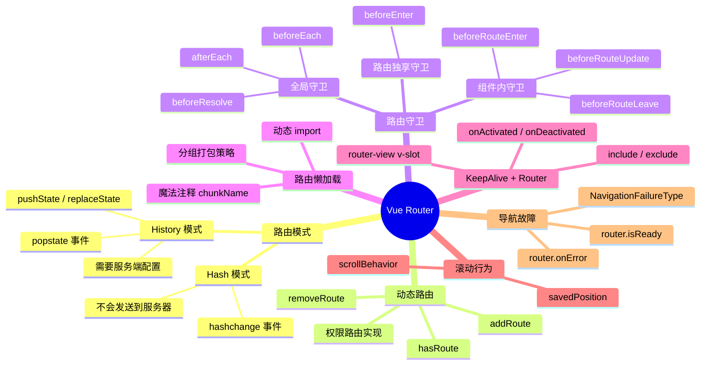

# Vue Router 知识地图

## 推荐学习顺序

### 一、核心机制（从基础到高级）

1. ⭐⭐⭐⭐⭐ [history / hash 模式](./history-vs-hash.md) — 先理解两种模式怎么工作
2. ⭐⭐⭐⭐⭐ [路由守卫](./route-guards.md) — 在模式基础上控制导航
3. ⭐⭐⭐⭐⭐ [动态路由](./dynamic-routing.md) — 守卫的进阶应用

### 二、进阶与集成（依赖核心机制）

4. ⭐⭐⭐⭐ [路由懒加载](./lazy-loading.md)
5. ⭐⭐⭐⭐ [KeepAlive + Router](./keepalive-integration.md)

### 三、辅助功能

6. ⭐⭐⭐ [导航故障处理](./navigation-failures.md)
7. ⭐⭐⭐ [scrollBehavior](./scroll-behavior.md)
8. ⭐⭐⭐ [路由元信息/传参](./route-meta-props.md)
9. ⭐⭐⭐ [命名视图/过渡动画](./named-views-transition.md)

## 知识点索引

| 知识点 | 频率 | 难度 | 手写 | 状态 |
|--------|------|------|------|------|
| [history / hash 模式](./history-vs-hash.md) | ⭐⭐⭐⭐⭐ | 初级 | — | filled |
| [路由守卫](./route-guards.md) | ⭐⭐⭐⭐⭐ | 中级 | — | filled |
| [动态路由](./dynamic-routing.md) | ⭐⭐⭐⭐⭐ | 高级 | — | filled |
| [路由懒加载](./lazy-loading.md) | ⭐⭐⭐⭐ | 初级 | — | filled |
| [KeepAlive + Router](./keepalive-integration.md) | ⭐⭐⭐⭐ | 中级 | — | filled |
| [scrollBehavior](./scroll-behavior.md) | ⭐⭐⭐ | 初级 | — | filled |
| [导航故障处理](./navigation-failures.md) | ⭐⭐⭐ | 中级 | — | filled |
| [路由元信息/传参](./route-meta-props.md) | ⭐⭐⭐ | 初级 | — | filled |
| [命名视图/过渡动画](./named-views-transition.md) | ⭐⭐⭐ | 中级 | — | filled |

## 相关阅读

- [Vue3 知识地图](../Vue3/index.md) — 响应式、组件通信、生命周期的底层基石
- [Pinia 知识地图](../Pinia/index.md) — 路由守卫中获取全局状态
- [项目实战：权限系统](../项目实战/权限系统/permission-rbac.md) — 动态路由 + RBAC 实战
- [面试题库：Vue Router](../面试题库/VueRouter.md) — 10 道路由高频真题

## 更新记录

- 2026-07-11：补"相关阅读"区——链向 Vue3/Pinia/项目实战/题库
- 2026-07-06：初始创建
