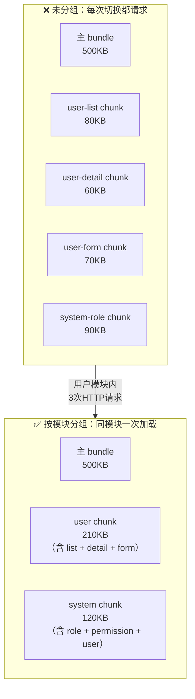

# 路由懒加载

> 不只是 `() => import()` 这么简单。能说出 chunk 命名和分组策略，说明你不是只对着文档抄例子，而是真的关心过打包产物的结构和首屏性能。

## 一句话总结

路由懒加载通过 ES 动态 `import()` 将路由组件从主 bundle 中分离为独立的异步 chunk，Vite/Webpack 在构建时自动进行代码分割，只有用户访问对应路由时才按需加载，从而显著减小首屏加载体积。配合魔法注释自定义 chunk 名称和分组策略，可以实现更精细的产物管理。

## 核心机制

### 1. 从同步到异步：`import()` 的原理

```ts
// ❌ 同步导入：所有组件打进主 bundle
import Home from '@/views/Home.vue'
import About from '@/views/About.vue'
const routes = [
  { path: '/', component: Home },
  { path: '/about', component: About },
]

// ✅ 懒加载：每个组件独立成 chunk
const routes = [
  { path: '/', component: () => import('@/views/Home.vue') },
  { path: '/about', component: () => import('@/views/About.vue') },
]
```

`import()` 是 ES2020 的动态导入语法，返回一个 `Promise<Module>`。Vue Router 在匹配到对应路由时，检测到 `component` 是一个函数（而不是组件对象），就会调用该函数并等待 Promise resolve，拿到模块中的 `default` 导出作为组件。

Vue Router 内部处理懒加载的简化逻辑：

```ts
// Vue Router 内部对异步组件的处理（简化版）
async function resolveAsyncComponent(component: () => Promise<Component>) {
  const resolved = await component()
  return resolved.default ?? resolved  // 支持 default 导出和具名导出
}
```

### 2. Webpack 的代码分割机制

Webpack 遇到 `import()` 时，会将该模块及其所有**同步依赖**打包为一个独立的 chunk 文件：

```
# 构建产物示例
dist/
  js/
    app.abc123.js          # 主 bundle（runtime + router + 公共依赖）
    Home.def456.js         # 首页 chunk
    About.ghi789.js        # 关于页 chunk
    UserList.jkl012.js     # 用户列表页 chunk
    vendors.mno345.js      # 公共第三方库 chunk（如果配置了 splitChunks）
```

**Webpack 中的魔法注释**：

```ts
const routes = [
  {
    path: '/user/list',
    component: () => import(
      /* webpackChunkName: "user-list" */    // chunk 文件名
      /* webpackPrefetch: true */               // 预取提示（空闲时预加载）
      '@/views/user/List.vue'
    )
  },
  {
    path: '/user/detail/:id',
    component: () => import(
      /* webpackChunkName: "user-detail" */
      /* webpackPreload: true */               // 预加载提示（与父 chunk 并行）
      '@/views/user/Detail.vue'
    )
  }
]
```

| 魔法注释 | 效果 | 使用场景 |
|---------|------|---------|
| `webpackChunkName: "name"` | 自定义 chunk 文件名 | 所有路由，便于排查和监控 |
| `webpackPrefetch: true` | `<link rel="prefetch">`，浏览器空闲时下载 | 用户大概率会访问的下一页 |
| `webpackPreload: true` | `<link rel="preload">`，与父 chunk 并行下载 | 当前页面立即需要的资源 |

**`prefetch` vs `preload` 的区别**：
- `prefetch`：低优先级，浏览器空闲时才下载，适用于"下一步可能需要"的资源
- `preload`：高优先级，与当前页面资源并行下载，适用于"当前页面就需要的"资源

### 3. Vite 的代码分割机制

Vite 基于 Rollup，同样支持 `import()` 自动代码分割，但**不需要 `webpackChunkName` 魔法注释**。Vite/Rollup 默认使用模块路径自动生成 chunk 名。

如果需要对 Vite 的 chunk 进行命名和分组，在 `vite.config.ts` 中通过 `build.rollupOptions.output.manualChunks` 配置：

```ts
// vite.config.ts
export default defineConfig({
  build: {
    rollupOptions: {
      output: {
        // 手动控制 chunk 分组——将同模块的路由打包到一起
        manualChunks: {
          'user-module': [
            'src/views/user/List.vue',
            'src/views/user/Detail.vue',
            'src/views/user/Form.vue',
          ],
          'system-module': [
            'src/views/system/Role.vue',
            'src/views/system/Permission.vue',
          ],
          'vendor-element': ['element-plus'],  // Element Plus 独立成 chunk
          'vendor-echarts': ['echarts'],        // ECharts 独立成 chunk
        }
      }
    }
  }
})
```

或者更方便的**函数式分组**——自动按目录结构合并同一业务模块的路由：

```ts
// vite.config.ts —— 按 views 子目录自动分组
manualChunks(id: string) {
  if (id.includes('node_modules')) {
    if (id.includes('element-plus')) return 'vendor-element'
    if (id.includes('echarts')) return 'vendor-echarts'
    return 'vendor'  // 其余第三方库
  }
  // 按业务模块目录分组
  const match = id.match(/src\/views\/([^/]+)/)
  if (match) return `module-${match[1]}`
}
```

### 4. 分组打包策略

这是比"会用 `import()`"更资深的考查点。核心思想：**同一个业务流程的路由组件应打包在同一个 chunk 中**。

```ts
// 用户模块 → 打包为同一个 chunk
const userRoutes = {
  path: '/user',
  component: Layout,
  children: [
    {
      path: 'list',
      component: () => import(/* webpackChunkName: "user" */ '@/views/user/List.vue')
    },
    {
      path: 'detail/:id',
      component: () => import(/* webpackChunkName: "user" */ '@/views/user/Detail.vue')
    },
    {
      path: 'form/:id?',
      component: () => import(/* webpackChunkName: "user" */ '@/views/user/Form.vue')
    }
  ]
}
// 所有 user 目录下的组件统一命名为 "user" → 打包为一个 chunk
// 用户在用户模块内切换页面时不需要额外加载，体验流畅
```



**分组策略权衡**：
- 太细：每个页面一个 chunk → 大量的 HTTP 请求 → 开发/测试环境好排查，但生产环境请求多
- 太粗：整个应用一个 chunk → 首屏巨大，懒加载失去意义
- **推荐方案**：按业务模块分组（每个一级菜单一个 chunk），模块入口页面设 `webpackPrefetch`

## 深度拓展

### 追问1：懒加载对首屏性能的实际影响有多大？

以一个典型的后台管理系统为例：

| 指标 | 同步导入（全量） | 懒加载（未分组） | 懒加载（按模块分组） |
|------|-----------------|-----------------|---------------------|
| 首屏 JS 体积 | ~3.2 MB | ~800 KB | ~800 KB |
| 首次加载时间 | 4.5s | 1.8s | 1.8s |
| 模块内页面切换时延 | 0ms（已全部加载） | 80-150ms（需下载 chunk） | 0-50ms（同 chunk 已下载） |
| 总 chunk 数 | 1 | 25+ | 8-10 |

**首屏 JS 体积是 LCP 的关键影响因素**。将 3MB+ 的全量代码拆到 800KB，对移动端弱网环境尤为显著。

### 追问2：生产环境 chunk 加载失败如何兜底？

```ts
// router/index.ts —— 异步加载失败重试
// 注意：import() 的路径必须是静态字符串字面量，构建工具才能分析并拆 chunk。
// 传运行时字符串变量（如 import(path)）不会被打包，浏览器解析不了别名路径，直接 404。
// 所以这里包装的是 loader 函数，import() 保持字面量写法
function lazyLoadWithRetry(loader: () => Promise<any>, retries = 2) {
  return async () => {
    let lastError: Error | undefined
    for (let i = 0; i <= retries; i++) {
      try {
        return await loader()
      } catch (e) {
        lastError = e as Error
        if (i < retries) {
          console.warn(`Chunk 加载失败，第 ${i + 1} 次重试`)
        }
      }
    }
    // 全部失败后抛出，交给 router.onError 兜底
    throw lastError!
  }
}

const routes = [
  {
    path: '/dashboard',
    // 带重试的懒加载
    component: lazyLoadWithRetry(() => import('@/views/dashboard/index.vue'))
  }
]

// 配合 router.onError 做全局兜底
router.onError((error) => {
  const chunkFailedPattern = /Failed to fetch dynamically imported module|Loading chunk .* failed/
  if (chunkFailedPattern.test(error.message)) {
    // 可能是用户在新版本发布后还停留在旧页面，刷新即可
    window.location.reload()
  }
})
```

### 追问3：Vite vs Webpack 在路由懒加载上的差异

| 维度 | Webpack | Vite |
|------|---------|------|
| 构建时 | 打包所有路由 chunk 到 dist | 不打包，开发时按需编译 |
| 生产产物 | chunk 文件（哈希命名） | chunk 文件（Rollup 构建） |
| 命名方式 | `webpackChunkName` 魔法注释 | `manualChunks` 配置 |
| 预加载 | `webpackPrefetch` / `webpackPreload` | 需要手动添加 `<link>` 标签 |
| 模块格式 | CommonJS/ESM | 纯 ESM |

## 项目实战

```ts
// router/modules/user.ts —— 用户模块的路由 + 分组策略
import Layout from '@/layouts/Default.vue'

// 公共 loader 工厂：给懒加载函数加上失败兜底
// import() 参数保持静态字面量，Vite/Webpack 才能正常分析拆 chunk
function withFallback(loader: () => Promise<unknown>) {
  return () => loader().catch((err) => {
    console.error('[Router] 加载组件失败', err)
    return import('@/views/error/500.vue')  // fallback 组件
  })
}

export default {
  path: '/user',
  name: 'User',
  component: Layout,
  redirect: '/user/list',
  meta: { title: '用户管理', icon: 'User' },
  children: [
    {
      path: 'list',
      name: 'UserList',
      component: withFallback(() => import('@/views/user/List.vue')),
      meta: { title: '用户列表', keepAlive: true }
    },
    {
      path: 'detail/:id',
      name: 'UserDetail',
      component: withFallback(() => import('@/views/user/Detail.vue')),
      meta: { title: '用户详情', activeMenu: '/user/list' }
    },
    {
      path: 'form/:id?',
      name: 'UserForm',
      component: withFallback(() => import('@/views/user/Form.vue')),
      meta: { title: '用户编辑', activeMenu: '/user/list' }
    }
  ]
}
```

```ts
// vite.config.ts —— 生产环境自动分组
// 将 src/views 下的每个一级子目录的所有组件打包为一个业务 chunk
export default defineConfig({
  build: {
    rollupOptions: {
      output: {
        manualChunks(id: string) {
          // 第三方库单独打包——利用浏览器缓存
          if (id.includes('node_modules')) {
            if (id.includes('element-plus')) return 'vendor-element'
            if (id.includes('echarts')) return 'vendor-echarts'
            if (id.includes('xlsx')) return 'vendor-xlsx'
            return 'vendor'
          }
          // 业务模块按一级目录分组
          const viewMatch = id.match(/src\/views\/([^/]+)/)
          if (viewMatch) return `module-${viewMatch[1]}`
        }
      }
    }
  }
})
```

## 易错点

**❌ `webpackChunkName` 带 `/`、空格等特殊字符**
chunk 名称尽量用 `a-z`、`0-9`、`-` 的字符集，不要带 `/`（会被当作路径分隔符生成子目录）。

**❌ 同步导入了 Layout 组件，它的所有同步依赖也会进主 bundle**
Layout 通常会被多个路由引用，它是同步导入的（如 `import Layout from '@/layouts/Default.vue'`）。如果 Layout 里同步 `import` 了其他重量级组件（如富文本编辑器），这些也会进主 bundle。**Layout 里的重组件也应该懒加载。**

**❌ 每个路由都 `prefetch`，导致带宽浪费**
`prefetch` 过多相当于把所有 chunk 都提前下载，与懒加载的初衷矛盾。只对"用户大概率访问的下一页"做 prefetch。

**❌ Vite 中开发环境无法测试 chunk 加载失败**
Vite 开发模式不产生 chunk，所有模块都是按需 ESM 请求。chunk 加载失败验证需要 `vite build && vite preview` 后测试。

## 面试信号

当面试官问"你们怎么做路由懒加载的"，你的回答骨架：

1. **基础**：所有路由组件用 `() => import('@/views/xxx.vue')` 编译为独立 chunk
2. **命名**：Webpack 用 `/* webpackChunkName */` 魔法注释，Vite 用 `manualChunks` 配置
3. **分组**：同一业务模块（如 user 下的 list/detail/form）打包为同一个 chunk，减少模块内的 HTTP 请求
4. **性能**：首屏体积从全量 3MB+ 降到 800KB，首屏加载时间降低 60%+
5. **兜底**：带重试机制的 loader + `router.onError` 处理 chunk 加载失败
6. **预加载**：对高频访问的下一页使用 `prefetch`，但不过度

## 相关阅读

- [history / hash 模式](./history-vs-hash.md) — History 模式需要服务端配合，与懒加载的 chunk 加载路径相关
- [导航故障处理](./navigation-failures.md) — 懒加载 chunk 加载失败的错误处理
- [Webpack](../工程化/webpack) — Webpack 代码分割的底层机制
- [首屏优化](../性能优化/first-screen) — 懒加载在首屏优化中的位置与权衡

## 更新记录

- 2026-07-18：事实修正（Phase 3 二审）——`lastError` 类型补 `undefined`（strict 下原写法触发 TS2454 使用前未赋值）
- 2026-07-18：事实修正（Phase 3）——重试/兜底 loader 改为包装静态 `import()` 的函数（原「运行时字符串路径 + @vite-ignore」写法构建后无法拆 chunk、运行时 404）、chunk 命名易错点自相矛盾处修正
- 2026-07：完整填充（Phase 1），含分组策略对比、Vite+Webpack 双构建工具方案、chunk 加载兜底
