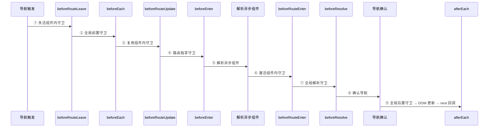

# 路由守卫

> 后台系统的"守门员"。`beforeEach` 做登录校验和权限验证是标配，但能把"完整导航解析流程"按顺序背下来的候选人很少 —— 这才是拉开差距的地方。

## 一句话总结

Vue Router 提供三级守卫体系 —— 全局守卫（`beforeEach`、`beforeResolve`、`afterEach`）、路由独享守卫（`beforeEnter`）、组件内守卫（`beforeRouteEnter`、`beforeRouteUpdate`、`beforeRouteLeave`），三者按严格的顺序编排构成完整的导航解析管道，可在任意阶段中止、重定向或继续导航。

## 核心机制

### 1. 三级守卫概览

| 级别 | 守卫 | 触发时机 | 能否访问 `this` | 常用场景 |
|------|------|---------|---------------|---------|
| 全局 | `beforeEach` | 任何导航触发前 | — | 登录验证、权限校验 |
| 全局 | `beforeResolve` | 组件解析完成后，导航确认前 | — | 最终的前置数据校验 |
| 全局 | `afterEach` | 导航完成后 | — | 页面标题、埋点、loading |
| 路由 | `beforeEnter` | 进入该路由前 | — | 单路由级别的鉴权 |
| 组件 | `beforeRouteEnter` | 进入该组件对应的路由前 | **否**（组件尚未创建） | 替代 `created` 获取数据 |
| 组件 | `beforeRouteUpdate` | 同一组件复用、参数变化时 | 是 | 监听 `params`/`query` 变化 |
| 组件 | `beforeRouteLeave` | 离开该组件时 | 是 | 未保存表单拦截 |

### 2. 全局守卫用法

```ts
// router/guards.ts
import router from './index'
import { useUserStore } from '@/store/user'
import NProgress from 'nprogress'

// 前置守卫：最先被调用，负责"能不能进"
router.beforeEach(async (to, from, next) => {
  NProgress.start()
  const userStore = useUserStore()

  // 1. 设置页面标题
  document.title = (to.meta.title as string) ?? '管理系统'

  // 2. 白名单放行
  const whiteList = ['/login', '/404', '/401']
  if (whiteList.includes(to.path)) {
    next()
    return
  }

  // 3. 未登录 → 跳转登录页
  if (!userStore.token) {
    next(`/login?redirect=${to.fullPath}`)
    return
  }

  // 4. 已登录但无角色 → 拉取角色并动态加路由
  if (!userStore.roles.length) {
    try {
      const { roles } = await userStore.fetchUserInfo()
      // 动态 addRoute……（详见动态路由章节）
      next({ ...to, replace: true })
    } catch {
      userStore.resetToken()
      next(`/login?redirect=${to.fullPath}`)
    }
    return
  }

  // 5. 检查权限
  if (to.meta.roles && !userStore.roles.some(r => to.meta.roles.includes(r))) {
    next('/401')   // 无权限页面
    return
  }

  next()
})

// 解析守卫：在组件解析完成后、导航被确认前调用
// 此时所有组件内守卫和异步组件都已解析完毕
router.beforeResolve(async (to) => {
  // 场景：确保后端返回的某些全局配置已加载完毕
  // 比 beforeEach 晚，但比导航完成早
  // 很少使用，但在需要"所有异步解析完成后再决策"时有奇效
})

// 后置守卫：导航已经完成，DOM 已更新
router.afterEach((to, from) => {
  NProgress.done()
  // 埋点：页面 PV 上报
  // analytics.track('page_view', { path: to.fullPath, title: to.meta.title })
})
```

### 3. 路由独享守卫

```ts
const routes: RouteRecordRaw[] = [
  {
    path: '/admin',
    component: AdminLayout,
    // 只在这一个路由上生效，不影响其他路由
    beforeEnter: (to, from, next) => {
      const userStore = useUserStore()
      if (userStore.roles.includes('admin')) {
        next()
      } else {
        next('/401')
      }
    }
  }
]
```

`beforeEnter` 与 `beforeEach` 的区别：
- `beforeEach` 是全局的，每次导航都走
- `beforeEnter` 只在进入**这一个路由**时触发，放在路由配置里，职责更聚焦
- 执行顺序：`beforeEach` → `beforeEnter` → `beforeRouteEnter`

### 4. 组件内守卫

```vue
<script setup lang="ts">
import { onBeforeRouteLeave, onBeforeRouteUpdate } from 'vue-router'

// 离开当前页面前
onBeforeRouteLeave((to, from) => {
  // 场景：表单未保存时弹窗确认
  if (formDirty.value) {
    const answer = window.confirm('你有未保存的更改，确定离开吗？')
    if (!answer) return false  // 返回 false 取消导航
  }
})

// 同一组件不同参数间切换（如 /user/1 → /user/2）
onBeforeRouteUpdate((to, from) => {
  // 场景：路由参数变了，重新加载数据
  const userId = to.params.id as string
  fetchUserDetail(userId)
})
</script>
```

Options API 写法：

```ts
export default {
  // beforeRouteEnter 无法访问 this（组件还没创建），需要用 next 回调
  beforeRouteEnter(to, from, next) {
    // 无法访问组件实例 this
    next((vm) => {
      // 通过 vm 访问组件实例——此时组件已挂载
      vm.fetchData()
    })
  },
  beforeRouteUpdate(to, from) {
    this.fetchData(to.params.id)
  },
  beforeRouteLeave(to, from) {
    if (this.hasUnsavedChanges) {
      return confirm('有未保存的更改，确定离开？')
    }
  }
}
```

### 5. 完整的导航解析流程



**关键要点**：
- `beforeRouteEnter` 在组件创建**之前**调用，所以访问不到 `this`
- `beforeResolve` 的区别：在 `beforeRouteEnter` 之后、导航确认之前。此时所有异步组件已解析完毕。如果你需要在**所有组件准备就绪后**做一个最终的权限判断，`beforeResolve` 是最合适的钩子
- `afterEach` 不能调用 `next()`，也不能中断导航（它只是通知你"导航完成了"）

## 深度拓展

### 追问1：`next()` 的三种调用方式及 Vue Router 4 的改进

```ts
// 方式1：next() 无参 —— 放行，确认当前导航
next()

// 方式2：next('/login') 或 next({ path: '/login' }) —— 重定向到新地址
next('/login')
next({ path: '/login', query: { redirect: to.fullPath } })

// 方式3：next(false) —— 取消当前导航，URL 重置回 from 的地址
next(false)

// 方式4：next(error) —— 把 error 传给 router.onError 注册的回调
next(new Error('导航失败'))
```

**Vue Router 4 的变化**：从 v4 开始，`next` 不再是必需的。建议在守卫中**不使用 `next`**，而是直接返回目标：

```ts
// Vue Router 4 推荐写法：返回目标路径或 false
router.beforeEach((to) => {
  if (!isAuthenticated && to.path !== '/login') {
    return '/login'                    // 返回路径 = 重定向
  }
  // return true 或不返回 = 确认导航
  // return false = 取消导航
})
```

异步场景同样用 return：守卫可以直接写成 `async` 函数，Vue Router 会等待它返回的 Promise 兑现，再根据 resolve 出的值决定放行 / 取消 / 重定向。`await` 完成后 `return` 即可，不需要退回 `next` 写法。

### 追问2：为什么 beforeRouteEnter 访问不到 `this`？

`beforeRouteEnter` 在导航确认**之前**调用，此时组件实例尚未创建，`this` 不存在。它是一个"预创建"的钩子，用于在组件渲染前获取数据。

### 追问3：多个守卫的执行顺序（同一个级别的守卫）

如果同一次导航涉及嵌套路由的多层组件守卫，执行顺序由**路由匹配的深度**决定，且离开与进入方向相反：`beforeRouteLeave` 从**最内层（子组件）向外层**逐级执行——先离开子、再离开父；进入守卫（`beforeRouteEnter`）则从**最外层（父组件）向内层**执行——先进入父、再进入子。

## 项目实战

```ts
// 典型后台管理系统的 beforeEach 完整逻辑
// router/guards.ts
import router from './index'
import { useUserStore } from '@/store/user'
import { whiteList } from './routes'
import NProgress from 'nprogress'
import 'nprogress/nprogress.css'

NProgress.configure({ showSpinner: false })

router.beforeEach(async (to, from, next) => {
  NProgress.start()
  const userStore = useUserStore()

  // Step 1: 页面标题
  const title = to.meta.title as string
  if (title) {
    document.title = `${title} - Admin System`
  }

  // Step 2: token 校验
  if (userStore.token) {
    if (to.path === '/login') {
      next('/')
      NProgress.done()
    } else {
      // 有 token 但可能还没拉角色信息
      if (userStore.roles.length === 0) {
        try {
          await userStore.fetchUserInfo()
          // 动态注入权限路由（略）
          next({ ...to, replace: true })
        } catch {
          userStore.resetToken()
          next(`/login?redirect=${to.path}`)
          NProgress.done()
        }
      } else {
        // 权限校验
        if (to.meta.roles) {
          const hasRole = userStore.roles.some(r => (to.meta.roles as string[]).includes(r))
          if (hasRole) {
            next()
          } else {
            next('/401')
            NProgress.done()
          }
        } else {
          next()
        }
      }
    }
  } else {
    if (whiteList.includes(to.path)) {
      next()
    } else {
      next(`/login?redirect=${to.path}`)
      NProgress.done()
    }
  }
})

router.afterEach(() => {
  NProgress.done()
})
```

## 易错点

**❌ `beforeEach` 中没有处理 `next()` 之后继续执行代码的问题**

```ts
// ❌ 错误：next() 之后代码仍会执行
router.beforeEach((to, from, next) => {
  if (token) {
    next()
  }
  next('/login')  // 无论 token 是否存在，这行都会执行！
})

// ✅ 正确：next() 后必须有 return
router.beforeEach((to, from, next) => {
  if (token) {
    next()
    return  // 关键！否则继续往下走
  }
  next('/login')
})
```

**❌ 在 Vue Router 4 中混用 return 和 next**
选择一个方式并保持一致：要么所有地方用 return 返回值，要么所有地方用 next。

**❌ `beforeEach` 中死循环**
在 `beforeEach` 中 `next('/login')`，而 `/login` 又会触发 `beforeEach`，如果 `/login` 又没在白名单里，就会无限循环。确保重定向的目标路径一定会被守卫放行。

## 面试信号

问"Vue Router 的导航守卫有哪些"时，面试官真正想听的是三层递进：
1. **背出三类七种守卫**：全局（beforeEach / beforeResolve / afterEach）、路由独享（beforeEnter）、组件内（beforeRouteEnter / beforeRouteUpdate / beforeRouteLeave）
2. **说出完整执行顺序**：beforeRouteLeave → beforeEach → beforeRouteUpdate → beforeEnter → 解析组件 → beforeRouteEnter → beforeResolve → afterEach → DOM更新 → next回调
3. **举出一个真实场景**：`beforeEach` 做登录验证 + 权限校验 + 页面标题 + NProgress 进度条；`beforeRouteLeave` 做表单未保存拦截

## 相关阅读

- [动态路由](./dynamic-routing.md) — beforeEach 与 addRoute 的配合是权限系统的核心
- [KeepAlive + Router](./keepalive-integration.md) — beforeRouteEnter 与 onActivated 的配合场景
- [导航故障处理](./navigation-failures.md) — 守卫中取消导航的各种情况

## 更新记录

- 2026-07-18：事实修正（Phase 3）——async 守卫推荐直接 return（删去「异步时仍推荐 next」的错误说法）、嵌套路由守卫执行方向修正（leave 由内向外、enter 由外向内）
- 2026-07：完整填充（Phase 1），含完整导航解析流程图、三种守卫使用方式、项目实战
