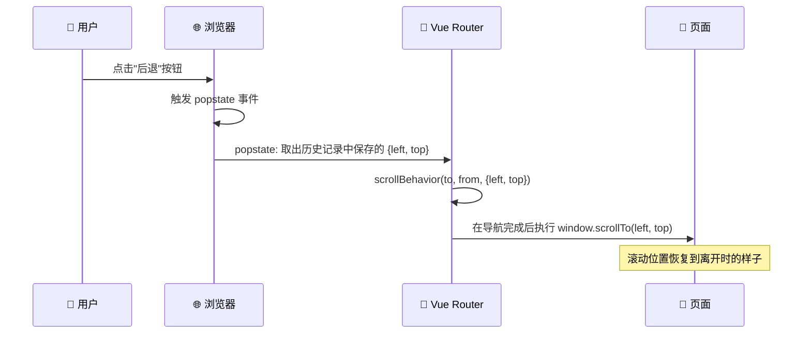

# scrollBehavior

> 面试频率不高，但"知道 `savedPosition` 是和 `popstate` 事件联动的"这一点，能让面试官觉得你对浏览器机制有系统性的理解。

## 一句话总结

`scrollBehavior` 是 Vue Router 提供的滚动行为控制函数，在导航完成后触发，可以根据目标路由和来源路由决定滚动到页面顶部、上一次的保存位置或指定锚点。核心亮点是 `savedPosition` 与浏览器前进/后退的联动机制。

## 核心机制

### 1. scrollBehavior 基础用法

```ts
import { createRouter, createWebHistory } from 'vue-router'

const router = createRouter({
  history: createWebHistory(),
  routes: [...],
  scrollBehavior(to, from, savedPosition) {
    // savedPosition 只有在浏览器前进/后退（popstate 触发）时才有值
    // 如果是 router.push() 或 router.replace() 触发，savedPosition 为 null

    // 场景1：浏览器前进/后退 → 恢复到上次的滚动位置
    if (savedPosition) {
      return savedPosition  // { left: number, top: number }（VR3 的 x/y 在 VR4 改名为 left/top）
    }

    // 场景2：有锚点（hash）→ 滚动到锚点
    if (to.hash) {
      return {
        el: to.hash,
        behavior: 'smooth'
      }
    }

    // 场景3：普通导航 → 回到顶部
    return { top: 0 }
  }
})
```



### 2. `savedPosition` 与 `popstate` 的联动

这是整个 `scrollBehavior` 中最重要的知识点。

**浏览器前进/后退时**，浏览器本身会尝试恢复滚动位置（部分浏览器），但这种行为是不一致的。Vue Router 通过以下机制来实现可控的滚动恢复：

1. 用户在页面 A 滚动到某个位置
2. 用户导航到页面 B（`pushState` 触发）
3. 在 `pushState` 之前，Vue Router 已经在内部记录了页面 A 当前的 `(scrollX, scrollY)`，并存入浏览器的历史记录条目中（通过 `history.state`）
4. 用户点击后退，浏览器触发 `popstate`
5. Vue Router 从 `history.state` 中读出之前保存的位置
6. Vue Router 调用 `scrollBehavior(to, from, savedPosition)`，其中 `savedPosition` = 之前在步骤 3 中保存的 `{ left, top }`
7. 返回值决定最终的滚动位置

```ts
// Vue Router 内部简化逻辑
// 1. 离开页面时保存滚动位置（VR4 坐标格式是 { left, top }，对齐 ScrollToOptions）
function saveScrollPosition(route: RouteLocation) {
  const pos = { left: window.scrollX, top: window.scrollY }
  history.replaceState(
    { ...history.state, scroll: pos },  // 保存到当前 history entry 的 state 中
    ''
  )
}

// 2. popstate 时读取
window.addEventListener('popstate', (e) => {
  const savedPosition = e.state?.scroll  // 读出来
  const result = router.scrollBehavior?.(to, from, savedPosition)
  if (result) {
    // 导航完成后应用到窗口
    window.scrollTo({ left: result.left ?? 0, top: result.top ?? 0 })
  }
})
```

**结论**：`savedPosition` 有值 = 这次导航是前进/后退触发的（popstate）。编程式导航（`router.push`、`router.replace`）不会产生 `savedPosition`。

### 3. 三种返回值类型

```ts
// 类型1：坐标对象
return { top: 0, left: 0 }                    // 回到顶部
return { top: 0, behavior: 'smooth' }          // 平滑滚动到顶部

// 类型2：CSS 选择器（锚点）
return { el: '#main-content', behavior: 'smooth' }
return { el: to.hash }                          // 使用 hash 的 # 部分

// 类型3：falsy / Promise（延迟滚动）
return false          // 不进行任何滚动操作
return null           // 同上
return new Promise(resolve => {
  // 等待数据加载完再滚动
  setTimeout(() => resolve({ top: 0 }), 500)
})
```

## 深度拓展

### 追问1：异步滚动 —— 数据没加载完怎么滚？

这是最实际的问题。如果页面到达后数据还没回来，DOM 高度不够，`scrollBehavior` 返回的坐标滚动到一半就停住了。

```ts
// 方案1：返回 Promise，等数据就绪后再滚动
scrollBehavior(to, from, savedPosition) {
  return new Promise((resolve) => {
    // 延迟到页面数据加载完成
    setTimeout(() => {
      resolve({ top: 0 })
    }, 300)  // 给数据加载留时间
  })
}
```

**更好的方案**是使用 Vue Router 4.x 的 `scrollBehavior` 返回 Promise 配合路由的 `savedPosition`：

```ts
scrollBehavior(to, from, savedPosition) {
  if (savedPosition) {
    return savedPosition
  }

  // 异步：等到 nextTick 后再滚动（此时组件已挂载，但数据可能还在加载中）
  // 更可靠的方案是页面内部用 watch + nextTick 自行滚动
  return new Promise((resolve) => {
    setTimeout(() => {
      resolve({
        top: 0,
        behavior: 'smooth'
      })
    }, 100)
  })
}
```

### 追问2：前端路由中锚点跳转的兼容处理

Hash 模式下 `#` 被路由占用，原生锚点跳转不生效。`scrollBehavior` 的 `el` 选项就是为此设计的：

```ts
// 不管是 Hash 模式还是 History 模式，这样写都能正确滚动到锚点
scrollBehavior(to, from, savedPosition) {
  if (to.hash) {
    // 去掉 #，等待 DOM 更新后滚动到对应元素
    return {
      el: to.hash,        // '#section-title'
      behavior: 'smooth',
      top: 80             // 顶栏固定高度补偿
    }
  }
}
```

### 追问3：keep-alive 缓存页面的滚动位置

这是 KeepAlive 和 scrollBehavior 配合的重点：

```vue
<!-- 方案：利用 ref 保存和恢复滚动容器 -->
<script setup lang="ts">
import { ref, onActivated, onDeactivated, nextTick } from 'vue'

const scrollContainer = ref<HTMLElement>()
const savedScrollTop = ref(0)

onActivated(() => {
  nextTick(() => {
    if (scrollContainer.value) {
      scrollContainer.value.scrollTop = savedScrollTop.value
    }
  })
})

onDeactivated(() => {
  if (scrollContainer.value) {
    savedScrollTop.value = scrollContainer.value.scrollTop
  }
})
</script>

<template>
  <div ref="scrollContainer" class="scroll-area">
    <!-- 列表内容 -->
  </div>
</template>
```

`scrollBehavior` 管理的是 **`window` 级别的滚动**。如果你的页面是有独立滚动容器（如 `overflow: auto` 的 `<el-main>`），就需要自己维护滚动位置。

## 项目实战

```ts
// 实际的 scrollBehavior 配置 —— 覆盖三种场景
const router = createRouter({
  history: createWebHistory(),
  routes: [...],
  scrollBehavior(to, from, savedPosition) {
    // 1. 浏览器前进/后退 → 恢复位置
    if (savedPosition) {
      return savedPosition
    }

    // 2. 有锚点（#xxx）→ 平滑滚动到锚点，考虑固定顶栏高度
    if (to.hash) {
      return {
        el: to.hash,
        behavior: 'smooth',
        top: 60   // 顶栏高度补偿
      }
    }

    // 3. 从列表页 A 切到列表页 B（同样都是列表）→ 不滚回顶部（保持阅读位置）
    // 通过 meta 字段标记
    if (to.meta?.preserveScroll && from.meta?.sameScrollGroup === to.meta?.sameScrollGroup) {
      return false  // 不做滚动
    }

    // 4. 默认：回到顶部
    return { top: 0, behavior: 'smooth' }
  }
})
```

```ts
// 路由配置中配合 meta 字段
const routes = [
  {
    path: '/users',
    meta: { title: '用户列表', preserveScroll: true, sameScrollGroup: 'data-list' }
  },
  {
    path: '/orders',
    meta: { title: '订单列表', preserveScroll: true, sameScrollGroup: 'data-list' }
  },
]
```

## 易错点

**❌ 以为 `savedPosition` 在所有导航中都有值**
`savedPosition` 只在浏览器前进/后退（popstate）时出现，`router.push` 和 `router.replace` 时始终是 `null/undefined`。

**❌ History 模式和 Hash 模式的滚动行为差异**
两者在 `scrollBehavior` 层面的表现一致，但 Hash 模式下 URL 中的 `#fragment` 既是路由的一部分又是浏览器锚点，容易产生二义性。建议 Hash 模式下统一用 `scrollBehavior` 的 `el` 处理，避免依赖浏览器的原生行为。

**❌ 忘记考虑固定定位元素的遮挡**
`{ el: '#target' }` 把元素滚动到视口顶部。但如果页面有 `position: fixed` 的顶栏（如 60px 高的 header），元素会被遮挡。加上 `top: 60` 偏移量。

## 面试信号

当面试官问"前进后退时如何恢复滚动位置"，你的回答骨架：

1. **`savedPosition` 与 `popstate` 联动**：Vue Router 在离开页面时把 `(scrollX, scrollY)` 写入 `history.state`，`popstate` 触发时从 `e.state` 取出，传给 `scrollBehavior` 作为 `savedPosition`
2. **不是自动的**：`savedPosition` 只是告诉你"上次在这里"，真正恢复滚动的是 `scrollBehavior` 中 `return savedPosition` 这一行
3. **与 KeepAlive 的区别**：`scrollBehavior` 管 `window` 级别的滚动（前进后退），KeepAlive 管组件级别的滚动（标签页切换）。两者独立但互补

## 相关阅读

- [history / hash 模式](./history-vs-hash.md) — popstate 机制的完整讲解
- [KeepAlive + Router](./keepalive-integration.md) — 页面级别滚动与 KeepAlive 组件的配合
- [导航故障处理](./navigation-failures.md) — 导航取消时的滚动位置变化

## 更新记录

- 2026-07-18：事实修正（Phase 3 二审）——时序图中残留的 VR3 坐标 `{x,y}` 同步为 VR4 的 `{left, top}`
- 2026-07-18：事实修正（Phase 3）——savedPosition 坐标格式由 VR3 的 `{ x, y }` 更正为 VR4 的 `{ left, top }`，内部伪代码同步（history.state 的 scroll 字段）
- 2026-07：完整填充（Phase 1），含 savedPosition 与 popstate 联动机制、异步滚动、锚点偏移
