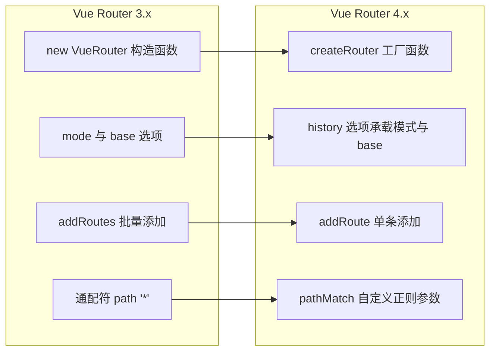

# Vue Router 4 新特性

> 2026 面经里 VueRouter 权重最高的考点。面试官常从"Vue Router 4 和 3 有什么区别"切入，真正想听的是 Composition API 用法——尤其是「解构 route 丢响应性」这个坑，主动讲出来就和只会背 API 的人拉开差距。

## 一句话总结

Vue Router 4 是配套 Vue 3 的重写版本：用 `createRouter` / `createWebHistory` 工厂函数替代 `new VueRouter`（ESM 具名导出，tree-shaking 友好），新增 `useRouter` / `useRoute` 组合式 API，移除 `*` 通配符（改用 `:pathMatch(.*)*`）和 `addRoutes`（只留 `addRoute`），导航守卫的 `next` 变为可选（推荐用返回值），重复导航从 reject 改为 resolve 出一个 `NavigationFailure`。

## 核心机制

### 1. 实例创建：工厂函数替代构造函数



```ts
import { createRouter, createWebHistory } from 'vue-router'

const router = createRouter({
  // VR3 的 mode: 'history' + base 选项 → 统一收进 history 工厂函数
  history: createWebHistory(import.meta.env.BASE_URL),
  routes
})
app.use(router)  // 替代 VR3 的 Vue.use(VueRouter) + new Vue({ router })
```

三个 history 工厂函数：`createWebHistory`（History 模式）、`createWebHashHistory`（Hash 模式）、`createMemoryHistory`（SSR / 测试）。没 import 的那个整个不进 bundle——这是"tree-shaking 友好"的直接体现。

### 2. 路由匹配：`*` 通配符移除

VR4 中写 `path: '*'` 会在运行时直接抛错 `Catch all routes ("*") must now be defined using a param with a custom regexp`，404 兜底改用带自定义正则的参数：

```ts
{ path: '/:pathMatch(.*)*', name: 'NotFound', component: NotFound }
// 圆括号里是自定义正则 (.*)；末尾的 * 表示参数可重复
// 匹配 /a/b/c 时 params.pathMatch = ['a', 'b', 'c']（按 / 分段的数组）
// 末尾不加 * 也能匹配，但按 name 反向导航时斜杠会被编码成 %2F
```

同时匹配策略从 VR3 的"声明顺序优先"改为**路径评分排序**：静态段分高、动态段分低、`pathMatch` 这类 catch-all 分数最低，天然兜底，与声明位置无关。

### 3. Composition API：useRouter 与 useRoute

```vue
<script setup lang="ts">
import { computed, toRefs, watch } from 'vue'
import { useRoute, useRouter } from 'vue-router'

const router = useRouter()  // 路由器实例：push / replace / addRoute
const route = useRoute()    // 当前路由：reactive 对象，随导航自动更新

// ❌ 解构 = 当次导航的快照，之后不再更新
const { path, query } = route

// ✅ 三种保住响应性的方式
const page = computed(() => Number(route.query.page ?? 1))   // 方式一：computed
const { path: pathRef } = toRefs(route)                      // 方式二：toRefs
watch(() => route.query.keyword, (kw) => fetchList(kw))      // 方式三：watch getter
</script>
```

为什么解构会丢：每次导航后 route 的属性被**整体替换**成新对象，解构出的变量还指着旧值。模板里 `$route` / `$router` 仍然可用（Options API 兼容层）。

组件内守卫也有对应 composable：`onBeforeRouteUpdate` / `onBeforeRouteLeave` 可在 `setup` 中注册；`beforeRouteEnter` 没有对应 composable（组件尚未创建），逻辑放全局守卫或路由独享 `beforeEnter`。

### 4. 守卫写法：next 可选，推荐 return

```ts
// VR3：next 必须恰好调用一次——漏调导航挂起，双调报错
// VR4：用返回值表达结果（next 仍兼容，但同一守卫里别混用）
router.beforeEach((to) => {
  if (to.meta.requiresAuth && !hasToken()) {
    return { path: '/login', query: { redirect: to.fullPath } }  // 重定向
  }
  // return false 取消导航；返回 undefined 或 true 放行
})
```

return 风格的收益：不会忘调、不会重复调用，且返回值类型能被 TS 精确推导。

### 5. 重复导航不再 reject

VR 3.1 起 `push` 返回 Promise，push 到相同路由会 reject 一个 `NavigationDuplicated` 错误，很多项目全局 patch `router.push` 来吞掉它。VR4 改为：**导航层面的失败不再 reject**，Promise 总是 resolve——成功时值为 `undefined`，失败时是一个 `NavigationFailure` 对象：

```ts
import { isNavigationFailure, NavigationFailureType } from 'vue-router'

const failure = await router.push('/search?q=vue')
if (isNavigationFailure(failure, NavigationFailureType.duplicated)) {
  // 重复导航：静默即可
} else if (isNavigationFailure(failure, NavigationFailureType.aborted)) {
  // 被守卫 return false 拦截
}
// failure === undefined 表示导航成功；只有代码抛异常才会真正 reject
```

## 深度拓展

### 追问1：为什么工厂函数对 tree-shaking 友好？

VR3 导出一个 `VueRouter` class，Hash / History 两种模式的实现都挂在实例内部，靠 `mode` 字符串在运行时分支——打包器无法静态分析删除没用到的模式。VR4 把每种能力拆成独立的具名导出（`createWebHistory`、`createWebHashHistory`、`RouterLink` 等），ESM 静态 import 让打包器能精确剔除未引用的部分。

### 追问2：setup 外怎么拿 router？

`useRouter` / `useRoute` 底层是 `inject`，只在组件 `setup` 同步执行期有注入上下文。守卫文件、axios 拦截器、pinia store 里调用会得到 `undefined` 并伴随 inject 警告。正确做法是直接 import 单例：

```ts
// router/permission.ts —— 守卫文件里直接用实例
import { router } from './index'

router.beforeEach(async (to) => {
  if (!hasToken() && to.path !== '/login') {
    return { path: '/login', query: { redirect: to.fullPath } }
  }
})
// 守卫回调里要路由信息用参数 to / from，不要 useRoute
// 其他模块里取当前路由：router.currentRoute.value（VR4 里 currentRoute 是 ref）
```

### 追问3：TypeScript 支持强在哪？

- 源码用 TS 重写，`RouteRecordRaw` 注解 routes 数组、`RouteLocationNormalized` 注解守卫参数，全部开箱即用
- `meta` 类型增强：`declare module 'vue-router'` 扩展 `RouteMeta` 接口，`to.meta.requiresAuth` 就有类型检查
- typed routes：4.4+ 实验性能力，通常配合 `unplugin-vue-router` 从文件生成路由类型映射，`push({ name: 'user' })` 时路由名和 `params` 都有编译期校验

### 追问4：其他破坏性变化速览

| Vue Router 3 | Vue Router 4 | 说明 |
|--------------|--------------|------|
| `router.match()` | `router.resolve()` | 解析路由地址 |
| `router.getMatchedComponents()` | `router.currentRoute.value.matched` | `currentRoute` 变成 ref |
| `<transition>` 包裹 `<router-view>` | `<router-view>` 的 `v-slot` 里包 `<transition>` | `<keep-alive>` 同理 |
| `<router-link>` 的 `tag` / `event` prop | `custom` prop + `v-slot` 自定义渲染 | |
| `router.app` | 移除；`app.use(router)` 可安装到多个应用 | |

## 项目实战

```ts
// router/index.ts —— VR4 + TS 的典型骨架
import { createRouter, createWebHistory, type RouteRecordRaw } from 'vue-router'

const routes: RouteRecordRaw[] = [
  { path: '/', redirect: '/dashboard' },
  {
    path: '/dashboard',
    name: 'Dashboard',
    component: () => import('@/views/dashboard/index.vue'),
    meta: { title: '仪表盘', requiresAuth: true }
  },
  // 兜底路由：位置无关（评分制），但按惯例仍放末尾便于阅读
  { path: '/:pathMatch(.*)*', name: 'NotFound', component: () => import('@/views/404.vue') }
]

export const router = createRouter({
  history: createWebHistory(import.meta.env.BASE_URL),
  routes
})
```

```vue
<!-- 列表页：URL 即状态，query 驱动请求 -->
<script setup lang="ts">
const route = useRoute()
const router = useRouter()

const page = computed(() => Number(route.query.page ?? 1))
watch(page, (p) => fetchList(p), { immediate: true })

async function goPage(p: number) {
  const failure = await router.push({ query: { ...route.query, page: p } })
  if (failure) return  // NavigationFailure：被守卫拦截或重复导航，不弹错误提示
}
</script>
```

## 易错点

**❌ 解构 `useRoute()` 丢响应性**
`const { query } = useRoute()` 拿到的是当次导航的快照——route 属性在每次导航后整体替换，解构变量不会跟着变。"第一次进页面正常、切换参数后视图不刷新"多半是它。用 `computed(() => route.query.xxx)`、`toRefs(route)` 或 `watch(() => route.query, ...)` 保住响应性。

**❌ `path: '*'` 写法残留**
VR3 迁移最常见的运行时报错：`Catch all routes ("*") must now be defined using a param with a custom regexp`。改成 `/:pathMatch(.*)*`，并注意末尾 `*` 的分段数组语义。

**❌ 沿用"404 必须放最后"的旧结论**
VR3 按声明顺序匹配，`*` 必须放最后；VR4 按路径评分排序，catch-all 分数最低天然兜底，位置不影响匹配。真正的坑在动态权限路由：`addRoute` 补充路由之前，当前这次导航已按旧路由表匹配到 404，需要 `return to.fullPath` 重放导航（见[动态路由](./dynamic-routing.md)）。

**❌ 在 setup 外调用 useRouter / useRoute**
两者依赖 `inject`，只能在 `setup` 同步执行期调用；写在守卫文件、异步回调、工具函数里会拿到 `undefined`。守卫文件直接 `import router`，守卫回调用参数 `to` / `from`。

**❌ 还在 try/catch 里捕重复导航**
VR3.1 时代全局 patch `router.push` 吞 `NavigationDuplicated` 的代码在 VR4 里是死代码——push 因守卫拦截或重复导航失败时不 reject 而是 resolve 出 `NavigationFailure`，try/catch 捕不到，必须检查返回值 + `isNavigationFailure`。

## 面试信号

当面试官问"Vue Router 4 相比 3 有哪些变化"，回答骨架：

1. **创建方式**：`createRouter` + `createWebHistory` 工厂函数替代 `new VueRouter` + `mode` 字符串；ESM 具名导出让未用到的模块可被 tree-shaking
2. **路由匹配**：`*` 通配符移除，404 用 `/:pathMatch(.*)*`；匹配改为路径评分制，与声明顺序无关
3. **Composition API**：`useRouter` 拿实例、`useRoute` 拿响应式当前路由——主动讲"解构丢响应性、setup 外不可用"两个坑
4. **导航行为**：守卫用返回值替代 `next`；push 失败不再 reject，用 `isNavigationFailure` 判断 `NavigationFailure`
5. **TS 支持**：源码 TS 重写，`RouteRecordRaw` / `RouteMeta` 增强，4.4+ 实验性 typed routes

## 相关阅读

- [history / hash 模式](./history-vs-hash.md) — `createWebHistory` / `createWebHashHistory` 的底层机制
- [路由守卫](./route-guards.md) — 完整守卫链与执行顺序
- [动态路由](./dynamic-routing.md) — `addRoute` 权限路由与 404 重放
- [导航故障处理](./navigation-failures.md) — `NavigationFailureType` 全部类型与 `router.isReady`
- [面试题库：Vue Router](../面试题库/VueRouter.md) — Q8 考察本篇

## 更新记录

- 2026-07-18：事实修正（Phase 3 二审）——typed routes 版本标注 4.2+ 更正为 4.4+（官方文档 Typed Routes v4.4.0+）
- 2026-07-18：初次填充（Phase 2 补缺）——API 变化、Composition API 两大坑、NavigationFailure、TS 支持
