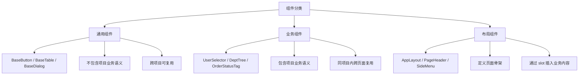

# 组件设计

> "组件接口设计得好不好，看调用方代码就知道 —— 如果调用一个组件要传 15 个 prop，那这个组件就该拆了。"

---

## 一句话总结

Vue3 组件设计围绕三个维度：**Props（数据进）**、**Events（事件出）**、**Slots（内容扩展）**。好的组件设计遵循**单一职责、可组合、可配置、可测试**四大原则。核心决策有两个：(1) 这是通用组件还是业务组件？-- 决定了复用的边界；(2) Props 走受控还是非受控？-- 决定了数据流向。

---

## 核心机制

### 1. 组件分类与职责



**通用组件要求最严格**：不能出现任何项目特有的枚举、API 路径、业务术语。如果你看到一个 `BaseButton` 组件里写了 `if (type === 'user')`，那它就不是通用组件。

**业务组件是降本增效的关键**：把高频的业务选择逻辑封装成组件，10 个页面共用同一个 `UserSelector`，而不是每个页面手写一遍 `el-select` + 搜索 + 分页。

### 2. Props 设计：受控 vs 非受控

```vue
<!-- 受控组件：数据由父组件完全掌控 -->
<ElPagination
  :current-page="page"
  :total="total"
  @update:current-page="page = $event"
/>

<!-- 非受控组件：组件内部自己管理状态 -->
<BaseCollapse>
  <template #title>展开更多</template>
  <p>折叠内容...</p>
</BaseCollapse>
<!-- 展开/收起状态完全在 BaseCollapse 内部，父组件不感知 -->
```

**选择原则**：

| 场景 | 选择 |
|------|------|
| 表单输入类（Input、Select、DatePicker） | **受控**：父组件需要拿到值 |
| 纯 UI 状态（折叠、Tab 切换、弹窗显隐） | **非受控**优先，除非父组件需要控制 |
| 数据展示类（Table、List） | **受控**：数据源来自父组件请求 |

Vue3 中实现受控/非受控切换的经典模式：

```vue
<script setup lang="ts">
// 支持受控和非受控两种模式的 Dialog
interface Props {
  visible?: boolean        // 受控：由父组件控制
}
const props = withDefaults(defineProps<Props>(), {
  visible: undefined       // 不传 = 非受控模式
})
const emit = defineEmits<{
  'update:visible': [value: boolean]
}>()

const innerVisible = ref(false)
const isControlled = computed(() => props.visible !== undefined)
const show = computed({
  get: () => isControlled.value ? props.visible! : innerVisible.value,
  set: (val) => {
    if (isControlled.value) {
      emit('update:visible', val)
    } else {
      innerVisible.value = val
    }
  },
})
</script>
```

### 3. 插槽设计：默认/具名/作用域的选择

```vue
<template>
  <div class="card">
    <!-- 1. 默认插槽：只有一个可变区域 -->
    <slot />

    <!-- 2. 具名插槽：多个预定义扩展点 -->
    <div class="card-header">
      <slot name="header" />
    </div>
    <div class="card-footer">
      <slot name="footer" />
    </div>

    <!-- 3. 作用域插槽：暴露内部数据给父组件 -->
    <div v-for="item in list" :key="item.id">
      <slot name="item" :item="item" :index="index" />
    </div>
  </div>
</template>
```

| 插槽类型 | 使用时机 | 示例 |
|---------|---------|------|
| 默认插槽 | 组件只有一个需要自定义的区域 | `<BaseCard>{{ content }}</BaseCard>` |
| 具名插槽 | 多个预定义的可替换区域 | `<BaseCard><template #header>...</template></BaseCard>` |
| 作用域插槽 | 父组件需要访问子组件内部数据 | `<BaseTable><template #cell="{ row, col }">...</template></BaseTable>` |

### 4. v-model：组件通信的标准接口

```vue
<!-- 父组件：v-model 语法糖 -->
<UserSelector v-model="selectedUserId" />

<!-- 等价于 -->
<UserSelector
  :model-value="selectedUserId"
  @update:model-value="selectedUserId = $event"
/>

<!-- 多个 v-model -->
<UserSelector
  v-model="selectedUserId"
  v-model:department="selectedDeptId"
/>
```

```vue
<!-- 子组件实现 -->
<script setup lang="ts">
interface Props {
  modelValue: number | null
  department: number | null
}
defineProps<Props>()
const emit = defineEmits<{
  'update:modelValue': [value: number | null]
  'update:department': [value: number | null]
}>()

function selectUser(user: User) {
  emit('update:modelValue', user.id)
}
</script>
```

**v-model 是 Vue3 组件通信的最佳实践**：它提供了明确的"双向数据绑定"语义，比 `emit('someEvent', val)` 更标准化。

---

## 深度拓展

### 追问：什么时候拆组件？什么时候合组件？

拆的信号：
- 组件超过 **200 行**（template + script）
- 同一个 `v-for` / `v-if` 判断逻辑出现 **3 次以上**
- 一段逻辑有**独立的输入/输出**，不需要看上下文就能理解

不拆的信号：
- 拆开后需要 **5+ 个 props/emit** 来传递数据（说明这两个组件耦合太紧，要么不拆，要么重新设计边界）
- 只在**一个地方**使用，且没有独立复用的可能

---

## 项目实战

### 封装"用户选择器"业务组件（完整思路）

需求：后台管理系统多个页面都需要"选择用户"，功能包括远程搜索 + 下拉分页 + 多选。

```vue
<!-- src/components/business/UserSelector.vue -->
<script setup lang="ts">
import { ref, watch } from 'vue'
import { getUserList } from '@/api/user'

interface Props {
  modelValue: number | number[] | null      // v-model 双向绑定
  multiple?: boolean                        // 是否多选
  disabled?: boolean                        // 是否禁用
  placeholder?: string                      // 占位文本
}
const props = withDefaults(defineProps<Props>(), {
  multiple: false,
  disabled: false,
  placeholder: '请选择用户',
})

const emit = defineEmits<{
  'update:modelValue': [value: number | number[] | null]
  'change': [users: User | User[]]          // 选中变更时抛出完整 User 对象
}>()

const options = ref<User[]>([])
const loading = ref(false)
const total = ref(0)
const query = ref('')

async function search(keyword: string) {
  loading.value = true
  const { data } = await getUserList({ keyword, page: 1, size: 20 })
  options.value = data.records
  total.value = data.total
  loading.value = false
}

function handleChange(val: number | number[]) {
  emit('update:modelValue', val)
  // 找到完整的 User 对象并通知父组件
  const selected = Array.isArray(val)
    ? options.value.filter(u => val.includes(u.id))
    : options.value.find(u => u.id === val)
  emit('change', selected as any)
}

// 打开下拉时自动搜索
function handleVisibleChange(visible: boolean) {
  if (visible) search(query.value)
}
</script>

<template>
  <el-select
    :model-value="modelValue"
    :multiple="multiple"
    :disabled="disabled"
    :placeholder="placeholder"
    filterable
    remote
    :remote-method="search"
    :loading="loading"
    @change="handleChange"
    @visible-change="handleVisibleChange"
  >
    <el-option
      v-for="user in options"
      :key="user.id"
      :label="`${user.name} (${user.deptName})`"
      :value="user.id"
    />
  </el-select>
</template>
```

**设计要点回顾**：
- **Props 进**：`modelValue`（受控数据）、`multiple`、`disabled`、`placeholder`（配置项）
- **Events 出**：`update:modelValue`（标准双向绑定）、`change`（扩展信息）
- **接口隔离**：内部自己调用 `getUserList` API，外部完全不感知数据来源

---

## 易错点

1. **❌ Props 直接解构赋值**：`const { name } = props` 会丢失响应式，要解构用 `toRefs(props)`。
2. **❌ 通用组件里写业务枚举**：`<BaseButton :type="UserType.Admin">` —— 业务语义泄露到了通用层。
3. **❌ emit 命名不规范**：应该用 `update:modelValue` 而非 `input`/`change`，方便 v-model 绑定。

---

## 面试信号

当你说"我封装了一个 XX 业务组件"，面试官会从这三个维度考察你的设计能力：

1. **Props 维度**："这个组件接收什么参数？必传还是可选？有没有默认值？"
2. **Events 维度**："组件状态变更怎么通知父组件？走 v-model 还是事件？"
3. **Slots 维度**："哪些部分允许自定义？表头？单元格？还是整个面板？"

能从容回答这三个问题，说明你**不是照着 UI 画组件，而是从接口设计出发**。

---

## 相关阅读

- [项目分层设计](./project-structure.md) — 业务组件和通用组件的目录归属
- [模块解耦](./module-decoupling.md) — 组件间通信的更多选择
- [设计模式](./design-patterns.md) — 策略模式、装饰器在组件设计中的应用

---

## 更新记录

- 2026-07-06：完成内容填充，新增受控/非受控双模式实现、UserSelector 完整封装思路、props/events/slots 三维设计法
