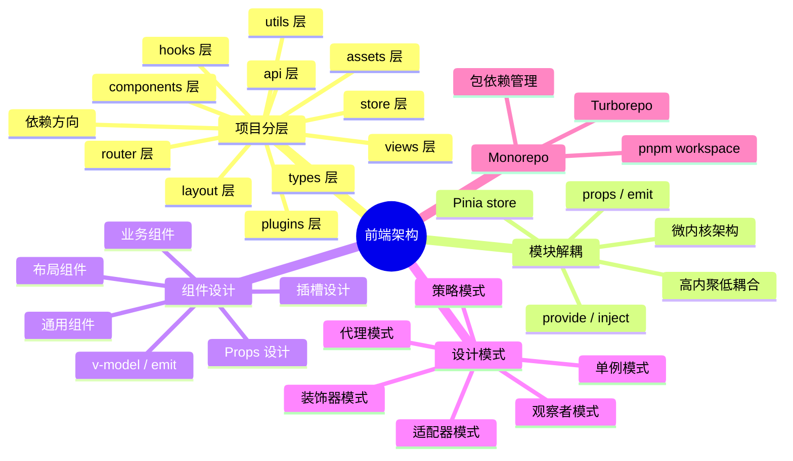

# 前端架构 知识地图

## 推荐学习顺序

### 一、核心架构

1. ⭐⭐⭐⭐⭐ [项目分层设计](./project-structure.md)
2. ⭐⭐⭐⭐⭐ [组件设计](./component-design.md)
3. ⭐⭐⭐⭐   [模块解耦](./module-decoupling.md)
4. ⭐⭐⭐⭐   [设计模式在前端](./design-patterns.md)
5. ⭐⭐⭐⭐   [Monorepo](./monorepo.md)

### 二、微前端（了解为主，面试低频）

6. ⭐⭐⭐ [微前端概述](./微前端/overview.md)
7. ⭐⭐⭐ [qiankun](./微前端/qiankun.md)
8. ⭐⭐   [Module Federation](./微前端/module-federation.md)
9. ⭐⭐   [iframe 方案](./微前端/iframe.md)

## 知识点索引

| 知识点 | 频率 | 难度 | 手写 | 状态 |
|--------|------|------|------|------|
| [项目分层设计](./project-structure.md) | ⭐⭐⭐⭐⭐ | 中级 | — | filled |
| [组件设计](./component-design.md) | ⭐⭐⭐⭐⭐ | 高级 | — | filled |
| [模块解耦](./module-decoupling.md) | ⭐⭐⭐⭐ | 高级 | — | filled |
| [设计模式在前端](./design-patterns.md) | ⭐⭐⭐⭐ | 高级 | — | filled |
| [Monorepo](./monorepo.md) | ⭐⭐⭐⭐ | 中级 | — | filled |
| [微前端概述](./微前端/overview.md) | ⭐⭐⭐ | 高级 | — | filled |
| [qiankun](./微前端/qiankun.md) | ⭐⭐⭐ | 高级 | — | filled |
| [Module Federation](./微前端/module-federation.md) | ⭐⭐ | 高级 | — | filled |
| [iframe 方案](./微前端/iframe.md) | ⭐⭐ | 初级 | — | filled |
