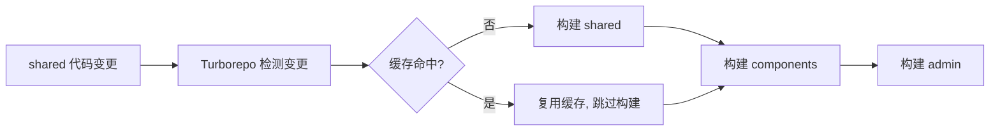

# Monorepo

> "Monorepo 不是把 5 个项目拷到一个文件夹，而是用 workspace 协议让它们共享依赖、统一构建、版本联动。"

---

## 一句话总结

Monorepo（单仓库多包）通过 **pnpm workspace** 管理包之间的依赖引用，通过 **Turborepo / Nx** 实现增量构建和任务编排。核心价值在于：**一套 `node_modules`**（节省磁盘）、**一份配置**（ESLint/TSConfig 共享）、**一次 PR 联动**（改 shared 包时自动跑所有下游包的测试）。适用场景：组件库 + 文档站 + 示例项目在同一仓库，或后台系统的多个子应用共享基础包。

---

## 核心机制

### 1. pnpm workspace 配置

```
my-admin/
├── pnpm-workspace.yaml           # 声明 workspace 包
├── package.json                  # 根：公共脚本和 devDependencies
├── packages/
│   ├── shared/                   # @my-admin/shared — 公共工具/类型
│   │   ├── src/
│   │   │   ├── utils/
│   │   │   └── types/
│   │   └── package.json
│   ├── components/               # @my-admin/components — 组件库
│   │   ├── src/
│   │   └── package.json
│   └── admin/                    # @my-admin/admin — 主应用
│       ├── src/
│       └── package.json
└── docs/                         # 文档站（VitePress）
    └── package.json
```

```yaml
# pnpm-workspace.yaml
packages:
  - 'packages/*'
  - 'docs'
```

```json
// packages/shared/package.json
{
  "name": "@my-admin/shared",
  "version": "1.0.0",
  "main": "./src/index.ts",
  "exports": {
    ".": "./src/index.ts",
    "./utils": "./src/utils/index.ts",
    "./types": "./src/types/index.ts"
  }
}

// packages/admin/package.json
{
  "name": "@my-admin/admin",
  "dependencies": {
    "@my-admin/shared": "workspace:*",      // workspace 协议：引用本地包
    "@my-admin/components": "workspace:*",
    "vue": "^3.4.0",
    "element-plus": "^2.6.0"
  }
}
```

`"workspace:*"` 的含义：pnpm 会自动链接到本地包的最新代码，发布时替换为实际版本号。

### 2. 包之间的依赖引用

```ts
// packages/admin/src/main.ts
import { formatDate, validateEmail } from '@my-admin/shared/utils'
import { BaseTable, UserSelector } from '@my-admin/components'

// 直接 import，像引用 npm 包一样引用本地包
// pnpm 在 node_modules 里创建了软链接
```

开发体验：修改 `packages/shared` 的代码，`packages/admin` 立即生效（因为是指向源码的软链接，不需要重新 install 或 build）。

### 3. Turborepo 增量构建

```json
// turbo.json
{
  "$schema": "https://turbo.build/schema.json",
  "tasks": {
    "build": {
      "dependsOn": ["^build"],       // 先构建所有依赖包，再构建自己
      "outputs": ["dist/**"],
      "cache": true                  // 缓存构建产物
    },
    "lint": {
      "dependsOn": [],
      "cache": true
    },
    "test": {
      "dependsOn": ["build"],
      "cache": true
    },
    "dev": {
      "dependsOn": ["^build"],
      "persistent": true             // 长期运行，不缓存
    }
  }
}
```

Turborepo 的工作流程：



**一次 `turbo run build`**：
- shared 没改 -> 缓存命中，跳过
- components 改了 -> 重新构建
- admin 依赖 components -> 级联重新构建

这就是**增量构建 + 任务编排**的核心价值：只重建真正需要重建的包。

### 4. 根 package.json 脚本

```json
// 根目录 package.json
{
  "scripts": {
    "dev": "turbo run dev",
    "build": "turbo run build",
    "lint": "turbo run lint",
    "test": "turbo run test",
    "clean": "turbo run clean && rm -rf node_modules",
    "publish:packages": "changeset publish"
  },
  "devDependencies": {
    "turbo": "^2.0.0",
    "eslint": "^9.0.0",
    "typescript": "^5.4.0",
    "@changesets/cli": "^2.27.0"
  }
}
```

---

## 深度拓展

### 追问1：Monorepo vs Multirepo，选哪个？

| 维度 | Monorepo | Multirepo |
|------|---------|-----------|
| 包依赖管理 | `workspace:*` 一键链接 | 需要 `npm link` 或手动发版 |
| 版本一致性 | 所有包在同一 commit 下，天然一致 | 各仓库独立版本，需手动对齐 |
| CI/CD | 一次 PR 跑所有受影响包的测试 | 每个仓库独立 CI，跨仓库改动需要手动协调 |
| 权限管控 | 全仓库同一权限 | 可按仓库设置独立权限 |
| 仓库体积 | 大（克隆慢） | 小（但包多了个数也多） |
| 适用规模 | 5-15 个互相依赖的包 | 50+ 独立微服务/应用 |

**结论**：5-15 个互相依赖包的场景（组件库+文档站+示例项目），优先选 Monorepo。

### 追问2：什么是幽灵依赖？pnpm 怎么解决？

```bash
# npm/yarn 的扁平化 node_modules —— 幽灵依赖问题
# 你的 package.json 里没有写 express，但 require('express') 居然能用
# 因为某个间接依赖把 express 提升到了顶层 node_modules

# pnpm 的解决：严格的 node_modules 结构
node_modules/
├── .pnpm/                  # 所有依赖的真实存储（内容寻址）
│   ├── vue@3.4.0/
│   └── element-plus@2.6.0/
├── vue -> .pnpm/vue@3.4.0/    # 只有直接依赖才出现在顶层
└── element-plus -> .pnpm/element-plus@2.6.0/
# 间接依赖在顶层不可见，无法被 import，杜绝幽灵依赖
```

**pnpm 是非扁平化的 node_modules**，你的代码只能引用 `package.json` 里声明的依赖。这在 Monorepo 中尤其重要，因为 `packages/admin` 如果幽灵依赖了 `@my-admin/shared` 的依赖，当 shared 升级时 admin 可能悄悄崩溃。

### 追问3：Changesets 怎么管理版本？

```bash
# 修改 shared 包后
pnpm changeset        # 交互式选择要发版的包 + 填写变更日志
# 生成 .changeset/xxx.md

# 发版时
pnpm changeset version   # 根据 changeset 更新各包的 version + CHANGELOG
pnpm changeset publish   # 发布到 npm
```

---

## 项目实战

### 后台管理系统 Monorepo 实战结构

```
my-admin-monorepo/
├── pnpm-workspace.yaml
├── turbo.json
├── package.json                    # 根：统一脚本
├── tsconfig.base.json              # 共享 TS 配置
├── .eslintrc.cjs                   # 共享 ESLint 配置
├── packages/
│   ├── shared/                     # @my-admin/shared
│   │   ├── src/
│   │   │   ├── utils/format.ts     #   日期/金额格式化
│   │   │   ├── utils/validate.ts   #   表单校验规则
│   │   │   ├── types/api.d.ts      #   接口通用返回类型
│   │   │   └── constants/          #   枚举常量
│   │   └── package.json
│   ├── components/                 # @my-admin/components
│   │   ├── src/
│   │   │   ├── UserSelector/       #   用户选择器
│   │   │   ├── DeptTree/           #   部门树
│   │   │   ├── BaseTable/          #   通用表格封装
│   │   │   └── index.ts
│   │   └── package.json
│   ├── admin/                      # @my-admin/admin（主应用）
│   │   ├── src/
│   │   │   ├── views/              #   页面
│   │   │   ├── router/
│   │   │   ├── stores/
│   │   │   └── main.ts
│   │   ├── vite.config.ts
│   │   └── package.json
│   └── mobile/                     # @my-admin/mobile（移动端）
│       └── ...
├── apps/
│   └── docs/                       # VitePress 文档站
│       ├── .vitepress/
│       ├── guide/
│       └── package.json
```

**这套结构的好处**：
- `shared` 改了日期格式化逻辑，`admin` 和 `mobile` 同时生效
- `components` 里加了新的业务组件，`admin` 和 `mobile` 都能 import
- 一份 ESLint/TSConfig 配置约束所有包
- `turbo run test` 只跑变更包和它下游的测试

---

## 易错点

1. **❌ 在 Monorepo 中用 npm/yarn**：npm 的 `node_modules` 是扁平化的，会产生幽灵依赖。Monorepo 场景下 pnpm 是唯一正确选择。
2. **❌ 根 package.json 里写 dependencies**：根只放 `devDependencies`（ESLint、TypeScript、turbo），子包各自管理自己的 `dependencies`。
3. **❌ 所有子包共用同一个版本号**：这导致改了一个 shared 的小 bug，所有包都要重新发版。用 Changesets 做独立版本管理。
4. **❌ workspace 包之间循环依赖**：`shared` 引了 `components`，`components` 又引了 `shared`。Turborepo 的拓扑依赖检测会报错。

---

## 面试信号

能说清楚下面这条链路，Monorepo 的面试就过了：

1. **"pnpm workspace 声明包，`workspace:*` 协议互相引用"** —— 包管理机制
2. **"Turbo 根据依赖拓扑决定构建顺序，缓存未变更包的产物"** —— 构建编排机制
3. **"共享 tsconfig/eslint，一次 PR 联动所有下游包"** —— 工程效率价值

---

## 相关阅读

- [项目分层设计](./project-structure.md) — 当单体项目复杂到需要拆成多个包时，Monorepo 是下一步
- [工程化 - pnpm](../工程化/pnpm.md) — pnpm 的幽灵依赖解决原理
- [工程化 - Vite](../工程化/vite.md) — Vite 在 Monorepo 中的配置要点

---

## 更新记录

- 2026-07-06：完成内容填充，新增 pnpm workspace 完整配置、Turbo 增量构建流程图、Monorepo vs Multirepo 对比表、Changesets 版本管理
