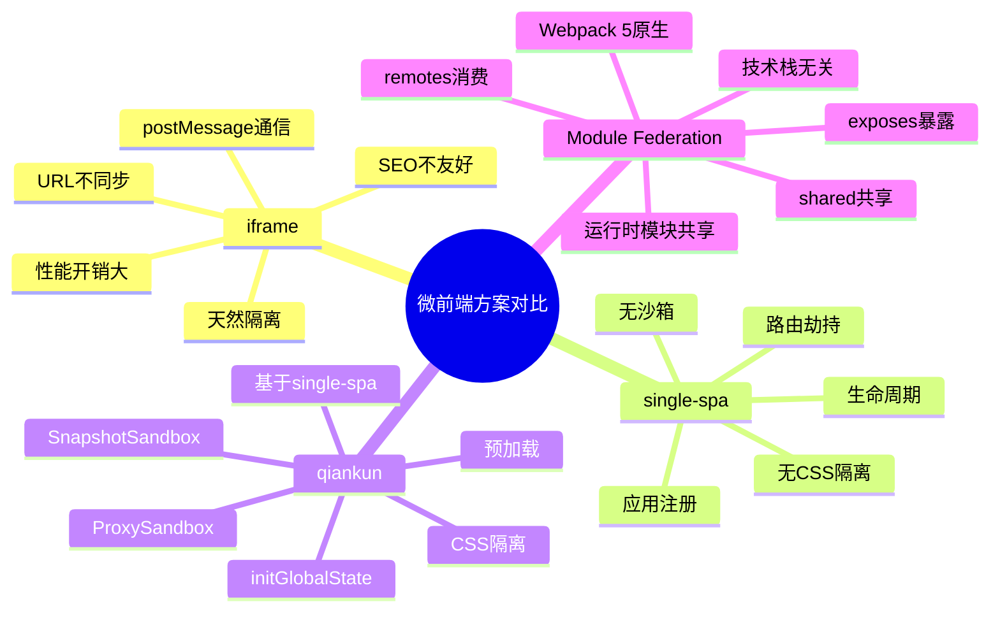

# 微前端 知识地图

## 推荐学习顺序

1. ⭐⭐⭐⭐   [微前端概述](./overview.md) —— 四种方案的适用场景对比
2. ⭐⭐⭐⭐⭐ [qiankun 深度解析](./qiankun.md) —— 阿里系微前端框架，面试高频
3. ⭐⭐⭐⭐   [Module Federation](./module-federation.md) —— Webpack 5 原生联邦模块
4. ⭐⭐⭐     [iframe 方案的优劣](./iframe.md) —— 最简单也最容易被忽视的方案

## 知识点索引

| 知识点 | 频率 | 难度 | 手写 | 状态 |
|--------|------|------|------|------|
| [微前端概述](./overview.md) | ⭐⭐⭐⭐ | 中级 | — | filled |
| [qiankun](./qiankun.md) | ⭐⭐⭐⭐⭐ | 高级 | — | filled |
| [Module Federation](./module-federation.md) | ⭐⭐⭐⭐ | 高级 | — | filled |
| [iframe 方案](./iframe.md) | ⭐⭐⭐ | 初级 | — | filled |
