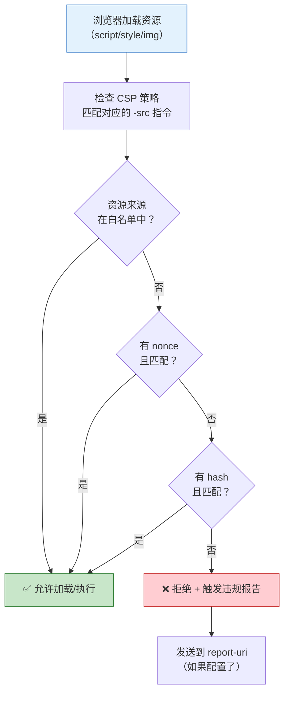

# CSP 内容安全策略
> 📘 **深度阅读**：[浏览器/$(case "$(basename "$f" .md)" in xss|csrf) echo "xss-csrf";; csp) echo "browser-security";; token-storage) echo "cookie";; esac).md](../浏览器/$(case "$(basename "$f" .md)" in xss|csrf) echo "xss-csrf";; csp) echo "browser-security";; token-storage) echo "cookie";; esac).md) —— 本文为面试清单视角，浏览器模块为完整技术原理。

> "CSP 是 XSS 的最后一道防线"——这句话在面试中说出来，面试官就知道你理解了纵深防御的思维。输入输出过滤是第一道，CSP 是第二道。

## 一句话总结

**CSP（Content Security Policy）通过白名单机制告诉浏览器哪些来源的资源可以加载和执行，从而减少 XSS 攻击面。通过 HTTP Header 或 Meta 标签配置，核心指令包括 `default-src`、`script-src`、`style-src` 等，配合 nonce/hash 实现精细控制，并通过 `report-uri` 收集违规报告。**

---

## 核心机制

### CSP 是什么？

默认情况下，浏览器信任页面中所有资源——`<script src="...">` 不管指向哪都加载执行。这给了 XSS 攻击可乘之机：攻击者只要注入一个 `<script>` 标签就能执行任意代码。

CSP 的本质是**给浏览器一个白名单**：只允许加载指定来源的资源，不在白名单内的统统拒绝。

### 设置方式

**方式一：HTTP Header**（推荐，覆盖范围最广）

```
Content-Security-Policy: default-src 'self'; script-src 'self' https://cdn.example.com; style-src 'self' 'unsafe-inline'
```

**方式二：Meta 标签**（适合纯静态页面或无法配置 HTTP Header 的场景）

```html
<meta http-equiv="Content-Security-Policy"
      content="default-src 'self'; script-src 'self'">
```

注意：Meta 方式不支持 `frame-ancestors`、`report-uri`（已废弃，用 `report-to` 替代）、`sandbox` 等指令。

### 核心指令一览

| 指令 | 控制范围 | 示例 |
|------|---------|------|
| `default-src` | 默认策略，其他指令未设置时的回退值 | `default-src 'self'` |
| `script-src` | JavaScript 脚本来源 | `script-src 'self' https://cdn.example.com` |
| `style-src` | CSS 样式来源 | `style-src 'self' 'unsafe-inline'` |
| `img-src` | 图片来源 | `img-src 'self' data: https:` |
| `connect-src` | XHR/WebSocket/EventSource 等请求目标 | `connect-src 'self' https://api.example.com` |
| `font-src` | 字体来源 | `font-src 'self' https://fonts.gstatic.com` |
| `frame-src` | iframe 来源（已废弃，改用 `child-src`） | `frame-src 'self'` |
| `frame-ancestors` | 哪些页面可以嵌入当前页面（防点击劫持） | `frame-ancestors 'none'` |
| `form-action` | 表单提交目标 | `form-action 'self'` |
| `base-uri` | `<base>` 标签的 href | `base-uri 'self'` |

### 关键安全指令详解

**`script-src 'self'`**：只允许同源脚本，阻止所有内联脚本和外部恶意脚本——这是防御 XSS 最核心的指令。但这也意味着**所有 `<script>` 内联代码和 `onclick="..."` 事件都会失效**。

**`'unsafe-inline'` 的问题和替代方案**：加了 `'unsafe-inline'` 后内联脚本可以执行，但 CSP 基本形同虚设——攻击者注入的 `<script>alert(1)</script>` 也能执行。替代方案：

- **nonce（一次性随机数）**：`script-src 'nonce-random123'`，只有 `<script nonce="random123">` 能执行。nonce 必须在每次请求中随机生成，不能被攻击者猜到
- **hash（内容哈希）**：`script-src 'sha256-abc123...'`，只有内容哈希匹配的 `<script>` 才能执行。适合静态内联脚本

**`'strict-dynamic'`**：用了 nonce/hash 后，该脚本动态创建的 `<script>`（如 `document.createElement('script')`）也自动获得信任——不需要把所有 CDN 域名都加入白名单。

**`'unsafe-eval'`**：阻止 `eval()`、`new Function()`、`setTimeout(str, ...)` 等字符串到代码的执行方式。不加此关键字时这些 API 全部失效。

---

## CSP 策略匹配流程图



---

## 深度拓展

### 追问1：CSP 和 XSS 的关系

XSS 的根本原因是**浏览器无法区分"开发者写的代码"和"攻击者注入的代码"**。CSP 解决的就是这个问题：

- **第一道防线**：输入输出过滤/转义（HTML 实体编码、JS 编码等），防止恶意代码混入
- **第二道防线**：CSP 限制可执行脚本的来源，即使恶意代码混进来了也不能执行

面试金句：**CSP 不是替代 XSS 防御的，而是纵深防御的补充——前端开发做转义，安全策略做兜底。**

### 追问2：report-uri / report-to 违规报告

CSP 可以配置违规上报地址，帮助监控攻击尝试：

```
Content-Security-Policy: default-src 'self'; report-uri /csp-violation-report
```

或使用新的 Reporting API（`report-to`）：

```
Report-To: {"group":"csp","max_age":10886400,"endpoints":[{"url":"/csp-report"}]}
Content-Security-Policy: default-src 'self'; report-to csp
```

浏览器会以 JSON 格式 POST 违规详情（被阻止的资源 URL、违反的指令、页面地址等）到指定端点。**注意**：攻击者可能大量触发违规报告，报告接口本身也可能被 DDoS——需要做限流和异常检测。

### 追问3：Vue/React 如何配合 CSP

**React** 中的 <code v-pre>dangerouslySetInnerHTML=`{`{ __html: '&lt;script&gt;alert(1)&lt;/script&gt;' }}</code> 在 CSP 开启 `script-src 'self'` 时，注入的 `<script>` **不会执行**——这是 CSP 的兜底保护。但 CSP 不能防止 DOM 型 XSS 中通过 `innerHTML` 注入的事件处理器（如 `onerror`），所以仍需配合输入过滤。

**Vue** 中的 `v-html` 同样受 CSP 限制：CSP 阻止 `'unsafe-eval'` 时，Vue 模板编译必须使用**运行时编译的 CSP 兼容版本**（`vue.runtime.esm-bundler.js`），通过预编译模板避开 `new Function()`。

### 追问4：常见 CSP 配置模板

**严格策略**（推荐）：

```
Content-Security-Policy: default-src 'self'; script-src 'self'; style-src 'self'; img-src 'self' data:; font-src 'self'; connect-src 'self'; frame-ancestors 'none'; base-uri 'self'; form-action 'self'
```

**兼容 Google Analytics / 第三方 CDN**：

```
Content-Security-Policy: default-src 'self'; script-src 'self' https://www.google-analytics.com https://cdn.example.com; img-src 'self' data: https://www.google-analytics.com; connect-src 'self' https://api.example.com
```

---

## 项目实战

**场景：后台管理系统上线前安全审计，发现 CSP 缺失。如何安全上线？**

1. **先用 Report-Only 模式收集数据**（不阻断任何请求，只报告）：

```
Content-Security-Policy-Report-Only: default-src 'self'; report-uri /csp-report
```

2. **分析 1-2 周的报告日志**，梳理所有合法资源来源（CDN、API 域名、第三方服务）
3. **添加 nonce 保护内联脚本**：服务端为每个请求生成随机 nonce，注入到 CSP Header 和 `<script>` 标签
4. **逐步收紧策略**：先放开 `'unsafe-inline'` 确保功能正常，然后用 nonce/hash 替代，逐步移除 `'unsafe-inline'`
5. **配置违规告警**：report-uri 收到违规报告时触发告警，持续监控

---

## 易错点

- **"CSP 可以完全防止 XSS"**：不能。CSP 只能阻止脚本执行，不能阻止 HTML 注入导致的页面篡改、CSS 注入导致的钓鱼界面等。
- **"加了 CSP 就不用做输入过滤了"**：错误。CSP 是第二道防线，不能替代输入输出过滤/转义。纵深防御的意义在于：一道防线被突破，还有另一道。
- **"`frame-ancestors` 是 iframe 白名单"**：注意，`frame-ancestors` 控制的是**谁可以嵌入当前页面**（防点击劫持），`frame-src` 控制的是**当前页面可以嵌入谁**。
- **"Meta 标签和 HTTP Header 的 CSP 会合并"**：会取并集中最严格的策略，但效果取决于浏览器实现——建议只用一种方式设置。

---

## 相关阅读

- [XSS](./xss.md) —— 跨站脚本攻击的三种类型和防御方案
- [CSRF](./csrf.md) —— 跨站请求伪造的原理和防御（SameSite Cookie）
- [Token 存储安全](./token-storage.md) —— HttpOnly/Secure/SameSite Cookie 配置
- [HTTPS 安全](../网络/http-https.md) —— TLS 加密和证书验证

---

## 更新记录

- 2026-07-06：完成完整内容，覆盖 CSP 核心指令、nonce/hash、违规报告、前端框架配合（Phase 2）
