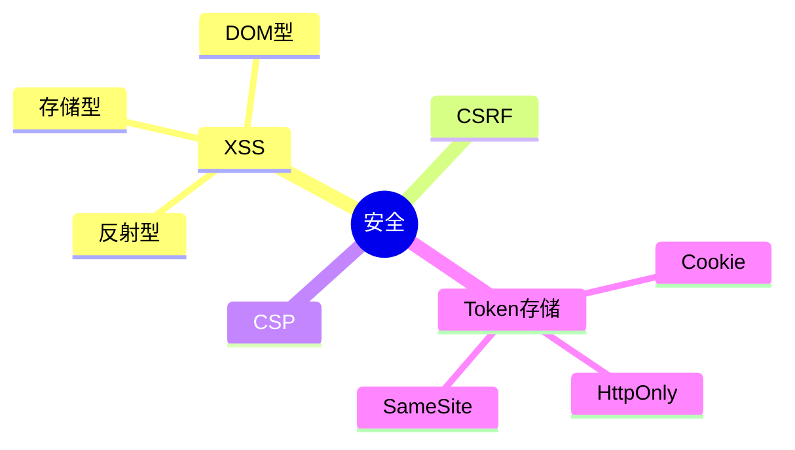

# 安全 知识地图

## 推荐学习顺序

1. ⭐⭐⭐⭐⭐ [XSS](./xss.md)
2. ⭐⭐⭐⭐⭐ [CSRF](./csrf.md)
3. ⭐⭐⭐⭐   [Token 存储安全](./token-storage.md)

## 知识点索引

| 知识点 | 频率 | 难度 | 手写 | 状态 |
|--------|------|------|------|------|
| [XSS](./xss.md) | ⭐⭐⭐⭐⭐ | 中级 | — | draft |
| [CSRF](./csrf.md) | ⭐⭐⭐⭐⭐ | 中级 | — | draft |
| [Token 存储安全](./token-storage.md) | ⭐⭐⭐⭐ | 中级 | — | draft |
