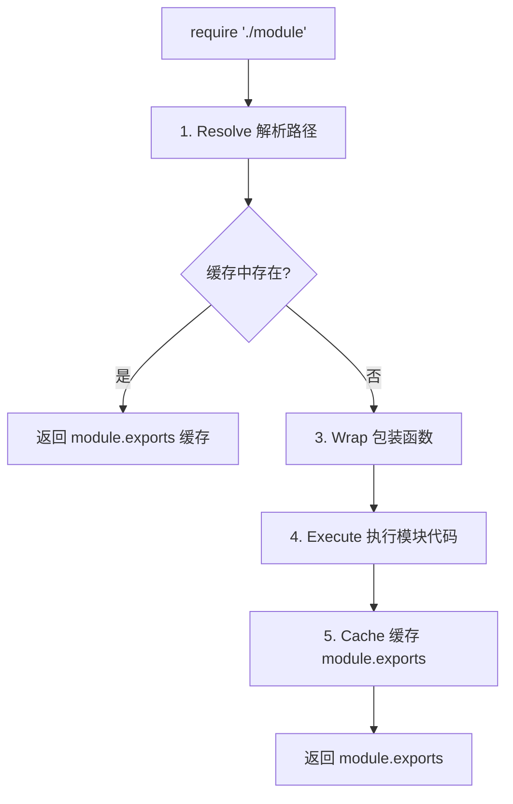
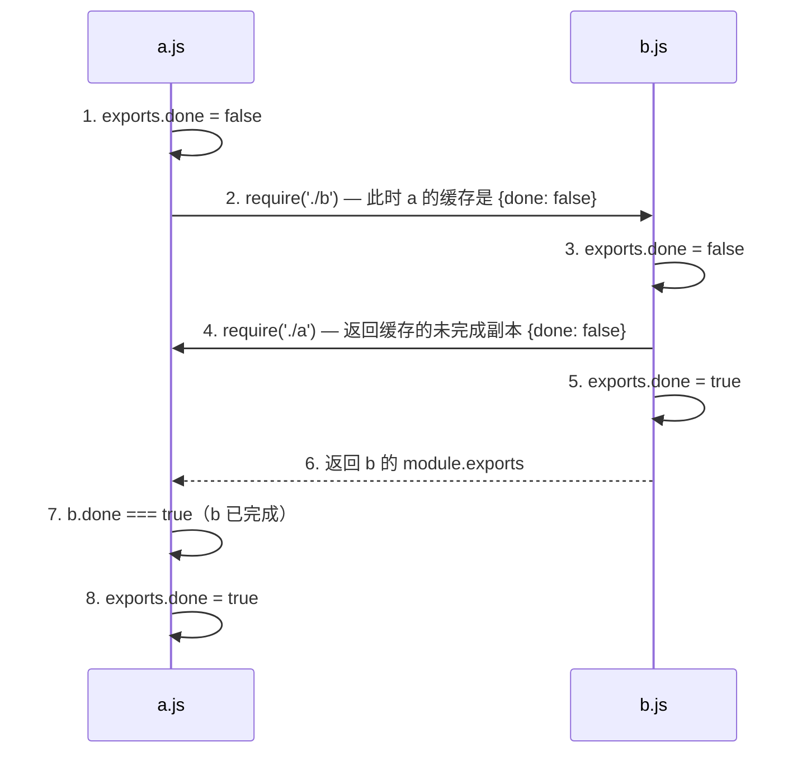

# CommonJS / ESM

> ⭐⭐⭐⭐⭐｜难度：中级｜项目：★★★

**模块化是 Node.js 面试的高频考点，尤其是 CJS 和 ESM 的互操作问题。** 理解循环引用在两种模块系统中的不同表现，能体现你对模块加载机制的深入理解。

## 一句话总结

**CommonJS 是 Node.js 默认的同步模块系统，运行时加载（`require` 返回值的拷贝）；ESM 是 JS 标准的静态模块系统，编译时确定依赖（`import` 返回值的引用），支持 Tree Shaking 和静态分析，两者在加载时机、缓存机制和 this 指向上有本质区别。**

## 核心机制

### CJS 加载流程：require 到底做了什么？



```ts
// Node 内部，每个模块被包装成这样的函数：
(function (exports, require, module, __filename, __dirname) {
  // 你的代码写在这里
  const value = 42
  module.exports = { value }
  // this === module.exports（在模块顶层）
})

// 所以 module.exports 和 exports 的关系是：
// exports = module.exports（初始指向同一个对象）
// 但最终导出的是 module.exports，而不是 exports

// ❌ 错误：给 exports 赋值不会改变导出
exports = { a: 1 } // exports 现在指向新对象，module.exports 不变

// ✅ 正确：修改 module.exports 或给 exports 添加属性
module.exports = { a: 1 }
exports.a = 1 // 等价于 module.exports.a = 1
```

### ESM 的静态 import 和动态 import()

```ts
// 静态 import：编译时确定，必须在模块顶层
import { ref, computed } from "vue"
import type { Ref } from "vue"

// 动态 import()：运行时返回 Promise，可以在任何地方调用
// 返回的是整个模块对象（包含所有导出）
async function loadComponent(name: string) {
  const module = await import(`./components/${name}.vue`)
  return module.default // 默认导出
}

// 按需加载 Element Plus 组件（路由懒加载）
const routes = [
  {
    path: "/dashboard",
    component: () => import("@/views/Dashboard.vue"), // 异步路由
  },
]
```

### CJS 和 ESM 互操作

```json
// package.json — 模块类型声明
{
  "type": "module"  // .js 文件被当作 ESM；需要 CJS 时用 .cjs
  // 不设置或 type: "commonjs"，.js 就是 CJS
}
```

```ts
// .mjs — 永远是 ESM，不管 package.json
// .cjs — 永远是 CJS，不管 package.json

// ESM 中导入 CJS 模块（Node.js 支持）
import pkg from "some-cjs-package" // CJS 的 module.exports 成为默认导入
import { named } from "some-cjs-package" // CJS 具名导入（有限支持）

// CJS 中导入 ESM 模块（受限）
// require() 不能用于 ESM 模块！
// 只能用动态 import()
const esmModule = await import("some-esm-package")
```

### exports 字段条件导出

现代 npm 包通过 `exports` 字段同时提供 CJS 和 ESM 版本：

```json
{
  "name": "my-library",
  "exports": {
    ".": {
      "import": "./dist/index.mjs",   // ESM 使用者拿到这个
      "require": "./dist/index.cjs",  // CJS 使用者拿到这个
      "types": "./dist/index.d.ts"    // TypeScript 拿到这个
    },
    "./utils": {
      "import": "./dist/utils.mjs",
      "require": "./dist/utils.cjs"
    }
  }
}
```

## 深度拓展

### 循环引用：CJS vs ESM 的不同表现

这是面试中最能区分水平的追问点。

**CJS 循环引用 -- 返回"未完成的副本"**：

```ts
// a.js
console.log("a 开始")
exports.done = false
const b = require("./b")
console.log("在 a 中，b.done =", b.done)
exports.done = true
console.log("a 结束")

// b.js
console.log("b 开始")
exports.done = false
const a = require("./a")
console.log("在 b 中，a.done =", a.done) // 注意：a 还没执行完！
exports.done = true
console.log("b 结束")

// 运行 node a.js 输出：
// a 开始
// b 开始
// 在 b 中，a.done = false    <-- 拿到的是 a 执行到一半的状态！
// b 结束
// 在 a 中，b.done = true
// a 结束
```



**ESM 循环引用 -- Live Binding 正确处理**：

```ts
// a.mjs
console.log("a 开始")
export let done = false
import { done as bDone } from "./b.mjs"
console.log("在 a 中，b.done =", bDone) // true！因为是 Live Binding
export { done }
done = true
console.log("a 结束")

// b.mjs
console.log("b 开始")
export let done = false
import { done as aDone } from "./a.mjs"
console.log("在 b 中，a.done =", aDone) // undefined（TDZ）
done = true
console.log("b 结束")

// ESM 的 import 是"实时绑定"——不是值的拷贝，而是对导出变量本身的引用
// b 中访问 aDone 时 a 还没初始化 done，处于 TDZ（暂时性死区）
```

**面试回答要点**：CJS 循环引用返回"未完成的对象副本"可能导致逻辑错误；ESM 通过 Live Binding 解决这个问题，但访问时机不当会触发 TDZ 报错。

### Tree Shaking 为什么依赖 ESM

见 [工程化/Tree Shaking](../tree-shaking.md) 详细分析。一句话：CJS 的 `require` 是运行时动态的，打包工具无法在编译阶段分析哪些代码不会被用到；ESM 的 `import`/`export` 是静态语法，依赖图在编译时就确定了。

### Node 中同时使用 CJS 和 ESM 的坑

```ts
// 坑1：CJS 里用 require 加载 ESM → 报错
const esmModule = require("./esm.mjs") // ❌ ERR_REQUIRE_ESM

// 坑2：ESM 里 import CJS → named exports 可能 undefined
import { namedExport } from "cjs-pkg" // ❌ 可能 undefined
// 因为 CJS 的 module.exports = { namedExport } 只在默认导出中
import cjsPkg from "cjs-pkg"
const namedExport = cjsPkg.namedExport // ✅ 先取默认导出再解构

// 坑3：__dirname / __filename 在 ESM 中不存在
import { fileURLToPath } from "node:url"
import { dirname } from "node:path"
const __filename = fileURLToPath(import.meta.url)
const __dirname = dirname(__filename)
```

## 项目实战

### 1. 后台管理系统的模块策略

```json
// apps/admin/package.json
{
  "type": "module", // Vite 项目默认 ESM
  "scripts": {
    "dev": "vite",
    "build": "vite build"
  }
}
```

```ts
// src/vite-env.d.ts — Vite 客户端类型声明
/// <reference types="vite/client" />

// Vite 项目中所有 .ts/.vue 文件走 ESM
// build 时 Vite 用 Rollup 处理 CJS/ESM 互操作
import { createApp } from "vue"
import App from "./App.vue" // SFC 默认导出
```

### 2. 发布同时支持 CJS 和 ESM 的组件库

```json
// packages/shared/package.json
{
  "name": "@myapp/shared",
  "type": "module",
  "main": "./dist/index.cjs",    // CJS 入口（给旧 Node 项目）
  "module": "./dist/index.mjs",  // ESM 入口（给 Vite/Webpack 项目）
  "types": "./dist/index.d.ts",  // TypeScript 类型
  "exports": {
    ".": {
      "import": "./dist/index.mjs",
      "require": "./dist/index.cjs",
      "types": "./dist/index.d.ts"
    },
    "./*": "./dist/*"  // 子路径导出
  }
}
```

### 3. 动态导入组件（路由懒加载）

```ts
// Vue Router 的路由懒加载就是利用动态 import()
const routes: RouteRecordRaw[] = [
  {
    path: "/users",
    name: "Users",
    component: () => import("@/views/Users.vue"), // 动态 import() 返回 Promise
    meta: { title: "用户管理" },
  },
  {
    path: "/roles",
    name: "Roles",
    // Vite 的 glob import：批量导入目录下的所有模块
    component: () => import("@/views/Roles.vue"),
  },
]
```

## 易错点

1. **`import` 被提升（hoisted）** -- ESM 的 import 声明会被提升到模块顶部执行，即使写在文件末尾，也是最先执行的。这是规范和 Tree Shaking 的基础
2. **ESM 中 `this === undefined`** -- 而 CJS 模块顶层 `this === module.exports`，在 Vue 组件中要注意这个差异
3. **`type: "module"` 后 `require()` 不可用** -- package.json 设了 type: module 后，所有 .js 文件为 ESM，`require()` 不再可用。如果需要 CJS，必须用 .cjs 扩展名
4. **动态 import 的路径必须是静态可分析的前缀** -- `import(variable)` 是合法的但 Webpack/Rollup 无法静态分析；`import("./components/" + name)` 中前缀 `./components/` 必须是字面量，这样打包工具才能知道哪些文件需要打包
5. **CJS 导出的对象可以在模块外部被修改** -- `const obj = require("./a"); obj.value = "changed"` 会影响模块内部，因为导出的是值的引用（不是拷贝）。这与 ESM 的 Live Binding 不同

## 相关阅读

- [Node 知识地图](./index.md)
- [Node Event Loop](./node-event-loop.md)
- [npm / pnpm](./package-manager.md)
- [工程化 Tree Shaking](../tree-shaking.md)

## 更新记录

- 2026-07-05：Phase 2 深度填充（CJS 加载流程 + ESM 静态/Dynamic import + 循环引用 + 条件导出 + 项目实战）
