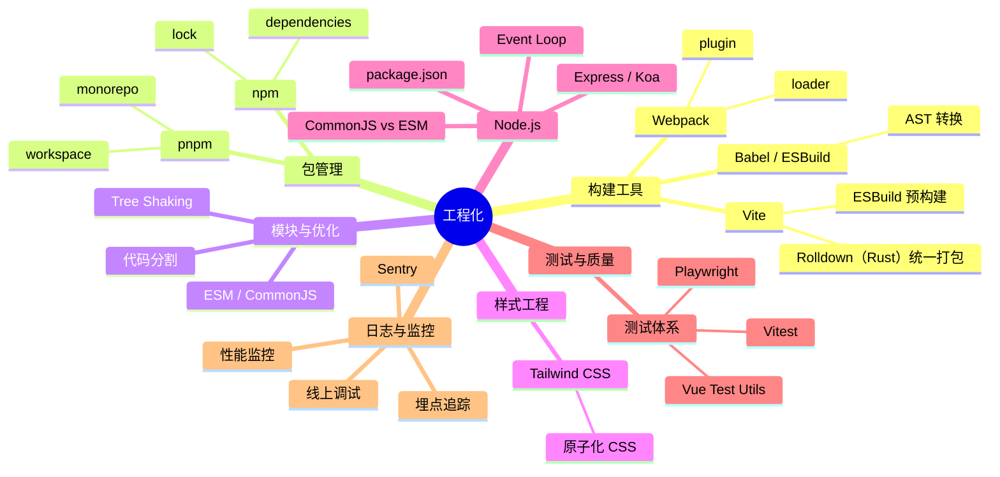

# 工程化 知识地图

## 推荐学习顺序

### 一、包管理与模块

1. ⭐⭐⭐⭐⭐ [npm 深入](./npm-deep.md)
2. ⭐⭐⭐⭐   [pnpm](./pnpm.md)
3. ⭐⭐⭐⭐   [ESM / CommonJS](./esm-module.md)

### 二、构建工具

4. ⭐⭐⭐⭐⭐ [Vite](./vite.md)
5. ⭐⭐⭐⭐⭐ [Vite 深入](./vite-deep.md)
6. ⭐⭐⭐⭐   [Webpack](./webpack.md)
7. ⭐⭐⭐     [Babel / ESBuild](./babel-esbuild.md)
8. ⭐⭐⭐⭐   [Tree Shaking](./tree-shaking.md)

### 三、样式与质量

9. ⭐⭐⭐     [Tailwind CSS](./tailwindcss.md)
10. ⭐⭐⭐     [前端测试体系](./testing.md)
11. ⭐⭐⭐⭐⭐ [ESLint / Husky](./eslint-husky.md)

### 四、优化与扩展

12. ⭐⭐⭐⭐   [Code Splitting](./code-splitting.md)
13. ⭐⭐⭐     [Rollup / Prettier / SourceMap](./rollup-prettier-sourcemap.md)

> Node 子模块和日志监控子模块参见 [Node 知识地图](./Node/index.md) 和 [日志监控 知识地图](./日志监控/index.md)

## 知识点索引

| 知识点 | 频率 | 难度 | 手写 | 状态 |
|--------|------|------|------|------|
| [npm 深入](./npm-deep.md) | ⭐⭐⭐⭐⭐ | 中级 | — | reviewed |
| [Vite](./vite.md) | ⭐⭐⭐⭐⭐ | 中级 | — | reviewed |
| [Vite 深入](./vite-deep.md) | ⭐⭐⭐⭐⭐ | 高级 | — | reviewed |
| [Webpack](./webpack.md) | ⭐⭐⭐⭐ | 高级 | — | reviewed |
| [pnpm](./pnpm.md) | ⭐⭐⭐⭐ | 初级 | — | reviewed |
| [Tree Shaking](./tree-shaking.md) | ⭐⭐⭐⭐ | 中级 | — | reviewed |
| [ESM / CommonJS](./esm-module.md) | ⭐⭐⭐⭐ | 中级 | — | reviewed |
| [Babel / ESBuild](./babel-esbuild.md) | ⭐⭐⭐ | 高级 | — | reviewed |
| [Tailwind CSS](./tailwindcss.md) | ⭐⭐⭐ | 中级 | — | filled |
| [前端测试体系](./testing.md) | ⭐⭐⭐ | 中高级 | — | filled |
| [ESLint / Husky](./eslint-husky.md) | ⭐⭐⭐⭐⭐ | 中级 | — | filled |
| [Code Splitting](./code-splitting.md) | ⭐⭐⭐⭐ | 中级 | — | filled |
| [Rollup / Prettier / SourceMap](./rollup-prettier-sourcemap.md) | ⭐⭐⭐ | 中级 | — | filled |

## 相关阅读

- [Node.js 知识地图](./Node/index.md) — Express/Koa、Event Loop、package.json
- [日志监控 知识地图](./日志监控/index.md) — Sentry、性能监控、埋点追踪
- [前端架构 知识地图](../前端架构/index.md) — 微前端、Monorepo
- [面试题库：工程化](../面试题库/工程化.md) — 12 道工程化高频真题
- [面试回答：工程化](../面试回答/工程化/vite-webpack.md) — 4 篇工程化逐字回答稿（Vite/Webpack / 构建优化 / TreeShaking+HMR / ESM+CJS）

## 更新记录

- 2026-07-21：mindmap「Rollup 生产打包」→「Rolldown（Rust）统一打包」，反映 Vite 8 起 Rolldown 成为默认打包器
- 2026-07-12：学习顺序三组分类（包管理与模块/构建工具/样式与质量），pnpm+ESM归入包管理
- 2026-07-11：补 vite.md / testing.md / esm-module.md 到学习顺序和知识点索引；mindmap 扩大覆盖 Node.js/测试/日志/监控
- 2026-07-05：初始创建
