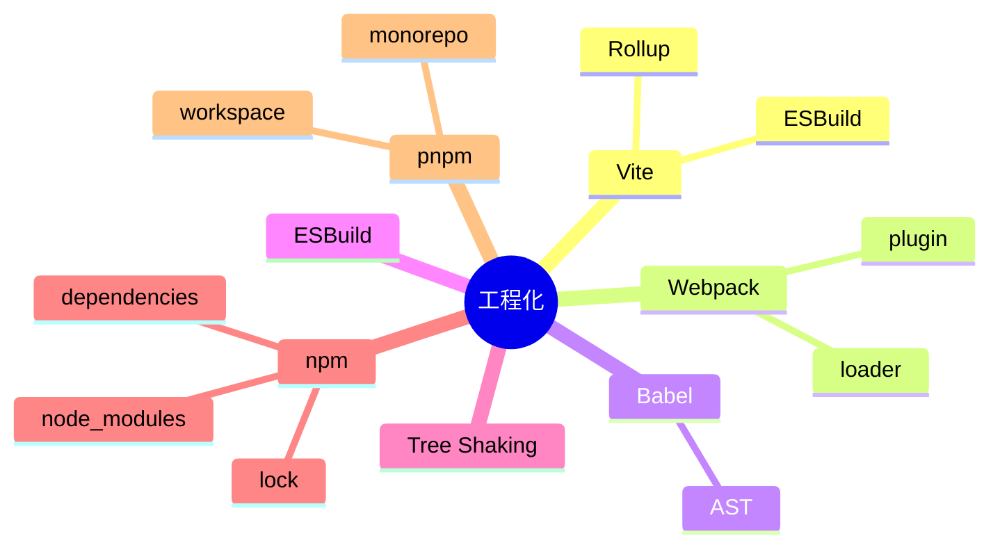

# 工程化 知识地图

## 推荐学习顺序

1. ⭐⭐⭐⭐⭐ [npm 深入](./npm-deep.md)
2. ⭐⭐⭐⭐⭐ [Vite 深入](./vite-deep.md)
3. ⭐⭐⭐⭐   [Webpack](./webpack.md)
4. ⭐⭐⭐⭐   [Tree Shaking](./tree-shaking.md)
5. ⭐⭐⭐⭐   [pnpm](./pnpm.md)
6. ⭐⭐⭐     [Babel / ESBuild](./babel-esbuild.md)

## 知识点索引

| 知识点 | 频率 | 难度 | 手写 | 状态 |
|--------|------|------|------|------|
| [npm 深入](./npm-deep.md) | ⭐⭐⭐⭐⭐ | 中级 | — | filled |
| [Vite 深入](./vite-deep.md) | ⭐⭐⭐⭐⭐ | 高级 | — | filled |
| [Webpack](./webpack.md) | ⭐⭐⭐⭐ | 高级 | — | draft |
| [Babel / ESBuild](./babel-esbuild.md) | ⭐⭐⭐ | 高级 | — | draft |
| [Tree Shaking](./tree-shaking.md) | ⭐⭐⭐⭐ | 中级 | — | draft |
| [pnpm](./pnpm.md) | ⭐⭐⭐⭐ | 初级 | — | draft |
