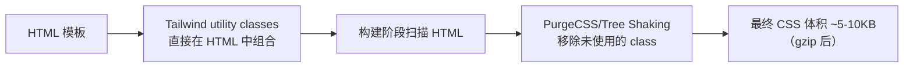

# Tailwind CSS

> &#11088;&#11088;&#11088;｜难度：中级&#9733;&#9733;

## 一句话总结

**Tailwind 是"原子化 CSS 框架"——用预定义的 utility class（如 `flex`、`p-4`、`text-red-500`）直接在 HTML 中组合样式，而不是写自定义 CSS。** 核心理念是"utility-first"（工具类优先），配合构建阶段的 Tree Shaking 只保留用到的类，最终 CSS 体积反而极小。

## 核心机制

### Utility-First —— 与传统 CSS 的思维差异

```html
<!-- 传统 CSS 写法 -->
<style>
.card { border-radius: 8px; padding: 16px; background: white; box-shadow: ...; }
</style>
<div class="card">...</div>

<!-- Tailwind 写法 —— 样式内联到 HTML -->
<div class="rounded-lg p-4 bg-white shadow-md">
  ...
</div>
```



**优点**：
- 不需要给 class 起名字（命名是最难的事之一）
- 改样式直接在 HTML 改，不用切到 CSS 文件
- 构建后 CSS 体积和项目复杂度无关（只和用到的 utility 数量相关）
- 设计约束（只有预定义的颜色/间距/字号），天然保证一致性

**缺点**：
- HTML 看起来"脏"（一堆 class 堆在一起）
- 学习曲线（几百个 utility class 名字要记）
- 复用样式需要抽组件（React/Vue 组件是解决 class 复用的答案）

### Tree Shaking —— 为什么 Tailwind 的 CSS 这么小

```js
// tailwind.config.js
module.exports = {
  content: ['./src/**/*.{html,js,ts,jsx,tsx,vue}'],  // 扫描路径
  theme: {
    extend: {
      colors: {
        primary: '#3451b2',
      }
    }
  }
}
// 构建时：只保留 content 路径下 HTML 中实际用到的 utility class
// 写 1000 个 utility 但只用 50 个 → CSS 只包含 50 个
```

### 核心配置：自定义设计系统

```js
// 项目设计规范映射到 Tailwind 配置
module.exports = {
  theme: {
    extend: {
      colors: {
        brand: {                         // 品牌色板
          50: '#eef2ff',
          500: '#3451b2',               // bg-brand-500
          700: '#2a4198',
        },
      },
      spacing: {                         // 自定义间距
        '18': '4.5rem',
      },
      fontSize: {
        'xxs': '0.625rem',              // text-xxs
      },
    }
  }
}
```

## 深度拓展

### Tailwind 的 `@apply` —— 提取可复用样式

```css
/* 重复的 class 组合可以抽离为 @apply */
/* ❌ 在 HTML 中重复写相同的 class 组合 */
<button class="px-4 py-2 bg-brand-500 text-white rounded-lg hover:bg-brand-700">

/* ✅ 用 @apply 抽离为语义化 class */
@layer components {
  .btn-primary {
    @apply px-4 py-2 bg-brand-500 text-white rounded-lg hover:bg-brand-700 transition-colors;
  }
}
/* 注意：过度使用 @apply 会失去 utility-first 的优势，谨慎使用 */
```

### 与 Vue/React 的配合 —— 组件是解决复用的正确答案

```vue
<!-- 不需要 @apply，用 Vue 组件封装 class 组合 -->
<template>
  <button class="px-4 py-2 rounded-lg font-medium transition-colors
                 bg-brand-500 text-white hover:bg-brand-700
                 disabled:opacity-50 disabled:cursor-not-allowed">
    <slot />
  </button>
</template>
<!-- 这就是你的 .btn-primary —— 用组件而非 CSS 类来复用 -->
```

### 对比选型决策矩阵

| 维度 | Tailwind | BEM + SCSS | CSS Modules | CSS-in-JS |
|------|----------|------------|-------------|-----------|
| 学习成本 | 中（记 class 名） | 低 | 低 | 低 |
| 命名负担 | 无 | 高（Block__Element--Modifier） | 低 | 无 |
| CSS 体积 | ⭐极低（Tree Shaking） | 随项目增长 | 按需加载 | 按需加载 |
| 设计一致性 | ⭐强制（预定义值） | 依赖规范 | 依赖规范 | 依赖规范 |
| HTML 可读性 | ⚠️ class 多 | 好 | 好 | 好 |
| 适合团队规模 | 中大型 | 所有 | 中大型 | 中型 |

## 易错点

1. **把所有样式都写成 class 而不抽组件** —— 相同的 class 组合在 10 个地方重复 → 抽成一个 Vue/React 组件
2. **滥用 `@apply`** —— `@apply` 是把 utility 变回传统 CSS，用多了就失去了 utility-first 的意义
3. **忘记配 `content` 路径** —— 没配或配错路径 → Tree Shaking 失效 → 生产的 CSS 缺少用到的 class
4. **和组件库样式冲突** —— Tailwind 的 preflight（reset）可能会影响 Element Plus 等组件库的基础样式

## 面试信号表

| 面试官问 | 下一问大概率是 |
|----------|-------------|
| "Tailwind CSS 的理念是什么" | 追问 Utility-first——用原子类组合代替语义化类名 |
| "Tailwind 和传统 CSS 框架有什么区别" | 追问 Bootstrap 给你组件——Tailwind 给你构建块 |
| "Tailwind 的生产包为什么这么小" | 追问 Tree Shaking + JIT 编译——只生成用到的类 |

## 相关阅读

- [BEM 命名](../CSS/bem.md)
- [CSS Modules / Scoped](../CSS/css-modules-scoped.md)
- [Vite](../工程化/vite.md)

## 更新记录

- 2026-07-08：新建（Utility-first 理念 + Tree Shaking + 配置 + 对比选型矩阵）
