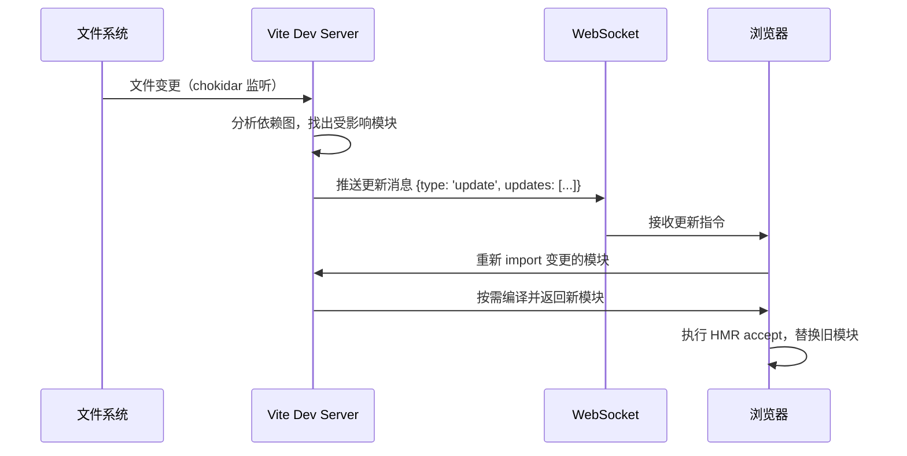

# Vite 深入

> ⭐⭐⭐⭐⭐｜难度：高级

**Vite 不只是"更快的 Webpack"，而是一种全新的开发范式。** 本文从 ESM 按需编译、esbuild 预构建、HMR 原理三个核心层面，逐层拆解 Vite 为什么能做到毫秒级冷启动。

## 一句话总结

**Vite 利用浏览器原生 ESM 实现"按需编译"（不改不编译），用 Go 编写的 esbuild 做依赖预构建消除 node_modules 的性能瓶颈，生产环境回归 Rollup 保证产物质量——三阶段分层设计，各取所长。**

## 核心机制

### 1. Vite 为什么快：三层架构

面试中只回答"Vite 用 esbuild 所以快"不够，要能分层说清：

```
第一层：开发服务器不打包（原生 ESM）
  浏览器通过 <script type="module"> 直接 import 源码
  Vite 只编译浏览器当前请求的那个模块，而不是全量打包
  → 冷启动几乎不随项目规模增长

第二层：esbuild 预构建依赖
  node_modules 可能有几百个包、几千个模块
  esbuild 用 Go 语言极速地把它们转成 ESM 并合并
  → 避免浏览器发出几百个 HTTP 请求（瀑布式加载）

第三层：HMR 基于 ESM 精准失效
  只重新请求变更的模块，不刷新页面
  改一个 .vue 组件的 <style>，只热更新样式部分
  → HMR 速度不随项目规模增长
```

### 2. esbuild 为什么这么快

esbuild 不是"优化过的 JS 打包器"，而是用 Go 从零写的原生二进制：

| 维度 | esbuild（Go） | Babel/Webpack（JS） |
|------|-------------|-------------------|
| 语言 | Go，编译为机器码 | JS，需要 V8 JIT 预热 |
| 并行 | goroutine 多线程并行解析/编译/打印 | 单线程事件循环，parallel 靠 worker_threads |
| AST | 手写解析器，一次遍历完成 | 完整 AST 构建 + 遍历 + 生成，三次遍历 |
| 内存 | 一次分配、复用，GC 压力小 | 大量临时对象，GC 停顿 |
| 速度 | 0.3s | 15-30s（同等规模） |

关键点：esbuild **不需要完整 AST 转换**。Babel 是 parse -> transform -> generate 三阶段，每阶段产生大量中间对象。esbuild 手写的解析器在解析的同时就输出结果，没有"完整的 AST 对象"这个中间产物。

但 esbuild 也有代价：不支持 AST 级别的自定义插件（只支持简单的 onLoad/onResolve 钩子），某些 ES2020+ 语法降级不完整，ESM/CJS 互操作有边界 bug。所以 Vite 只在**预构建**和**开发时的 TS 语法擦除**中用 esbuild，生产构建回归 Rollup。

### 3. HMR 原理：基于 ESM 的精确热更新

传统 Webpack HMR 流程：文件变更 -> 增量编译 -> 生成 hot update chunk -> WebSocket 推送 -> 浏览器替换模块。

Vite HMR 流程更简洁：



核心优势：**改哪个模块，只重新请求哪个模块**。不涉及 chunk 重建、不需要生成 hot update manifest。因为开发时根本没有 chunk，每个模块都是独立的 ESM 文件。

```ts
// Vite 中自定义 HMR 行为
// 场景：一个模块初始化时创建了定时器，热更新时需要清理
let timer: ReturnType<typeof setInterval>

if (import.meta.hot) {
  // dispose：旧模块被替换时清理副作用
  import.meta.hot.dispose(() => {
    clearInterval(timer)
  })
  // accept：接受自身热更新（不通知父模块）
  import.meta.hot.accept()
  // decline：拒绝热更新，回退到整页刷新
  // import.meta.hot.decline()
}
```

**HMR 失效边界**：如果一个模块没有 `hot.accept()` 且没有被任何父模块 accept，热更新会向上冒泡，最终整页刷新。这就是"HMR 链条"的概念。

### 4. 依赖预构建的细节

执行 `npx vite` 时，Vite 首先扫描 `node_modules`：

```ts
// 预构建做两件事：
// 1. CJS/UMD → ESM：把 require('lodash') 转为 import lodash from 'lodash'
// 2. 合并碎片模块：lodash-es 有 600+ 个内部模块，合并成少数几个文件

// 预构建结果缓存于 node_modules/.vite/deps/
// 形如：lodash.js, vue.js, element-plus.js...

// 源码中的裸模块导入被重写：
// import { ref } from 'vue'
// ↓ 重写为 ↓
// import { ref } from '/node_modules/.vite/deps/vue.js?v=abcdef12'
```

缓存策略：预构建结果有强缓存（文件内容 hash）。`package-lock.json` + `vite.config.ts` 的 hash 变化时才会重新预构建。强制重构建用 `npx vite --force`。

`optimizeDeps` 配置场景：

```ts
// vite.config.ts
export default defineConfig({
  optimizeDeps: {
    // include：手动指定需要预构建的包（Vite 没自动发现的）
    include: ["element-plus/es/locale/lang/zh-cn"],
    // exclude：排除不需要预构建的包（已经是 ESM 且模块少的）
    exclude: ["@vueuse/core"],
  },
})
```

### 5. 插件机制：Rollup 兼容 + Vite 独有钩子

Vite 插件的接口是 **Rollup 插件接口的超集**：

```ts
// 一个 Vite 插件的完整钩子一览
function myVitePlugin() {
  return {
    name: "my-plugin",

    // ===== Rollup 兼容钩子（构建时） =====
    resolveId(id, importer) { /* 自定义模块解析 */ },
    load(id) { /* 返回模块内容（虚拟模块） */ },
    transform(code, id) { /* 转换代码 */ },

    // ===== Vite 独有钩子（开发时） =====
    config(config, env) { /* 修改 Vite 配置 */ },
    configResolved(config) { /* 配置确认后 */ },
    configureServer(server) { /* 注入中间件 */ },
    configurePreviewServer(server) { /* 注入 preview 中间件 */ },
    transformIndexHtml(html) { /* 修改 index.html */ },
    handleHotUpdate(ctx) { /* 自定义 HMR 逻辑 */ },
  }
}
```

**Rollup 钩子 vs Vite 钩子的分工**：Rollup 钩子在开发和生产都会调用（transform 在开发时按需、生产时打包），Vite 独有钩子主要服务开发体验（服务器中间件、HMR 控制、HTML 注入）。

## 深度拓展

### Vite vs Webpack 六维对比

| 维度 | Vite | Webpack |
|------|------|---------|
| 冷启动 | <1s（不打包，只启动服务器） | 10s-60s（全量打包依赖图） |
| HMR | 毫秒级（基于 ESM 按需失效） | 秒级（增量编译 + chunk 重组） |
| 生产构建 | Rollup（代码分割、Tree Shaking 成熟） | Webpack 5（持久化缓存 + 增量） |
| 生态 | 兼容 Rollup 插件 + Vite 自身生态 | 最丰富（十几年的 loader/plugin 积累） |
| 学习曲线 | 低（开箱即用、约定大于配置） | 高（loader/plugin/resolve 概念多） |
| 配置复杂度 | 简洁（vite.config.ts 通常 < 80 行） | 复杂（webpack.config.ts 动辄 200+ 行） |

### 为什么生产不用 esbuild？

四个原因：
1. **代码分割**：esbuild 的 code splitting 能力远不如 Rollup（Rollup 有成熟的 manualChunks + 动态 import 分析）
2. **Tree Shaking 深度**：esbuild 的跨模块副作用分析不如 Rollup 精细，对导出使用追踪更保守；Rollup 对调用副作用、跨模块依赖链的分析更深，能消除更多死代码
3. **插件生态**：CSS 处理（PostCSS、Sass）、HTML 生成、资源压缩等生产需求需要成熟的插件
4. **稳定性**：esbuild 的 ESM/CJS 互操作在某些边界场景有 bug，而 Rollup 作为久经考验的生产打包器更稳定

Vite 的策略是"开发求快、生产求稳"——开发用 esbuild（快就行了，边界 bug 可以容忍），生产用 Rollup（稳 + 质量优先）。

## 项目实战

### 1. 155 个组件的中型后台系统 Vite 配置

```ts
// vite.config.ts — 实际项目配置关键点
export default defineConfig({
  // 路径别名：避免 ../../../ 地狱
  resolve: { alias: { "@": resolve("src") } },
  // CSS 变量注入
  css: {
    preprocessorOptions: {
      scss: { additionalData: `@use "@/styles/variables.scss" as *;` },
    },
  },
  // 生产构建分包策略
  build: {
    rollupOptions: {
      output: {
        manualChunks: {
          vue: ["vue", "vue-router", "pinia"],
          elementPlus: ["element-plus"],
          echarts: ["echarts"],
        },
      },
    },
  },
})
```

### 2. Vite 开发代理配置

```ts
server: {
  proxy: {
    "/api": {
      target: "http://localhost:8080",
      changeOrigin: true,
      rewrite: (path) => path.replace(/^\/api/, ""),
    },
  },
}
// 注意：proxy 只在 dev server 生效，生产用 nginx 反向代理
```

## 易错点

1. **环境变量没有 `VITE_` 前缀** -- 只有带此前缀的变量才会暴露给客户端，防止敏感信息泄漏
2. **开发正常、生产报错** -- esbuild 和 Rollup 处理 CJS 的方式不同，某些包在生产构建时需要手动加入 `optimizeDeps.include`
3. **`ssr.noExternal` 未配置** -- SSR 项目中某些 ESM 包在 Node 端运行时需要标记为 "不外部化"，否则会报 `SyntaxError: Unexpected token 'export'`
4. **HMR 不生效** -- 检查 `.vue` 文件是否使用 `<script setup>`（Vite 能更精准分析依赖图）；检查 `import.meta.hot` 是否被条件编译移除
5. **不合理的 `manualChunks`** -- 把太多小包分到一个 chunk 导致首屏请求变多；把不常变的库和业务代码混在一个 chunk 导致缓存失效

## 面试信号

当面试官问"Vite 为什么比 Webpack 快"，**不要只说"用了 esbuild"**——要从三个层面回答：

> "第一层是架构差异：Vite 开发时不打包，利用浏览器原生 ESM 按需编译，Webpack 必须先全量打包再启动 dev server。第二层是语言优势：esbuild 用 Go 编写，比 JS 写的 Babel 快 10-100 倍——多线程并行、一次遍历输出、无需完整 AST。第三层是 HMR 效率：基于 ESM 的精准失效，改哪个模块只重新请求哪个模块，而 Webpack HMR 需要增量编译 + 生成 chunk 差异。但生产构建 Vite 回归 Rollup，因为 esbuild 在代码分割和 Tree Shaking 上不如 Rollup 成熟。"

## 相关阅读

- [Vite 基础](./vite.md)
- [Webpack](./webpack.md)
- [Babel / ESBuild](./babel-esbuild.md)
- [Tree Shaking](./tree-shaking.md)
- [ESM 模块化深入](./esm-module.md)

## 更新记录

- 2026-07-06：Phase 3 深度填充（三层快的原因 + esbuild 性能原理 + HMR 链条 + 预构建细节 + 插件钩子 + 六维对比表）
