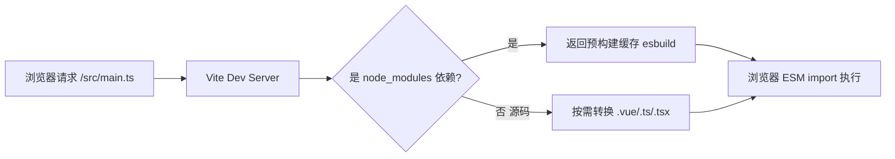
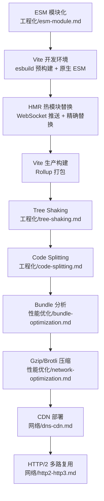

# Vite

> ⭐⭐⭐⭐⭐｜难度：中级

**Vite 是当下 Vue3 生态的标配构建工具，面试必问。** 理解 Vite 不仅仅是会用 `vite.config.ts`，更要理解它"为什么快"——ESM 开发服务器 + esbuild 预构建 + Rollup 生产打包。

## 一句话总结

**Vite 是基于浏览器原生 ESM 的开发服务器，开发环境用 esbuild 做依赖预构建实现毫秒级冷启动，生产环境用 Rollup 打包确保最优输出体积。**

## 核心机制

### 开发环境："按需编译" 而不是 "全量打包"

Webpack 的思路是：启动时把所有源码打包成一个 bundle，然后启动 dev server。项目越大，启动越慢。

Vite 的思路是：**浏览器直接 import 源码，Vite 只转换浏览器请求的那个模块**。



关键三步：

1. **浏览器发起 ESM import**：`<script type="module" src="/src/main.ts">` 让浏览器原生支持 import 语法
2. **Vite 拦截请求**：把 `.ts`/`.vue`/`.tsx` 实时编译成 JS 返回给浏览器，不打包
3. **esbuild 预构建依赖**：node_modules 里的第三方包（如 Element Plus）先用 esbuild 转成 ESM 并合并，避免浏览器发几百个请求

### esbuild 预构建

这是 Vite 快的关键。esbuild 用 Go 语言编写，比 Babel/tsc 快 10-100 倍：

```ts
// vite.config.ts
import { defineConfig } from "vite"

export default defineConfig({
  // 预构建配置：哪些包需要预构建
  optimizeDeps: {
    include: ["element-plus", "axios", "vue-router"],
    // 强制排除某些不需要预构建的包
    exclude: ["@vueuse/core"],
  },
})
```

esbuild 在预构建阶段做了两件事：
- **CommonJS 转 ESM**：把 `require("lodash")` 转为 `import lodash from "lodash"`
- **重写裸模块路径**：把 `import { ref } from "vue"` 重写为 `import { ref } from "/node_modules/.vite/deps/vue.js?v=hash"`

### HMR（模块热替换）

Vite 的 HMR 基于 ESM，**只更新变更的模块，不刷新页面**：

```ts
// 在你的 Vue 组件中，Vite HMR 自动生效
// 修改 <template> 或 <style> 时，只热更新对应部分，状态保留

// 自定义 HMR 边界（模块自行处理热更新）
if (import.meta.hot) {
  import.meta.hot.accept((newModule) => {
    // 手动处理模块更新，避免页面刷新
  })
  // 模块被移除时清理副作用
  import.meta.hot.dispose(() => {
    clearInterval(timer)
  })
}
```

HMR 流程：文件变更 -> WebSocket 通知浏览器 -> 浏览器请求变更模块 -> Vite 返回新模块 -> 浏览器替换旧模块。

### 生产构建：Rollup

为什么生产不用 esbuild？**esbuild 的产物优化能力不如 Rollup**（代码分割、Tree Shaking 颗粒度、插件生态）。所以 Vite 生产构建用 Rollup，开发用 esbuild。

## 深度拓展

### Vite vs Webpack 对比

| 维度 | Vite | Webpack |
|------|------|---------|
| 冷启动 | <1s（不打包） | 10s-60s（全量打包） |
| HMR | 毫秒级（按需更新） | 秒级（增量编译） |
| 生态 | 成熟（Rollup 插件兼容） | 最丰富 |
| 生产构建 | Rollup | Webpack 5 |
| 学习成本 | 低（开箱即用） | 高（loader/plugin 概念多） |

**为什么开发用 esbuild、生产用 Rollup？** esbuild 快但不稳定（某些 ESM/CJS 互操作有 bug），且代码分割和 Tree Shaking 不如 Rollup 成熟。Vite 的策略是"开发求快，生产求稳"。

### 为什么 Vite 开发时不用打包？

浏览器原生支持 ESM import，所以不需要打包。`<script type="module">` 让浏览器能理解 `import` 语句，Vite 只要把 `node_modules` 里不兼容的依赖预处理好即可。但生产不能这样——浏览器发几百个请求加载模块，性能极差，必须打包成一个（或几个）bundle。

### Vite 插件机制

Vite 插件兼容 Rollup 插件接口，还扩展了 Vite 特有的钩子：

```ts
// 一个简单的 Vite 插件示例
function myPlugin() {
  return {
    name: "my-vite-plugin",
    // Vite 特有钩子：在服务器启动时注入中间件
    configureServer(server) {
      server.middlewares.use((req, res, next) => {
        console.log(`请求：${req.url}`)
        next()
      })
    },
    // Rollup 钩子：转换代码
    transform(code, id) {
      if (id.endsWith(".ts")) {
        // 处理 TypeScript 代码
      }
    },
    // 虚拟模块
    resolveId(id) {
      if (id === "virtual:config") return id
    },
    load(id) {
      if (id === "virtual:config") return `export default {}`
    },
  }
}
```

## 项目实战

### 1. Vite 项目配置

```ts
// vite.config.ts — 典型后台管理系统配置
import { defineConfig } from "vite"
import vue from "@vitejs/plugin-vue"
import AutoImport from "unplugin-auto-import/vite"
import Components from "unplugin-vue-components/vite"
import { ElementPlusResolver } from "unplugin-vue-components/resolvers"
import { resolve } from "path"

export default defineConfig({
  plugins: [
    vue(),
    // 自动导入 Vue API（ref, reactive, computed 等）
    AutoImport({
      imports: ["vue", "vue-router", "pinia"],
      dts: "src/auto-imports.d.ts",
    }),
    // Element Plus 按需导入，打包体积从 1.5M 降到 300K
    Components({
      resolvers: [ElementPlusResolver()],
      dts: "src/components.d.ts",
    }),
  ],
  resolve: {
    alias: {
      "@": resolve(__dirname, "src"), // 路径别名
    },
  },
  server: {
    port: 3000,
    proxy: {
      "/api": { target: "http://localhost:8080", changeOrigin: true },
    },
  },
  build: {
    rollupOptions: {
      output: {
        manualChunks: {
          vendor: ["vue", "vue-router", "pinia"],
          elementPlus: ["element-plus"],
        },
      },
    },
  },
})
```

### 2. 环境变量

```ts
// .env.development
VITE_APP_TITLE = "后台管理系统(开发)"
VITE_API_BASE_URL = "http://localhost:8080"

// .env.production
VITE_APP_TITLE = "后台管理系统"
VITE_API_BASE_URL = "https://api.example.com"

// 使用（Vite 中环境变量必须 VITE_ 前缀才能暴露给客户端）
console.log(import.meta.env.VITE_API_BASE_URL)
```

### 3. 构建后 CDN 部署

```ts
// vite.config.ts — CDN 部署配置
export default defineConfig({
  base: "https://cdn.example.com/admin/", // publicPath
})
// 所有静态资源路径都会以这个 base 开头
```

## 易错点

1. **环境变量没有 VITE_ 前缀** -- 只有 `VITE_` 前缀的变量才会暴露给客户端代码，安全考虑
2. **开发正常、生产报错** -- esbuild 和 Rollup 处理 CJS 的方式不同，某些包在生产构建时可能出问题。在 `optimizeDeps.include` 中显式声明
3. **vue 组件 HMR 不生效** -- 检查文件路径是否被 Vite 排除在 HMR 监听范围外，或 HMR 冒泡链是否断裂（组件没有 `hot.accept` 且父组件也未 accept 它）。注意：`defineProps`/`defineEmits` 是编译时宏，不影响运行时依赖图
4. **Element Plus 完整导入体积巨大** -- 必须配置 `unplugin-vue-components` 按需导入，否则打包体积 1.5M+
5. **proxy 代理在生产环境无效** -- proxy 只在 dev server 生效，生产环境需要 nginx 反向代理

## 面试信号表

| 面试官问 | 下一问大概率是 |
|----------|-------------|
| "Vite 为什么快" | 追问原生 ESM dev server + esbuild 预构建 + Rollup 生产打包 |
| "Vite 和 Webpack 有什么区别" | 追问开发模式——Vite 按需编译、Webpack 全量打包 |
| "Vite 的预构建做了什么" | 追问把非 ESM 依赖（CommonJS）转为 ESM、合并多个内部模块减少请求数 |

## 相关阅读

- [工程化 知识地图](./index.md)
- [Webpack](./webpack.md)
- [Babel / ESBuild](./babel-esbuild.md)
- [Tree Shaking](./tree-shaking.md)
- [pnpm](./pnpm.md)

## 跨模块连线——构建链路全景



> **面试怎么用**：面试官问"你们的构建流程是怎样的"——从开发到生产的完整链路。ESM 是理论前提，Vite 是工具实现，Tree Shaking + Code Splitting 是优化手段，CDN + HTTP2 是部署层加速。

参见：[ESM 模块化](./esm-module.md) · [Vite 深入](./vite-deep.md) · [Tree Shaking](./tree-shaking.md) · [Code Splitting](./code-splitting.md) · [打包优化](../性能优化/bundle-optimization.md) · [HTTP/2](../网络/http2-http3.md)

---

## 更新记录

- 2026-07-05：Phase 2 深度填充（ESM 机制 + esbuild 预构建 + HMR + 配置实战 + Vite vs Webpack）
