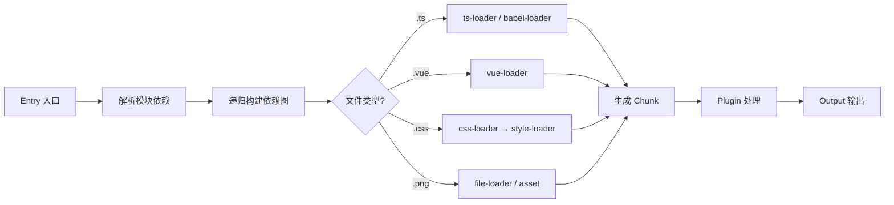

# Webpack

> ⭐⭐⭐⭐｜难度：高级｜项目：★★★

**Webpack 虽然在新项目中被 Vite 取代，但存量项目几乎全是 Webpack，面试必问核心概念。** 关键在于理解 loader 和 plugin 的本质区别，以及构建流程。

## 一句话总结

**Webpack 是静态模块打包器，从入口文件出发，通过 loader 链将各种资源（JS/CSS/图片/Vue）转换成模块，通过 plugin 在构建生命周期各阶段注入自定义逻辑，最终产出 bundle。**

## 核心机制

### 构建流程：Entry -> Dependency Graph -> Loader -> Plugin -> Output



Webpack 本身只认识 JS 和 JSON 文件。其他类型的文件（TS、Vue、CSS、图片）全靠 **loader** 转换。

### Loader vs Plugin -- 这是面试必问

| | Loader | Plugin |
|---|---|---|
| **职责** | 文件转换 -- 把非 JS 文件转成 JS 模块 | 构建流程扩展 -- 在打包的各个阶段注入行为 |
| **执行方式** | 链式调用，从右到左（从下到上） | 通过 Tapable 事件系统注册钩子 |
| **本质** | 一个函数：`(source: string) => string` | 一个类：有 `apply(compiler)` 方法 |
| **例子** | `css-loader`, `babel-loader`, `vue-loader` | `HtmlWebpackPlugin`, `DefinePlugin`, `MiniCssExtractPlugin` |

```ts
// Loader 本质：接收源文件内容，返回转换后的内容
function myLoader(source: string): string {
  // 可以把 source 做任何转换
  return source.replace(/console\.log/g, "// console.log")
}

// Plugin 本质：在 Webpack 编译生命周期中挂载自定义行为
class MyPlugin {
  apply(compiler: any) {
    // 在 emit 阶段（输出资源到 output 目录前）插入逻辑
    compiler.hooks.emit.tap("MyPlugin", (compilation: any) => {
      // compilation.assets 可以增删改输出的文件
    })
  }
}
```

**链式调用为什么从右到左？** 因为 `use: ["style-loader", "css-loader", "sass-loader"]` 的执行顺序是 sass-loader（编译 scss）-> css-loader（解析 @import）-> style-loader（注入 DOM）。后进先执行（类似函数组合 `style(css(sass(source)))`）。

### Chunk 拆分策略

Webpack 将模块分组输出到不同文件，这就是 chunk 拆分：

```ts
// webpack.config.ts — splitChunks 配置
module.exports = {
  optimization: {
    splitChunks: {
      chunks: "all", // 所有类型的 chunk 都拆分
      cacheGroups: {
        vendor: {
          test: /[\\/]node_modules[\\/]/, // 第三方库
          name: "vendor",
          priority: 10,
        },
        elementPlus: {
          test: /[\\/]node_modules[\\/]element-plus[\\/]/,
          name: "element-plus",
          priority: 20, // 优先级更高，先匹配
        },
        common: {
          minChunks: 2, // 被至少 2 个 chunk 引用
          name: "common",
          reuseExistingChunk: true, // 复用已有 chunk
        },
      },
    },
  },
}
```

## 深度拓展

### Webpack 5 的 Module Federation（微前端核心）

Module Federation 让多个独立构建的应用在运行时共享模块，**互不依赖但能共享代码**：

```ts
// 主应用 webpack.config.ts
new ModuleFederationPlugin({
  name: "host",
  remotes: {
    // 远程应用的模块入口
    app1: "app1@http://localhost:3001/remoteEntry.js",
  },
})

// 子应用 webpack.config.ts
new ModuleFederationPlugin({
  name: "app1",
  filename: "remoteEntry.js",
  exposes: {
    "./Button": "./src/components/Button.vue", // 暴露组件给主应用
  },
})
// 主应用中直接 import("app1/Button") 就能用子应用的组件
```

### 持久化缓存（Webpack 5）

```ts
module.exports = {
  cache: {
    type: "filesystem", // 缓存到磁盘
    buildDependencies: {
      config: [__filename], // 配置文件变更时缓存失效
    },
  },
}
// 二次构建速度从 30s 降到 3s
```

### 为什么 Webpack 比 Vite 慢？

Webpack 必须先把所有模块打包成 bundle 才能启动 dev server，即使有缓存也需要做一次完整的依赖分析。Vite 利用浏览器原生 ESM，**不打包就启动**，只编译浏览器请求的那个模块。核心差异是"全量 vs 按需"。

## 项目实战

### 1. 完整 Webpack 配置骨架

```ts
// webpack.config.ts — Vue3 + Element Plus 项目
import HtmlWebpackPlugin from "html-webpack-plugin"
import { VueLoaderPlugin } from "vue-loader"
import MiniCssExtractPlugin from "mini-css-extract-plugin"
import { DefinePlugin } from "webpack"
import path from "path"

export default {
  entry: "./src/main.ts",
  output: {
    path: path.resolve(__dirname, "dist"),
    filename: "js/[name].[contenthash:8].js",
    clean: true, // 每次构建清空 dist
  },
  resolve: {
    extensions: [".ts", ".tsx", ".js", ".vue"],
    alias: { "@": path.resolve(__dirname, "src") },
  },
  module: {
    rules: [
      {
        test: /\.vue$/,
        loader: "vue-loader", // 解析 .vue 单文件组件
      },
      {
        test: /\.ts$/,
        use: {
          loader: "babel-loader",
          options: {
            presets: ["@babel/preset-env", "@babel/preset-typescript"],
          },
        },
        exclude: /node_modules/,
      },
      {
        test: /\.css$/,
        use: [MiniCssExtractPlugin.loader, "css-loader"],
      },
      {
        test: /\.(png|jpg|gif|svg)$/,
        type: "asset", // Webpack 5 内置资源模块，替代 file-loader
        parser: { dataUrlCondition: { maxSize: 8 * 1024 } }, // <8KB 转 base64
      },
    ],
  },
  plugins: [
    new VueLoaderPlugin(),
    new HtmlWebpackPlugin({
      template: "./public/index.html",
      title: "后台管理系统",
    }),
    new DefinePlugin({
      __VUE_OPTIONS_API__: false, // 关闭 Options API，减小包体积
    }),
    new MiniCssExtractPlugin({
      filename: "css/[name].[contenthash:8].css", // 提取 CSS 到单独文件
    }),
  ],
}
```

### 2. 生产优化三板斧

```ts
// 1. splitChunks — 拆包，利用浏览器缓存（见上文 cacheGroups）
// 2. minimizer — 压缩 JS/CSS
import TerserPlugin from "terser-webpack-plugin"
import CssMinimizerPlugin from "css-minimizer-webpack-plugin"

export default {
  optimization: {
    minimizer: [
      new TerserPlugin({ parallel: true }), // 多线程压缩
      new CssMinimizerPlugin(),
    ],
  },
}

// 3. CSS 提取 — 避免 JS 中内联 CSS 阻塞渲染
// MiniCssExtractPlugin（见上文 plugins 配置）
```

### 3. 构建分析

```bash
# 生成构建分析报告
npx webpack --config webpack.config.ts --json > stats.json
# 然后上传到 https://webpack.github.io/analyse 可视化分析
```

## 易错点

1. **loader 顺序写反** -- `use: [style-loader, css-loader, sass-loader]` 实际执行是 sass -> css -> style，写反会导致报错
2. **source map 选错** -- `eval-cheap-module-source-map` 适合开发（快），`source-map` 适合生产（准），但生产不应暴露源码，把 `devtool` 关掉或用 `hidden-source-map`
3. **babel-loader 和 ts-loader 一起用** -- 不用 ts-loader 做类型检查，用 `fork-ts-checker-webpack-plugin` 在独立进程做类型检查，速度更快
4. **Element Plus 没有按需导入** -- webpack 中也需要配置 `unplugin-vue-components/webpack`，否则全量导入体积巨大
5. **开发模式下 CSS 提取** -- `MiniCssExtractPlugin` 应在生产使用，开发用 `style-loader` 支持 HMR

## 面试信号表

| 面试官问 | 下一问大概率是 |
|----------|-------------|
| "Webpack 的核心概念" | 追问 entry/output/loader/plugin 的职责和协作 |
| "loader 和 plugin 有什么区别" | 追问 loader 转换文件内容——plugin 扩展构建流程（钩子系统） |
| "Webpack 的 HMR 原理" | 追问 WebSocket 推送更新→模块热替换→保留应用状态 |

## 相关阅读

- [工程化 知识地图](./index.md)
- [Vite](./vite.md)
- [Babel / ESBuild](./babel-esbuild.md)
- [Tree Shaking](./tree-shaking.md)

## 更新记录

- 2026-07-05：Phase 2 深度填充（构建流程 + Loader vs Plugin + chunk 拆分 + Module Federation + 配置实战）
