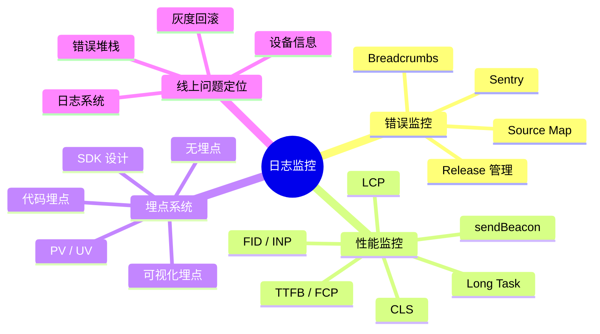

# 日志监控 知识地图

## 推荐学习顺序

1. ⭐⭐⭐⭐⭐ [Sentry 错误监控](./sentry.md) — 最核心，面试必问
2. ⭐⭐⭐⭐⭐ [线上问题定位](./online-debug.md) — 综合排查能力，高频场景题
3. ⭐⭐⭐⭐   [性能监控](./performance-monitor.md) — Core Web Vitals + 采集方案
4. ⭐⭐⭐⭐   [埋点系统](./tracking.md) — SDK 设计思路 + 数据规范

## 知识点索引

| 知识点 | 频率 | 难度 | 手写 | 状态 |
|--------|------|------|------|------|
| [Sentry 错误监控](./sentry.md) | ⭐⭐⭐⭐⭐ | 中级 | — | filled |
| [线上问题定位](./online-debug.md) | ⭐⭐⭐⭐⭐ | 高级 | — | filled |
| [性能监控](./performance-monitor.md) | ⭐⭐⭐⭐ | 高级 | — | filled |
| [埋点系统](./tracking.md) | ⭐⭐⭐⭐ | 中级 | ✅ | filled |

## 模块概述

日志监控是前端工程化的重要一环，也是面试中区分"只会写页面"和"懂工程体系"的分水岭。本模块覆盖四大方向：

- **错误监控**：Sentry 接入、Source Map 上传、Release 管理，确保线上报错能定位到源码行
- **性能监控**：Core Web Vitals 指标体系 + PerformanceObserver 采集 + sendBeacon 上报
- **埋点系统**：PV/UV、用户行为追踪、SDK 封装思路
- **线上排查**：从错误发现到定位修复的完整闭环

掌握本模块后，你应当能够独立设计并落地一套前端监控体系。
