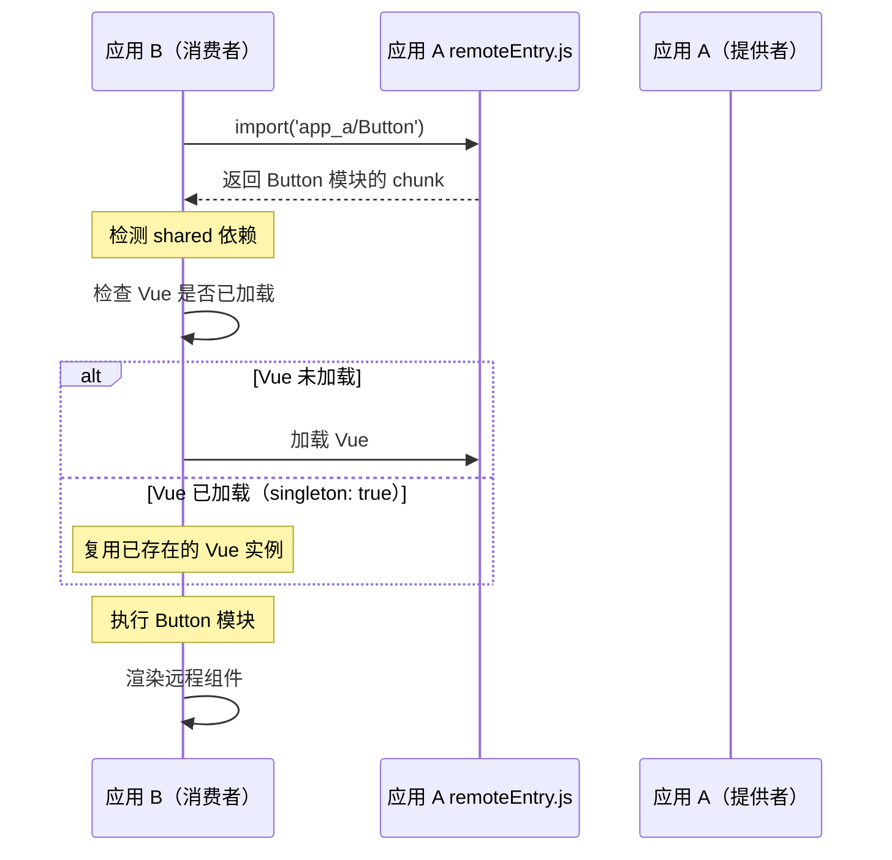
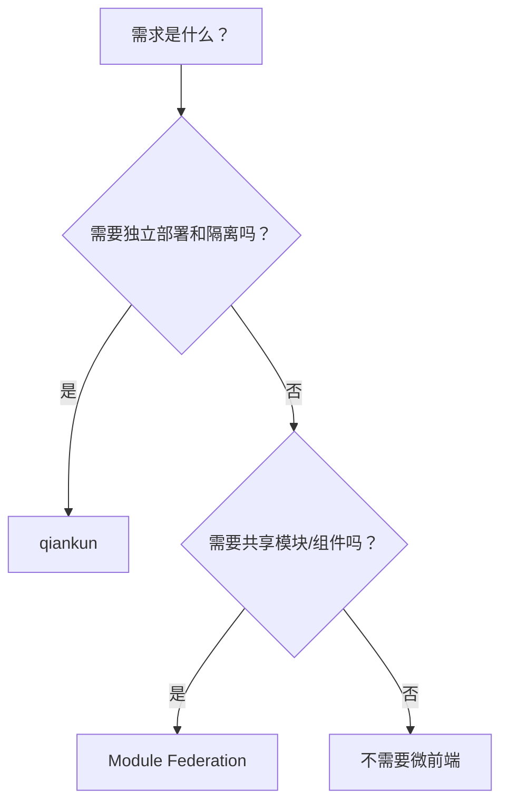

# Module Federation

> "Module Federation 解决的不是应用隔离，而是运行时模块共享 —— 这是在面试中最容易混淆的点。"

---

## 一句话总结

Module Federation（MF）是 Webpack 5 原生的微前端方案，它允许一个 JavaScript 应用在**运行时**动态加载另一个应用的模块。核心配置包括 `exposes`（声明暴露哪些模块）、`remotes`（声明消费哪些远程模块）、`shared`（声明哪些依赖共享）。与 qiankun 的本质区别：**MF 是模块级别的共享**（粒度是组件/函数/类），**qiankun 是应用级别的隔离**（粒度是整个子应用）。MF 适合技术栈异构的团队共享组件/工具函数，qiankun 适合将一个巨石应用拆成多个独立部署的子应用。

---

## 核心机制

### 1. 三个核心概念

```js
// webpack.config.js —— 应用 A（暴露模块的一方）
const { ModuleFederationPlugin } = require('webpack').container

module.exports = {
  plugins: [
    new ModuleFederationPlugin({
      name: 'app_a',          // 当前应用的唯一名称
      filename: 'remoteEntry.js', // 远程入口文件，其他应用加载此文件
      exposes: {
        // "外部可以引用此模块的路径": "本地实际文件路径"
        './Button': './src/components/Button.vue',
        './utils/format': './src/utils/format.ts',
        './store': './src/store/index.ts',
      },
      shared: {
        vue: {
          singleton: true,    // 整个页面只能有一个 Vue 实例
          requiredVersion: '^3.3.0',
        },
        lodash: {
          singleton: false,
        },
      },
    }),
  ],
}
```

```js
// webpack.config.js —— 应用 B（消费远程模块的一方）
module.exports = {
  plugins: [
    new ModuleFederationPlugin({
      name: 'app_b',
      remotes: {
        // "本地引用时的别名": "app_a@http://localhost:3001/remoteEntry.js"
        app_a: 'app_a@http://localhost:3001/remoteEntry.js',
      },
      shared: {
        vue: { singleton: true },
      },
    }),
  ],
}
```

**使用方式**：

```ts
// 应用 B 中直接 import 远程模块，就像本地模块一样
import AppAButton from 'app_a/Button'
import { formatDate } from 'app_a/utils/format'
```

通过一个异步 `import()`，Webpack 在运行时从 `http://localhost:3001/remoteEntry.js` 加载模块并执行。

### 2. shared 配置的三种策略

| 配置项 | 作用 | 典型值 |
|--------|------|--------|
| `singleton` | 是否全局只允许一个版本（如 Vue/React 必须是单例） | `true` 用于框架，`false` 用于工具库 |
| `requiredVersion` | 要求的版本范围 | `'^3.3.0'` |
| `eager` | 是否立即加载（`true` 则不异步） | 默认 `false`（按需加载） |
| `strictVersion` | 版本不一致时是否报错 | `true`（推荐，避免运行时混乱） |

```js
shared: {
  vue: {
    singleton: true,
    strictVersion: true,
    requiredVersion: '^3.3.0',
  },
  lodash: {
    singleton: false,
    requiredVersion: '^4.17.0',
  },
  dayjs: {},  // 最简单的共享声明
}
```

### 3. MF 的加载流程



核心逻辑：**运行时解析依赖**。应用 B 加载应用 A 的 Button 时，Button 需要 `vue`，但应用 B 声明了 `vue: { singleton: true }`，所以二者共享同一个 Vue 实例 —— 不会出现页面里有两个 Vue 导致报错。

---

## 深度拓展

### 追问1：Module Federation 和 qiankun 到底怎么选？



| 维度 | Module Federation | qiankun |
|------|-------------------|---------|
| **粒度** | 模块级（组件/函数/工具） | 应用级（整个子应用） |
| **隔离** | 无隔离（共享运行时） | JS 沙箱 + CSS 隔离 |
| **部署** | 各自部署，无中心节点 | 基座统一管理子应用 |
| **适用场景** | 不同团队共享组件库 | 巨石应用拆分为子应用 |
| **学习成本** | 需理解 webpack 配置 | 需理解沙箱和生命周期 |
| **运行时** | 所有模块在同一 JS 运行时 | 子应用有独立沙箱环境 |

**最简单的判断**：
- 你在"拆应用"？→ qiankun
- 你在"共享组件"？→ Module Federation

> 面试信号："MF 解决的是运行时模块共享，qiankun 解决的是应用级隔离"

### 追问2：Module Federation 的版本管理怎么做？

MF 没有统一的版本管理中心。如果应用 A 升级了 Button 组件的 props，应用 B 的代码引用了旧 props，运行时报错。

**解决方案**：
1. **约定版本号**：`remoteEntry.js` 文件名带版本 hash（如 `remoteEntry.abc123.js`），靠部署策略保证兼容
2. **TypeScript 类型共享**：暴露模块时同步导出 `.d.ts`，应用 B 在编译期就能发现不兼容
3. **Monorepo + MF**：在同一个 Monorepo 中管理所有模块，版本一致性由 pnpm workspace + lint 保证

### 追问3：MF 和 npm 包有什么区别？

| 维度 | npm 包 | Module Federation |
|------|--------|-------------------|
| **更新方式** | 发包 → 消费者升级版本 → 重新构建部署 | 提供者部署 → 消费者**运行时**自动获取最新 |
| **版本锁定** | `package.json` 精确锁定 | 无锁，运行时取最新 |
| **构建耦合** | 消费者需要重新构建 | 消费者无需重新构建 |
| **适用场景** | 稳定版本、需要 version lock | 需要快速同步、容忍运行时风险 |

MF 的优势是 **"改一行就生效"** —— 应用 A 的组件改了样式，部署后应用 B 立即看到变化，不需要应用 B 重新构建。

---

## 项目实战

### 组件库共享平台

场景：公司有 3 个业务团队，各自维护独立部署的应用（不一定需要微前端隔离），但都用到同一套 UI 组件库（UserSelector、DeptTree、OrderStatusTag 等）。

**MF 方案**：
1. 组件库团队维护一个"组件中心"应用，把组件通过 `exposes` 暴露
2. 业务团队在自己的 webpack 里配置 `remotes` 指向组件中心
3. 组件中心更新组件 → 部署 → 所有业务应用运行时自动获取最新版本

```js
// 组件中心 webpack.config.js
new ModuleFederationPlugin({
  name: 'component_center',
  filename: 'remoteEntry.js',
  exposes: {
    './UserSelector': './src/components/UserSelector.vue',
    './DeptTree': './src/components/DeptTree.vue',
    './OrderStatusTag': './src/components/OrderStatusTag.vue',
  },
  shared: { vue: { singleton: true }, 'element-plus': { singleton: true } },
})
```

**注意事项**：
- shared 的库版本必须一致，否则 singleton 会警告甚至报错
- 暴露的模块要向后兼容 —— 删 prop 之前给一个过渡期
- 组件中心挂了，所有业务应用的对应模块加载失败 → 需要 CDN 多节点 + fallback 方案

---

## 易错点

1. **❌ 忘记配置 `publicPath`**：远程模块加载时找不到 chunk 路径。配置 `output.publicPath: 'auto'` 或绝对 URL。

2. **❌ singleton 版本不一致**：应用 A 的 `vue: 3.3.0` vs 应用 B 的 `vue: 3.2.0`，共享时会警告。解决：统一升级所有应用的 Vue 版本，或关闭 `singleton`（但不推荐）。

3. **❌ 暴露了不该暴露的模块**：`exposes` 把 `./store` 暴露出去，远程应用可以直接修改本地状态 —— 破坏了封装。只暴露**纯组件**和**纯函数**，不暴露内部状态。

---

## 面试信号

当面试官问 Module Federation 时，分层回答：

1. **概念层**："Webpack 5 原生功能，让应用在运行时加载另一个应用的模块，通过 exposes/remotes/shared 三个配置实现"
2. **对比层**："和 qiankun 区别在于粒度 —— MF 共享模块，qiankun 隔离应用。和 npm 包区别在于更新不需要重新构建消费者"
3. **实战层**："用 MF 搭建了组件共享平台，7 个业务组共享一套组件库，组件中心一发版所有业务应用实时生效"

---

## 相关阅读

- [微前端概述](./overview.md) — 四种方案全景对比
- [qiankun 深度解析](./qiankun.md) — 应用级隔离的另一种思路
- [Webpack 基础](../工程化/webpack) — 理解 loader/plugin 机制才能看懂 MF 配置

---

## 更新记录

- 2026-07-06：完成内容填充，新增加载流程图、MF vs qiankun 决策表、MF vs npm 包对比、组件共享平台实战、版本管理方案
