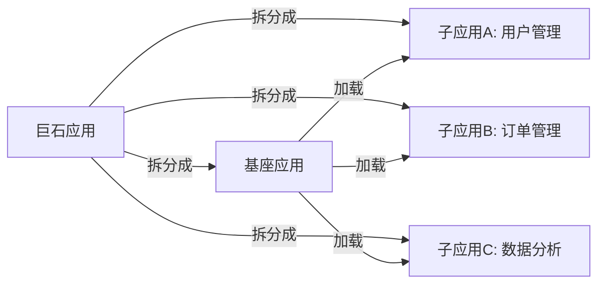

# 微前端概述

> "微前端不是银弹 —— 如果你的应用只有 3 个页面、1 个团队，引入微前端就是过度设计。"

---

## 一句话总结

微前端解决的问题是：**巨石应用**随着业务增长，多个团队在同一个仓库中协作，构建、部署、发布互相阻塞。微前端将巨石应用拆分为**独立开发、独立部署、独立运行**的子应用，通过主应用（基座）组装。目前主流方案有 4 种：`iframe`（天然隔离但体验差）、`single-spa`（路由编排）、`qiankun`（阿里封装，沙箱+隔离+通信）、`Module Federation`（Webpack 5 运行时模块共享）。选型的关键不是技术先进性，而是**团队规模、技术栈异构程度、性能要求**的匹配度。

---

## 核心机制

### 1. 为什么需要微前端？

痛点清单：
- **构建慢**：一个模块改一行，全量重新构建 20 分钟
- **发布阻塞**：A 团队完成需求，但 B 团队有 bug，导致无法上线
- **技术栈锁定**：想用 React 重写某模块？不可能，全项目都是 Vue2
- **协作冲突**：50 人在同一仓库中开发，merge conflict 天天见
- **回归风险**：改了 A 模块，B 模块莫名其妙挂了

### 2. 微前端核心要解决的四大问题

| 问题 | 说明 | 典型解决方案 |
|------|------|-------------|
| **JS 沙箱隔离** | 子应用间的全局变量不互相污染 | Proxy 代理 window（qiankun） |
| **CSS 样式隔离** | 子应用的样式不影响其他子应用 | Shadow DOM / 命名空间前缀 / CSS Modules |
| **应用间通信** | 子应用之间的数据传递 | 全局状态池（initGlobalState）/ 自定义事件 / URL 参数 |
| **公共依赖** | React、Vue、lodash 等公共库的复用 | externals / shared（MF） / CDN 引入 |

### 3. 四种方案全景对比

| 维度 | iframe | single-spa | qiankun | Module Federation |
|------|--------|------------|---------|-------------------|
| **隔离方式** | 浏览器原生隔离 | 无隔离 | JS 沙箱 + CSS 隔离 | 模块级隔离 |
| **学习成本** | 极低 | 中 | 中 | 高 |
| **技术栈异构** | 天然支持 | 支持 | 支持 | 支持 |
| **通信方式** | postMessage | 自定义事件 | initGlobalState | 模块导出/导入 |
| **性能** | 差（独立渲染进程） | 好 | 好 | 最好 |
| **子应用接入成本** | 无 | 需改造入口 | 需导出生命周期 | 需配置 webpack |
| **SEO** | 不友好 | 需 SSR 配合 | 需 SSR 配合 | 需 SSR 配合 |
| **社区生态** | 标准 API | 一般 | 活跃（阿里） | Webpack 官方 |

### 4. 选型决策表

| 场景 | 推荐方案 | 理由 |
|------|---------|------|
| 嵌入第三方页面（如帮助文档、活动页） | **iframe** | 完全隔离，对方不需要适配 |
| 阿里系团队，Vue/React 混用，需快速落地 | **qiankun** | 中文文档完善，沙箱和通信开箱即用 |
| Webpack 5 项目，共享组件/模块级别 | **Module Federation** | 运行时共享模块，无需中心化基座 |
| 简单路由分发，不需要沙箱（自己控制子应用） | **single-spa** | 轻量，只做路由编排 |
| 10+ 子应用，性能敏感，SEO 要求高 | **qiankun + SSR** | 沙箱保证稳定性，SSR 解决首屏 |

---

## 深度拓展

### 追问1：single-spa 和 qiankun 到底是什么关系？

single-spa 是微前端的**路由器**：它监听 URL 变化，根据路由规则决定挂载哪个子应用。但它不提供 JS 沙箱、不提供 CSS 隔离、不提供应用间通信 —— 这些都需要自己实现。

qiankun 在 single-spa 基础上做了**3 层增强**：
1. **JS 沙箱**：子应用的 `window.xxx` 只在沙箱内生效，切换子应用时自动恢复
2. **CSS 隔离**：子应用的样式不泄漏到其他子应用
3. **应用间通信**：`initGlobalState` 提供全局状态管理

面试时可以说："qiankun 是 single-spa 的阿里增强版，解决了单靠路由分发解决不了的隔离和通信问题。"

### 追问2：什么情况下不应该用微前端？

1. **团队 < 10 人**：巨石应用的修改成本 < 微前端的基础设施维护成本
2. **业务模块强耦合**：子应用之间频繁通信，微前端的隔离反而成为障碍
3. **不需要独立部署**：如果所有模块总是一起发版，拆分没有意义
4. **SEO 是核心需求**：微前端对 SEO 的支持天然弱，需要大量额外工作

---

## 项目实战

### 后台管理系统微前端改造的思路

假设你有一个 Vue3 后台管理系统，现有 3 个独立业务线：用户管理、订单管理、数据分析。

**改造步骤**：
1. 抽取基座：layout + 路由分发 + 登录态 + 权限数据
2. 把 3 个业务模块改造为独立子应用（独立仓库、独立发版）
3. 基座注册 3 个子应用，按路由分发
4. 公共依赖（element-plus、lodash、dayjs）通过 CDN 或 externals 共享
5. 权限数据通过 `initGlobalState` 或 `provide/inject` 下发给子应用

**关键决策点**：
- 子应用是否需要自己的登录态？→ 不需要，基座统一管理，通过 token 传递
- 子应用的菜单谁来渲染？→ 基座的侧边栏负责，子应用只负责内容区
- 公共组件（如用户选择器）怎么共享？→ 如果用 MF，可以 `exposes`；如果用 qiankun，抽成 npm 包

---

## 面试信号

当面试官问"微前端了解吗"，你的回答结构：

1. **先说场景**："我们团队 30+ 人，多个业务线在一个仓库里，发布互相阻塞，所以引入了微前端"
2. **再说方案对比**："评估过 iframe、single-spa、qiankun，最终选了 qiankun，因为它提供了开箱即用的沙箱和 CSS 隔离"
3. **最后说踩坑**："实际落地中最大问题是样式冲突和公共依赖重复加载，通过 CSS 前缀命名空间和 externals 配置解决"
4. **加分项**：能说出 qiankun 的 ProxySandbox 原理、预加载机制、更新机制（`update` 生命周期）

> "能对比四类方案的适用场景，而不是只背概念"

---

## 相关阅读

- [qiankun 深度解析](./qiankun.md) — JS 沙箱、CSS 隔离、通信机制详解
- [Module Federation](./module-federation.md) — Webpack 5 运行时模块共享
- [iframe 方案的优劣](./iframe.md) — 最简单方案的适用边界

---

## 更新记录

- 2026-07-06：完成内容填充，新增四种方案全景对比表、选型决策表、微前端改造实战思路
