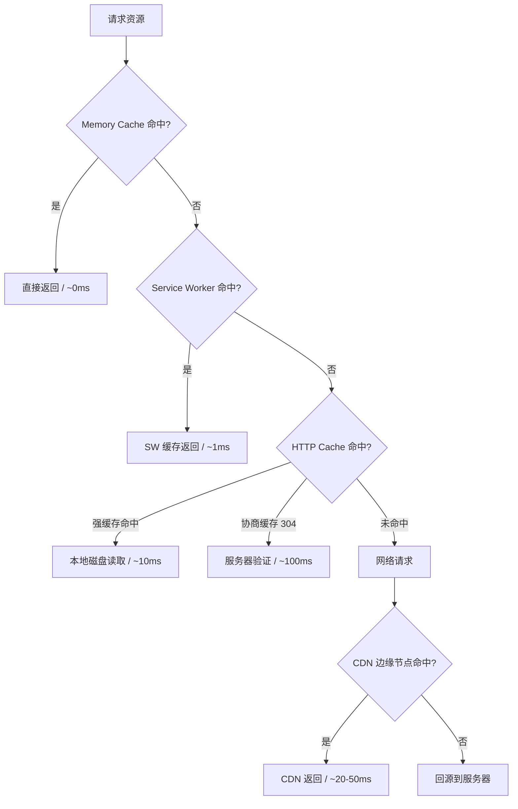

# 缓存策略体系

> ⭐⭐⭐⭐⭐｜难度：高级｜中高级面试必问

**面试官问"你项目里怎么做缓存"，不是让你背 Cache-Control 头——他要听你从浏览器到 CDN 的完整缓存层次和分级策略。**

## 一句话总结

**前端缓存分四层：Memory Cache（最快、容量最小）→ Service Worker Cache（开发者可控）→ HTTP Cache（强缓存+协商缓存）→ CDN 边缘缓存（离用户最近）。分层设计，逐级兜底。**

## 缓存层次全景



## 逐层详解

### 第一层：Memory Cache

浏览器内存缓存，**容量最小（由浏览器动态管理，无法指定大小）、速度最快（~0ms）、渲染进程关闭即清空**。

浏览器自动管理，开发者无法通过 JS API 直接控制。通常缓存当前页面已加载过的资源——图片在同一个文档内多次引用、preload 的资源会进 Memory Cache。

**面试关键点**：preload 资源会优先进入 Memory Cache，在页面关闭前多次使用同一资源时命中率最高。

### 第二层：Service Worker Cache

**开发者完全可控的缓存层**，可以拦截所有网络请求，决定返回缓存还是发起网络请求。基于 Cache API：

```javascript
// 安装阶段：预缓存关键静态资源
self.addEventListener('install', (event) => {
  event.waitUntil(
    caches.open('v1').then((cache) =>
      cache.addAll(['/index.html', '/app.js', '/style.css'])
    )
  );
});

// 请求拦截：缓存优先策略
self.addEventListener('fetch', (event) => {
  event.respondWith(
    caches.match(event.request).then((cached) => {
      // 缓存命中直接返回，否则走网络
      return cached || fetch(event.request).then((response) => {
        // 网络请求成功后写入缓存
        return caches.open('v1').then((cache) => {
          cache.put(event.request, response.clone());
          return response;
        });
      });
    })
  );
});
```

**三种常见策略**：

| 策略 | 流程 | 适用场景 |
|------|------|---------|
| Cache First | 先查缓存→缓存无则网络 | 不常变的静态资源（字体、logo） |
| Network First | 先网络→失败则缓存兜底 | 需要最新但需离线兜底 |
| Stale-While-Revalidate | 返回缓存同时后台更新 | API 数据、列表 |

### 第三层：HTTP 缓存

> 完整机制见 [HTTP 缓存](../网络/http-cache.md)

核心是两组 HTTP 头：

**强缓存**（不发请求，直接拿本地）：
- `Cache-Control: max-age=31536000` → 一年内直接用
- `Cache-Control: no-cache` → 每次都验证（不是不缓存）

**协商缓存**（发请求，服务器判断）：
- `ETag` / `If-None-Match` → 内容哈希对比，更精准
- `Last-Modified` / `If-Modified-Since` → 时间对比，秒级精度

**实际项目分级策略**：

| 资源类型 | 策略 | 典型配置 |
|---------|------|---------|
| 带 hash 的 JS/CSS（构建产物） | 强缓存 1 年 | `max-age=31536000, immutable` |
| HTML 入口文件 | 协商缓存 | `Cache-Control: no-cache` |
| 图片/字体 | 强缓存 30 天 | `max-age=2592000` |
| API 数据 | 不缓存 | `Cache-Control: no-store` |

### 第四层：CDN 缓存

CDN 是部署在用户附近的边缘服务器集群。**目的是让用户从最近的节点获取资源，减少延迟。**

- CDN 节点自身也有缓存，未命中时回源（origin）拉取
- 配合内容哈希文件名（`app.a1b2c3d.js`），实现永久缓存
- 常用 CDN 服务：阿里云 OSS + CDN、Cloudflare、腾讯云 CDN

## 项目实战

Vue3 后台管理系统的缓存分层配置：

```
构建产物:
  index.html           → Nginx: no-cache（协商缓存，保证入口最新）
  /assets/*.js         → CDN: max-age=31536000（永久缓存，hash 保证唯一性）
  /assets/*.css        → CDN: max-age=31536000
  图片/字体            → CDN: max-age=2592000（30 天）

Service Worker:
  可选——管理后台通常不需要离线能力，SW 更适合 C 端内容型产品

API:
  全部 Cache-Control: no-store（管理后台数据必须实时）
```

## 面试信号表

| 面试官问 | 下一问大概率是 |
|----------|-------------|
| "你们项目怎么做缓存" | 追问分层——"强缓存和协商缓存怎么配合" |
| "Cache-Control 有哪些值" | 追问 no-cache vs no-store——"区别是什么" |
| "Service Worker 怎么用" | 追问"牺牲了灵活性换什么"——离线能力和性能 |

## 相关阅读

- [HTTP 缓存](../网络/http-cache.md)
- [首屏优化](./first-screen.md)
- [Web Vitals](./web-vitals.md)

## 更新记录

- 2026-07-18：Phase 3 事实审计修正（Memory Cache 容量表述去掉"通常几 MB"的臆测数字）
- 2026-07-16：新建——四层缓存体系+分级策略+项目实战
