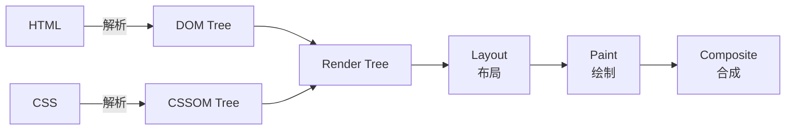

# 首屏优化

> ⭐⭐⭐⭐⭐｜难度：中级｜项目：★★★

**首屏优化是面试中"性能优化"话题的入口题。** 同时也是实际项目中最直接影响用户留存的工作--用户打开页面 3 秒还白屏，80% 会选择离开。这道题的回答层次直接决定面试官对你性能功底的判断。

## 一句话总结

**首屏优化目标是减少 FCP 和 LCP，核心策略是减少关键资源数量和体积 + 优化加载顺序，让用户尽快看到可交互的内容。**

## 核心机制

### 关键渲染路径（CRP）

浏览器从收到 HTML 到渲染出像素，中间有一个不能跳过的流水线：



三个阻塞点：

1. **CSS 阻塞渲染** -- Render Tree 依赖 CSSOM，浏览器必须等所有 CSS 下载并解析完
2. **JS 阻塞 DOM 构建** -- 碰到 `<script>` 标签（不带 async/defer），HTML 解析暂停
3. **外部资源增加网络往返** -- 每个关键资源都需要 DNS + TCP + TLS + Request

```ts
// 关键渲染路径的优化就是减少这三个阻塞的影响
// 目标：让 Render Tree 尽快构建完成，触发首次绘制
```

### 资源加载策略 -- 五种 hint 的使用场景

```ts
// preload — 当前页面现在就需要的资源（同页面、高优先级）
<link rel="preload" as="image" href="hero.webp" />
<link rel="preload" as="font" crossorigin href="/fonts/main.woff2" />

// prefetch — 下一个页面可能需要的资源（跨页面、低优先级、空闲时下载）
<link rel="prefetch" as="script" href="/chunks/dashboard.js" />

// preconnect — 提前建立到第三方源的连接（DNS + TCP + TLS）
<link rel="preconnect" href="https://api.example.com" />

// dns-prefetch — 只提前 DNS 解析（比 preconnect 轻量）
<link rel="dns-prefetch" href="https://cdn.example.com" />

// async vs defer — 控制脚本的下载和执行时机
<script async src="analytics.js" />   // 下载完立刻执行，适合独立脚本
<script defer src="app.js" />          // DOM 解析完再按顺序执行，适合依赖 DOM 的脚本
```

### 代码分割 -- 路由级别的懒加载

```ts
// Vue 路由懒加载 — 每个页面独立 chunk
const routes = [
  {
    path: "/dashboard",
    // webpackChunkName 给 chunk 命名，方便分析
    component: () => import(/* webpackChunkName: "dashboard" */ "@/views/Dashboard.vue"),
  },
  {
    path: "/settings",
    component: () => import(/* webpackChunkName: "settings" */ "@/views/Settings.vue"),
  },
]

// React 路由懒加载
const Dashboard = React.lazy(() => import("./pages/Dashboard"))
```

### SSR / SSG -- 服务端直接给 HTML

CSR 的问题：用户看到的是空 `<div id="app"></div>`，等 JS 下载 -> 执行 -> 请求数据 -> 渲染，期间全是白屏。SSR 在服务端执行 Vue/React 渲染成 HTML 字符串直接返回，用户立刻看到内容。

```ts
// Nuxt 3 示例：SSR 模式下页面数据在服务端获取
const { data } = await useFetch("/api/articles") // 服务端执行，HTML 中直接包含内容
```

但 SSR 不是银弹：服务器压力增加，TTFB 可能反而变慢，需要 CDN 和缓存策略配合。

## 深度拓展

### 骨架屏 -- 让白屏变成"即将加载"

骨架屏不改变真实的加载时间，但改变用户的**感知时间**。用户看到有东西在动，知道页面没卡死。

```ts
// 纯 CSS 骨架屏 — 利用 :empty 伪类和动画
.skeleton:empty {
  background: linear-gradient(90deg, #f0f0f0 25%, #e0e0e0 50%, #f0f0f0 75%);
  background-size: 200% 100%;
  animation: shimmer 1.5s infinite;
}

// Element Plus 提供开箱即用的骨架屏组件
<el-skeleton :loading="loading" animated>
  <template #template>
    <el-skeleton-item variant="image" style="width: 400px; height: 200px" />
    <el-skeleton-item variant="text" style="width: 60%" />
  </template>
  <template #default>
    
    <p>{{ article.title }}</p>
  </template>
</el-skeleton>
```

### Service Worker 预缓存

```ts
// Workbox 预缓存关键资源
// 首次访问后，关键资源被 SW 缓存，二次访问瞬间加载
import { precacheAndRoute } from "workbox-precaching"
precacheAndRoute(self.__WB_MANIFEST) // 构建时自动生成资源清单
```

### 字体加载优化

```css
/* font-display: swap — 立即显示 fallback 字体，加载完再替换（减少白屏但可能有 CLS） */
@font-face {
  font-family: "CustomFont";
  src: url("/fonts/custom.woff2") format("woff2");
  font-display: swap;
}

/* font-display: optional — 100ms 内没加载到就放弃，本次页面不再替换（零 CLS） */
@font-face {
  font-family: "CustomFont";
  src: url("/fonts/custom.woff2") format("woff2");
  font-display: optional;
}

/* 子集化 — 只打包用到的字符，中文字体特别有效（几 MB -> 几十 KB） */
```

## 项目实战

### 1. Vite 打包分析 -- 找出大模块

```ts
// vite.config.ts
import { visualizer } from "rollup-plugin-visualizer"

export default defineConfig({
  plugins: [
    visualizer({ open: true, gzipSize: true, brotliSize: true }),
  ],
})
// 运行 npm run build 后打开 stats.html，一眼看出哪些模块体积过大
```

### 2. 路由懒加载批量改造

```ts
// 全局扫描：所有 views 下的 .vue 文件都用动态 import
// 同时用 webpackChunkName 注释给 chunk 命名，方便分析缓存命中率
const Dashboard = () => import(/* webpackChunkName: "dashboard" */ "@/views/Dashboard.vue")
```

### 3. Element Plus 骨架屏替代 Loading Spinner

```ts
// 改造前：loading spinner，用户不知道在加载什么
<el-table v-loading="loading" :data="list" />

// 改造后：骨架屏 + el-skeleton，用户知道内容结构
<el-skeleton :loading="loading" animated :count="5">
  <template #template>
    <el-skeleton-item variant="text" v-for="i in 4" :key="i" />
  </template>
  <template #default>
    <el-table :data="list" />
  </template>
</el-skeleton>
```

## 易错点

1. **所有资源都加 preload** -- 滥用 preload 反而抢占带宽，浏览器不知道该优先下载哪个。preload 只给 LCP 关键资源（首屏大图、关键字体、核心 CSS）
2. **过度拆分导致请求瀑布** -- chunk 小到 2-3KB 时，HTTP 请求数量暴增。HTTP/2 下建议单个 chunk 30-50KB
3. **SSR 一定比 CSR 快** -- SSR 增加服务器压力，TTFB 可能比 CSR 的静态 HTML 更慢。需要 CDN + 页面缓存 + 降级策略
4. **骨架屏让用户等更久** -- 骨架屏不改变真实加载时间，只是改善心理感知。如果加载占了瓶颈，还是要做实质性优化
5. **defer 脚本完全不阻塞** -- defer 脚本的下载不阻塞 DOM，但执行仍在 DOMContentLoaded 之前，会延迟这个事件

## 相关阅读

- [Web Vitals](./web-vitals.md)
- [打包优化](./bundle-optimization.md)
- [图片优化](./image-optimization.md)
- [浏览器渲染流程](../浏览器/render-process.md)
- [浏览器缓存](../浏览器/cache.md)
- [性能优化知识地图](./index.md)

## 更新记录

- 2026-07-05：Phase 2 深度填充（CRP 机制 + 资源加载策略 + 骨架屏 + SSR 权衡 + 项目实战）
