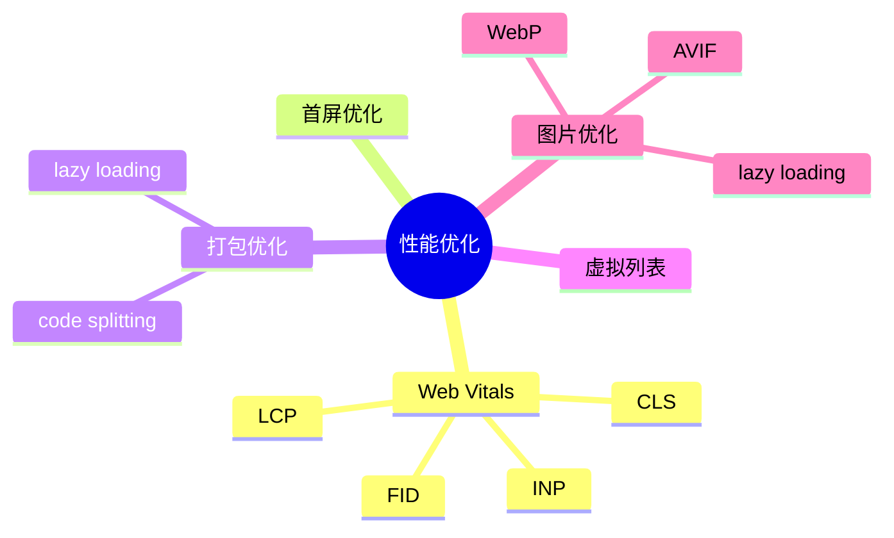

# 性能优化 知识地图

## 推荐学习顺序

1. ⭐⭐⭐⭐⭐ [Web Vitals](./web-vitals.md)
2. ⭐⭐⭐⭐⭐ [首屏优化](./first-screen.md)
3. ⭐⭐⭐⭐   [打包优化](./bundle-optimization.md)
4. ⭐⭐⭐⭐   [虚拟列表](./virtual-list.md)
5. ⭐⭐⭐     [图片优化](./image-optimization.md)

## 知识点索引

| 知识点 | 频率 | 难度 | 手写 | 状态 |
|--------|------|------|------|------|
| [Web Vitals](./web-vitals.md) | ⭐⭐⭐⭐⭐ | 高级 | — | draft |
| [首屏优化](./first-screen.md) | ⭐⭐⭐⭐⭐ | 中级 | — | draft |
| [打包优化](./bundle-optimization.md) | ⭐⭐⭐⭐ | 中级 | — | draft |
| [虚拟列表](./virtual-list.md) | ⭐⭐⭐⭐ | 高级 | — | draft |
| [图片优化](./image-optimization.md) | ⭐⭐⭐ | 初级 | — | draft |
