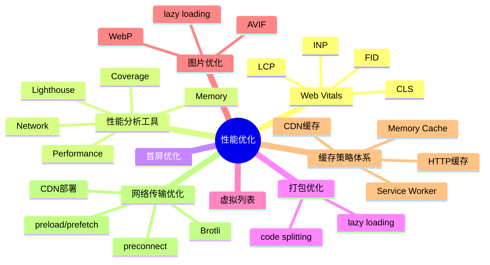

# 性能优化 知识地图

## 推荐学习顺序

### 一、核心指标与工具（先知道怎么衡量）

1. ⭐⭐⭐⭐⭐ [Web Vitals](./web-vitals.md) — 目标：知道什么"算快"
2. ⭐⭐⭐⭐⭐ [性能分析工具](./performance-devtools.md) — 工具：知道怎么测量

### 二、加载优化（从前到后）

3. ⭐⭐⭐⭐⭐ [首屏优化](./first-screen.md) — 综合实战
4. ⭐⭐⭐⭐⭐ [缓存策略体系](./caching-strategy.md) — 减少请求
5. ⭐⭐⭐⭐   [网络传输优化](./network-optimization.md) — 加快传输
6. ⭐⭐⭐⭐   [打包优化](./bundle-optimization.md) — 减少体积
7. ⭐⭐⭐     [关键渲染路径](./critical-rendering-path.md) — 浏览器视角
8. ⭐⭐⭐     [图片优化](./image-optimization.md) — 专项资源优化

### 三、运行时优化（渲染完成后）

9. ⭐⭐⭐⭐   [虚拟列表](./virtual-list.md) — 大数据量渲染

## 知识点索引

| 知识点 | 频率 | 难度 | 手写 | 状态 |
|--------|------|------|------|------|
| [Web Vitals](./web-vitals.md) | ⭐⭐⭐⭐⭐ | 高级 | — | draft |
| [性能分析工具](./performance-devtools.md) | ⭐⭐⭐⭐⭐ | 中级 | — | draft |
| [首屏优化](./first-screen.md) | ⭐⭐⭐⭐⭐ | 中级 | — | draft |
| [缓存策略体系](./caching-strategy.md) | ⭐⭐⭐⭐⭐ | 高级 | — | draft |
| [打包优化](./bundle-optimization.md) | ⭐⭐⭐⭐ | 中级 | — | draft |
| [网络传输优化](./network-optimization.md) | ⭐⭐⭐⭐ | 高级 | — | draft |
| [虚拟列表](./virtual-list.md) | ⭐⭐⭐⭐ | 高级 | — | draft |
| [图片优化](./image-optimization.md) | ⭐⭐⭐ | 初级 | — | draft |
