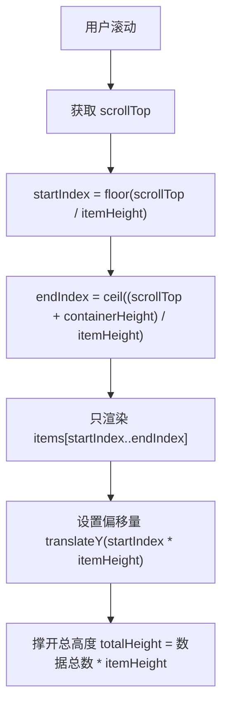

# 虚拟列表

> ⭐⭐⭐⭐｜难度：高级

**虚拟列表是大数据渲染的银弹，也是手写题的高频考点。** 面试时能说清楚"只渲染可视区域的节点 + 用 transform 模拟滚动偏移"，再补上动态高度和缓冲区的处理细节，基本就稳了。

## 一句话总结

**虚拟列表（Virtual Scroll）只渲染可视区域内的 DOM 节点，通过计算起始索引和偏移量模拟完整列表的滚动效果，将 10 万条数据的 DOM 节点数从 10 万降到 ~20 个。**

## 核心机制

### 原理：三要素



### 可视区域计算

```ts
// 核心公式 — 固定高度场景
const containerHeight = 600   // 容器高度
const itemHeight = 50         // 每项高度
const totalItems = 100000     // 总数据量

const handleScroll = (scrollTop: number) => {
  const startIndex = Math.floor(scrollTop / itemHeight)
  const endIndex = Math.ceil((scrollTop + containerHeight) / itemHeight)

  // 只渲染 [startIndex, endIndex] 这一小段
  const visibleData = rawData.slice(startIndex, endIndex + 1)

  // transform 偏移：让这段 DOM 出现在正确的位置
  const offsetY = startIndex * itemHeight
}
```

关键细节：`startIndex` 用 `Math.floor` 保证第一项完整可见，`endIndex` 用 `Math.ceil` 保证最后一项也被渲染，防止底部出现空白。

### 偏移量处理 -- transform vs padding

```ts
// 方式一：transform: translateY（推荐）
// GPU 加速，不触发 Layout/Paint，只触发 Composite
<div :style="{ transform: `translateY(${offsetY}px)` }">
  <div v-for="item in visibleData" :key="item.id">{{ item.text }}</div>
</div>

// 方式二：paddingTop 撑开
// 兼容性更好，但每次更新 padding 都会触发 reflow
<div :style="{ paddingTop: `${offsetY}px` }">
  <div v-for="item in visibleData" :key="item.id">{{ item.text }}</div>
</div>
```

### 缓冲区 -- overscan

快速滚动时，如果恰好只在 `[startIndex, endIndex]` 范围渲染，可能出现"先看到空白，再出现内容"的闪烁。解决方案：上下各多渲染几个节点。

```ts
const BUFFER_COUNT = 5 // 上下各多渲染 5 个

const visibleData = rawData.slice(
  Math.max(0, startIndex - BUFFER_COUNT),
  Math.min(totalItems, endIndex + BUFFER_COUNT)
)
const offsetY = Math.max(0, startIndex - BUFFER_COUNT) * itemHeight
```

### 动态高度 -- 从常量到数组

```ts
// 固定高度：维护两个变量
let scrollTop: number
let itemHeight: number

// 动态高度：维护整个位置数组
interface Position {
  index: number
  top: number         // 该项顶部偏移
  bottom: number      // 该项底部偏移
  height: number      // 该项实际高度（测量后更新）
}

const positions: Position[] = [] // 每一项的位置信息

// 用二分查找快速定位 startIndex（O(log n)）
function findStartIndex(scrollTop: number): number {
  let left = 0, right = positions.length - 1
  while (left <= right) {
    const mid = Math.floor((left + right) / 2)
    if (positions[mid].bottom <= scrollTop) {
      left = mid + 1
    } else {
      right = mid - 1
    }
  }
  return left
}
```

## 深度拓展

### 固定高度 vs 动态高度的实现差异

| 维度 | 固定高度 | 动态高度 |
|------|---------|---------|
| 数据维护 | scrollTop + itemHeight 两个变量 | positions 数组（每项的 top/bottom/height） |
| 查找 startIndex | O(1) 直接除 | O(log n) 二分查找 |
| 高度更新 | 不需要 | ResizeObserver 异步测量后更新缓存，并重新计算后续项偏移 |
| 适用场景 | 简单列表、推送通知列表 | 聊天消息、商品卡片、不固定高度的内容 |

### 虚拟列表 + 搜索/筛选后的定位

```ts
// 数据变化后的三种策略：
// 1. 回到顶部：最简单，数据源变化后重置 scrollTop = 0
// 2. 保持位置：记录 scrollTop，数据变化后恢复
// 3. 定位到匹配项：找到匹配项的 index，计算 offset 并 scrollTo

function scrollToItem(index: number) {
  const targetOffset = positions[index]?.top ?? index * estimatedItemHeight
  containerRef.value?.scrollTo({ top: targetOffset, behavior: "smooth" })
}
```

### 横向虚拟滚动

原理和纵向完全一致，只是把 `height` 换成 `width`，`scrollTop` 换成 `scrollLeft`。典型场景：横向时间轴、大量列的表格。

```ts
// 横向虚拟滚动核心：startIndex = floor(scrollLeft / columnWidth)
// 其余逻辑与纵向完全对称
```

## 项目实战

### 1. 万级表格数据 -- el-table-v2

```ts
// Element Plus 的 el-table-v2 内置虚拟滚动，是大数据量的首选
// 不需要自己实现虚拟列表
<template>
  <el-table-v2 :columns="columns" :data="listData" :width="800" :height="600" fixed />
</template>

<script setup>
// 10 万条数据 + 虚拟滚动 = 只渲染 ~20 个 tr，流畅滚动
const listData = ref(generateData(100_000))
</script>
```

### 2. 聊天消息虚拟列表 -- 动态高度

```ts
// 聊天场景特点：消息高度不固定（文本/图片/文件/语音）
// 需要动态高度 + 新消息自动滚动到底部
function scrollToBottom() {
  nextTick(() => {
    const totalHeight = positions.value[positions.value.length - 1]?.bottom ?? 0
    containerRef.value?.scrollTo({ top: totalHeight - containerHeight })
  })
}

watch(() => messages.value.length, () => {
  // 新消息到达 -> 更新 positions -> 滚动到底部
  updatePositions()
  scrollToBottom()
})
```

### 3. 下拉选择器虚拟化

```ts
// Element Plus 的 el-select-v2 支持虚拟化
// 1 万个选项不会卡顿（普通的 el-select 会渲染 1 万个 option DOM）
<el-select-v2
  v-model="value"
  :options="thousandsOfOptions"
  placeholder="选择"
/>
```

## 易错点

1. **虚拟列表的每一项没有 key** -- Vue 依赖 `:key` 进行 DOM 复用，没有 key 会导致滚动时 DOM 混乱（A 位置的数据显示 B 的文本）
2. **可视区域计算用 Math.round** -- 应该用 `Math.floor(startIndex)` 和 `Math.ceil(endIndex)`，round 会导致首尾漏渲染
3. **不设缓冲区** -- 快速滚动时用户会看到"先空白再出现内容"的闪烁，3-5 个缓冲节点就能解决
4. **动态高度每项都实时测量** -- 应该先用预估高度渲染，ResizeObserver 异步测量后更新缓存，实时测量会阻塞渲染
5. **scroll 事件没有节流** -- scroll 每秒可触发数十次（约一帧一次），需要用 `requestAnimationFrame` 包裹渲染逻辑，确保一帧只计算一次

## 面试信号表

| 面试官问 | 下一问大概率是 |
|----------|-------------|
| "虚拟列表的原理" | 追问只渲染可视区域 + 上下缓冲区——DOM 数量从 10000→~20 |
| "虚拟列表怎么处理不定高" | 追问预估高度 + 渲染后实测更新 + ResizeObserver 动态修正 |
| "虚拟列表和分页怎么选" | 追问虚拟列表适合连续滚动浏览——分页适合需要精确定位到第 N 页 |

## 相关阅读

- [打包优化](./bundle-optimization.md)
- [大数据表格实战](../项目实战/业务场景/big-data-table.md)
- [首屏优化](./first-screen.md)
- [性能优化知识地图](./index.md)

## 更新记录

- 2026-07-18：Phase 3 事实审计修正（mermaid 节点含括号/中括号需加引号否则渲染失败、el-auto-table-v2 更正为 el-table-v2、padding 方案必触发 reflow、scroll 触发频率表述）
- 2026-07-05：Phase 2 深度填充（虚拟列表原理 + 固定/动态高度实现 + 缓冲区 + 二分查找 + 项目实战）
