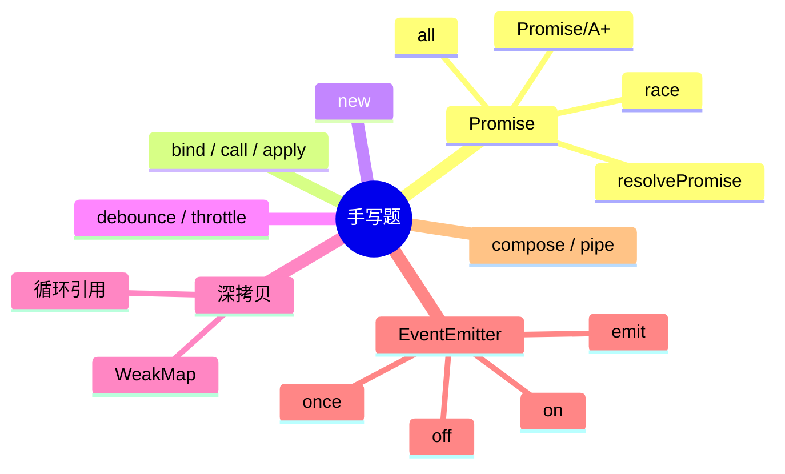

# 手写题 知识地图

## 推荐练习顺序

### 一、P0（必能手写——占考察 80%）

1. ⭐⭐⭐⭐⭐ [Promise](./promise.md)
2. ⭐⭐⭐⭐⭐ [Promise.all / allSettled / any / race](./promise-static.md)
3. ⭐⭐⭐⭐⭐ [bind / call / apply](./bind-call-apply.md)
4. ⭐⭐⭐⭐⭐ [深拷贝](./deep-clone.md)
5. ⭐⭐⭐⭐⭐ [debounce / throttle](./debounce-throttle.md)
6. ⭐⭐⭐⭐⭐ [new](./new.md)

### 二、P1（熟练——字节/阿里高频）

7. ⭐⭐⭐⭐ [EventEmitter](./event-emitter.md)
8. ⭐⭐⭐⭐ [LRU Cache](./lru-cache.md)
9. ⭐⭐⭐⭐ [批量请求并发控制](./concurrency-control.md)

### 三、P2（掌握思路）

10. ⭐⭐⭐ [compose / pipe](./compose-pipe.md)

## 知识点索引

| 手写题 | 频率 | 难度 | 关联知识 | 状态 |
|--------|------|------|---------|------|
| [Promise](./promise.md) | ⭐⭐⭐⭐⭐ | 高级 | [JavaScript Promise](../JavaScript/promise.md) | draft |
| [Promise.all / allSettled / any / race](./promise-static.md) | ⭐⭐⭐⭐⭐ | 中级 | drafted |
| [LRU Cache](./lru-cache.md) | ⭐⭐⭐⭐ | 中级 | drafted |
| [批量请求并发控制](./concurrency-control.md) | ⭐⭐⭐⭐ | 高级 | drafted |
| [bind / call / apply](./bind-call-apply.md) | ⭐⭐⭐⭐⭐ | 中级 | [JavaScript call/apply/bind](../JavaScript/call-apply-bind.md) | draft |
| [new](./new.md) | ⭐⭐⭐⭐ | 初级 | [JavaScript new](../JavaScript/new.md) | draft |
| [debounce / throttle](./debounce-throttle.md) | ⭐⭐⭐⭐ | 初级 | [JavaScript 防抖节流](../JavaScript/debounce-throttle.md) | draft |
| [深拷贝](./deep-clone.md) | ⭐⭐⭐⭐⭐ | 中级 | [JavaScript 深拷贝](../JavaScript/deep-clone.md) | draft |
| [EventEmitter](./event-emitter.md) | ⭐⭐⭐⭐ | 中级 | — | draft |
| [compose / pipe](./compose-pipe.md) | ⭐⭐⭐ | 初级 | — | draft |
