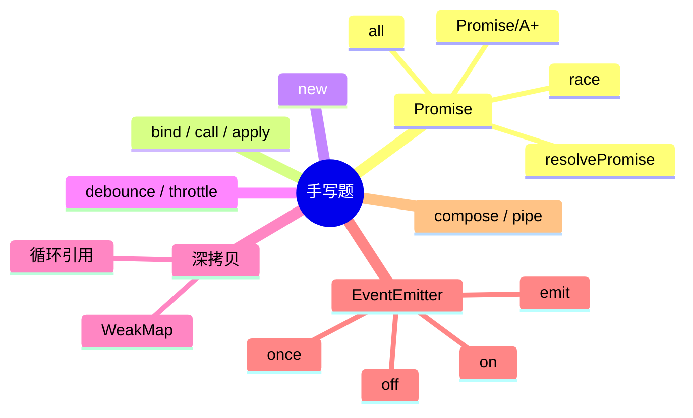

# 手写题 知识地图

## 推荐练习顺序

1. ⭐⭐⭐⭐⭐ [Promise](./promise.md)
2. ⭐⭐⭐⭐⭐ [bind / call / apply](./bind-call-apply.md)
3. ⭐⭐⭐⭐⭐ [深拷贝](./deep-clone.md)
4. ⭐⭐⭐⭐   [EventEmitter](./event-emitter.md)
5. ⭐⭐⭐⭐   [debounce / throttle](./debounce-throttle.md)
6. ⭐⭐⭐⭐   [new](./new.md)
7. ⭐⭐⭐     [compose / pipe](./compose-pipe.md)

## 知识点索引

| 手写题 | 频率 | 难度 | 关联知识 | 状态 |
|--------|------|------|---------|------|
| [Promise](./promise.md) | ⭐⭐⭐⭐⭐ | 高级 | [JavaScript Promise](../JavaScript/promise.md) | draft |
| [bind / call / apply](./bind-call-apply.md) | ⭐⭐⭐⭐⭐ | 中级 | [JavaScript call/apply/bind](../JavaScript/call-apply-bind.md) | draft |
| [new](./new.md) | ⭐⭐⭐⭐ | 初级 | [JavaScript new](../JavaScript/new.md) | draft |
| [debounce / throttle](./debounce-throttle.md) | ⭐⭐⭐⭐ | 初级 | [JavaScript 防抖节流](../JavaScript/debounce-throttle.md) | draft |
| [深拷贝](./deep-clone.md) | ⭐⭐⭐⭐⭐ | 中级 | [JavaScript 深拷贝](../JavaScript/deep-clone.md) | draft |
| [EventEmitter](./event-emitter.md) | ⭐⭐⭐⭐ | 中级 | — | draft |
| [compose / pipe](./compose-pipe.md) | ⭐⭐⭐ | 初级 | — | draft |
