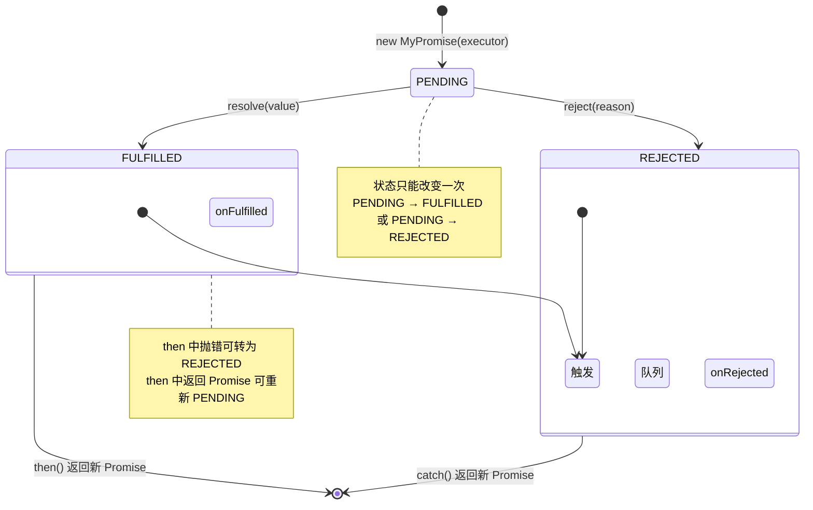

# 手写 Promise

> ⭐⭐⭐⭐⭐｜难度：高级｜项目：★★★

## 一句话总结

**Promise/A+ 规范的核心是"then 方法返回新 Promise + resolvePromise 递归解析 thenable"，掌握这两点就掌握了 Promise 的灵魂。** 接下来把 constructor、then、静态方法逐个击破，就能在面试中完整写出。

## 核心机制

> 以下实现符合 Promise/A+ 规范，通过 `queueMicrotask` 保证异步回调。面试时能写出 constructor + then + resolvePromise 三个核心即可通关；静态方法是加分项。

```typescript
// ========== 类型定义 ==========
type Resolve<T> = (value?: T | MyPromise<T>) => void;
type Reject = (reason?: any) => void;
type Executor<T> = (resolve: Resolve<T>, reject: Reject) => void;
type OnFulfilled<T, R = T> = ((value: T) => R | MyPromise<R>) | null | undefined;
type OnRejected<R> = ((reason: any) => R | MyPromise<R>) | null | undefined;

// ========== 常量 ==========
const enum STATE { PENDING, FULFILLED, REJECTED }

// ========== resolvePromise：Promise/A+ 的核心 ==========
function resolvePromise<T>(
  promise2: MyPromise<T>,
  x: any,
  resolve: Resolve<T>,
  reject: Reject
): void {
  // 2.3.1 循环引用检测
  if (promise2 === x) {
    return reject(new TypeError('Chaining cycle detected for promise'));
  }

  // 2.3.2 如果 x 是 MyPromise，采纳其状态
  if (x instanceof MyPromise) {
    // 2.3.2.1 ~ 2.3.2.3 传递 resolve/reject
    x.then(
      (v) => resolvePromise(promise2, v, resolve, reject),
      reject
    );
    return;
  }

  // 2.3.3 如果 x 是对象或函数（thenable 检测）
  if (x !== null && (typeof x === 'object' || typeof x === 'function')) {
    let called = false; // 2.3.3.3.3 防止 resolve/reject 被多次调用

    try {
      // 2.3.3.1 取出 then 方法（可能 getter 抛错）
      const then = x.then;

      if (typeof then === 'function') {
        // 2.3.3.3 thenable 调用
        try {
          then.call(
            x,
            (y: any) => {
              if (called) return;
              called = true;
              // 2.3.3.3.1 递归解析 y
              resolvePromise(promise2, y, resolve, reject);
            },
            (r: any) => {
              if (called) return;
              called = true;
              reject(r);
            }
          );
        } catch (error) {
          if (called) return;
          called = true;
          reject(error);
        }
      } else {
        // 2.3.3.4 then 不是函数，直接 resolve
        resolve(x);
      }
    } catch (error) {
      // 2.3.3.2 取 then 时抛错
      if (called) return;
      called = true;
      reject(error);
    }
  } else {
    // 2.3.4 x 不是对象也不是函数，直接 resolve
    resolve(x);
  }
}

// ========== MyPromise 类 ==========
class MyPromise<T = unknown> {
  private state: STATE = STATE.PENDING;
  private value: T | null = null;
  private reason: any = null;

  // 两个回调队列：pending 期间收集 then 注册的回调
  private onFulfilledCallbacks: Array<() => void> = [];
  private onRejectedCallbacks: Array<() => void> = [];

  constructor(executor: Executor<T>) {
    // 定义 resolve —— 只能从 PENDING 转换一次
    const resolve: Resolve<T> = (value?) => {
      if (this.state !== STATE.PENDING) return;

      // 如果 value 是对象或函数（MyPromise 或任意 thenable），
      // 走完整的 Promise Resolution Procedure（Promise/A+ 2.3）
      if (value !== null && (typeof value === 'object' || typeof value === 'function')) {
        resolvePromise(this, value, resolve, reject);
        return;
      }

      this.state = STATE.FULFILLED;
      this.value = value as T;
      this.onFulfilledCallbacks.forEach((cb) => cb());
    };

    // 定义 reject
    const reject: Reject = (reason?) => {
      if (this.state !== STATE.PENDING) return;
      this.state = STATE.REJECTED;
      this.reason = reason;
      this.onRejectedCallbacks.forEach((cb) => cb());
    };

    // 立即执行 executor，try-catch 兜底
    try {
      executor(resolve, reject);
    } catch (error) {
      reject(error);
    }
  }

  // ========== then：返回新 Promise，形成链式调用 ==========
  then<TResult1 = T, TResult2 = never>(
    onFulfilled?: OnFulfilled<T, TResult1>,
    onRejected?: OnRejected<TResult2>
  ): MyPromise<TResult1 | TResult2> {
    // 值穿透：非函数则透传 value 或 throw reason
    const onFulfilledFn =
      typeof onFulfilled === 'function'
        ? onFulfilled
        : (value: T) => value as unknown as TResult1;
    const onRejectedFn =
      typeof onRejected === 'function'
        ? onRejected
        : (reason: any): TResult2 => { throw reason; };

    const promise2 = new MyPromise<TResult1 | TResult2>((resolve, reject) => {
      // 2.2.4 用微任务保证 onFulfilled/onRejected 异步执行
      const fulfillTask = () => {
        queueMicrotask(() => {
          try {
            const x = onFulfilledFn(this.value!);
            resolvePromise(promise2, x, resolve, reject);
          } catch (error) {
            reject(error);
          }
        });
      };

      const rejectTask = () => {
        queueMicrotask(() => {
          try {
            const x = onRejectedFn(this.reason);
            resolvePromise(promise2, x, resolve, reject);
          } catch (error) {
            reject(error);
          }
        });
      };

      if (this.state === STATE.FULFILLED) {
        fulfillTask();
      } else if (this.state === STATE.REJECTED) {
        rejectTask();
      } else {
        // PENDING：收集回调，等 settled 后再执行
        this.onFulfilledCallbacks.push(fulfillTask);
        this.onRejectedCallbacks.push(rejectTask);
      }
    });

    return promise2;
  }

  // 语法糖：catch = then(null, onRejected)
  catch<TResult = never>(
    onRejected?: OnRejected<TResult>
  ): MyPromise<T | TResult> {
    return this.then(null, onRejected);
  }

  // finally：无论 fulfilled/rejected 都执行回调
  // 如果 onFinally() 返回 Promise，必须等待它 settled 再透传原值
  finally(onFinally?: () => any): MyPromise<T> {
    return this.then(
      value => MyPromise.resolve(onFinally?.()).then(() => value),
      reason => MyPromise.resolve(onFinally?.()).then(() => { throw reason })
    );
  }

  // ========== 静态方法 ==========

  static resolve<T>(value?: T | MyPromise<T>): MyPromise<T> {
    // 已是 MyPromise 实例则直接返回
    if (value instanceof MyPromise) return value;
    // 通过 constructor 走完整 Resolution Procedure（兼容任意 thenable）
    return new MyPromise<T>((resolve) => resolve(value as T));
  }

  static reject<T = never>(reason?: any): MyPromise<T> {
    return new MyPromise<T>((_, reject) => reject(reason));
  }

  static all<T extends readonly unknown[] | []>(
    promises: T
  ): MyPromise<{ -readonly [P in keyof T]: Awaited<T[P]> }> {
    return new MyPromise((resolve, reject) => {
      if (promises.length === 0) {
        return resolve([] as any);
      }
      const results: any[] = new Array(promises.length);
      let count = 0;

      for (let i = 0; i < promises.length; i++) {
        MyPromise.resolve(promises[i]).then(
          (value) => {
            results[i] = value;
            if (++count === promises.length) resolve(results as any);
          },
          reject // 任一失败则整体失败
        );
      }
    });
  }

  static race<T extends readonly unknown[] | []>(
    promises: T
  ): MyPromise<Awaited<T[number]>> {
    return new MyPromise((resolve, reject) => {
      for (const p of promises) {
        MyPromise.resolve(p).then(resolve, reject);
      }
    });
  }

  static allSettled<T extends readonly unknown[] | []>(
    promises: T
  ): MyPromise<
    { -readonly [P in keyof T]: PromiseSettledResult<Awaited<T[P]>> }
  > {
    return new MyPromise((resolve) => {
      if (promises.length === 0) {
        return resolve([] as any);
      }
      const results: any[] = new Array(promises.length);
      let count = 0;

      for (let i = 0; i < promises.length; i++) {
        MyPromise.resolve(promises[i]).then(
          (value) => {
            results[i] = { status: 'fulfilled', value };
            if (++count === promises.length) resolve(results as any);
          },
          (reason) => {
            results[i] = { status: 'rejected', reason };
            if (++count === promises.length) resolve(results as any);
          }
        );
      }
    });
  }

  static any<T extends readonly unknown[] | []>(
    promises: T
  ): MyPromise<Awaited<T[number]>> {
    return new MyPromise((resolve, reject) => {
      if (promises.length === 0) {
        return reject(new AggregateError([], 'All promises were rejected'));
      }
      const errors: any[] = new Array(promises.length);
      let count = 0;

      for (let i = 0; i < promises.length; i++) {
        MyPromise.resolve(promises[i]).then(resolve, (error) => {
          errors[i] = error;
          if (++count === promises.length) {
            reject(new AggregateError(errors, 'All promises were rejected'));
          }
        });
      }
    });
  }
}

// ========== 工具类型 ==========
type PromiseSettledResult<T> =
  | { status: 'fulfilled'; value: T }
  | { status: 'rejected'; reason: any };
```

### MyPromise 状态转移



## 深度拓展

### 追问点 1：resolve(v) 中为什么需要递归等待 MyPromise？

```typescript
// 面试官核心追问：resolve 传入一个 MyPromise 实例时会发生什么？

// ❌ 错误做法：直接存 value
const resolve = (value: any) => {
  this.value = value; // 如果 value 是 pending 中的 Promise，那就存了个半成品
};

// ✅ 正确做法：递归等待
const resolve = (value: any) => {
  if (value instanceof MyPromise) {
    value.then(
      (v) => resolve(v),   // 再包一层 then，等它 settled 后再次 resolve
      (e) => reject(e)
    );
    return;
  }
  this.state = STATE.FULFILLED;
  this.value = value;
};
```

这保证了 `new MyPromise((res) => res(new MyPromise(...)))` 这种嵌套场景下，外层 Promise 的状态和值完全由内层决定。

### 追问点 2：值穿透是什么？怎么实现？

```typescript
// 面试官追问：then 的参数如果是 null/undefined 会怎样？

// Promise/A+ 规范 2.2.1：onFulfilled 和 onRejected 都是可选参数
// 如果 onFulfilled 不是函数，必须忽略，并把 value 原样传递给下一个 then
// 如果 onRejected 不是函数，必须忽略，并把 reason 原样抛给下一个 catch

// 这就是"值穿透"的实现：
const onFulfilledFn = typeof onFulfilled === 'function'
  ? onFulfilled
  : (value: T) => value as unknown as TResult1;   // 透传 value
const onRejectedFn = typeof onRejected === 'function'
  ? onRejected
  : (reason: any): TResult2 => { throw reason; };  // 透传 reason

// 效果演示：
new MyPromise((res) => res(42))
  .then()            // onFulfilled 不是函数 → 透传 42
  .then()            // 继续透传 42
  .then((v) => console.log(v)); // 输出 42
```

### 追问点 3：为什么 Promise/A+ 要求用微任务而不是同步回调？

```typescript
// 规范 2.2.4：onFulfilled/onRejected 必须在执行上下文栈只包含平台代码时调用
// 也就是：必须异步。queueMicrotask 比 setTimeout 更精确。

// ❌ 如果同步调用的话：
new MyPromise((res) => {
  res(1);
  console.log('A');
}).then((v) => {
  console.log('B', v);  // 如果同步，输出：B1 A；如果微任务，输出：A B1
});

// 浏览器原生 Promise 输出 "A" → "B1"，所以必须用微任务
```

## 项目实战

在后台管理系统中异步请求链：

```typescript
// 场景：顺序请求多个接口
function fetchUser(id: string): MyPromise<User> { /* ... */ }
function fetchOrders(userId: string): MyPromise<Order[]> { /* ... */ }

// 用 MyPromise 串联（与原生 Promise 行为一致）
fetchUser('123')
  .then((user) => fetchOrders(user.id))
  .then((orders) => {
    console.log(orders);
  })
  .catch((err) => {
    console.error('请求失败', err);
  });

// 并发请求：用户信息 + 权限列表
MyPromise.all([
  fetchUser('123'),
  fetchPermissions('123'),
]).then(([user, permissions]) => {
  // 两个都成功才进入这里
});

// 竞速：3 秒超时
MyPromise.race([
  fetchData(),
  new MyPromise((_, reject) => setTimeout(() => reject('timeout'), 3000)),
]);
```

## 易错点

1. **`resolvePromise` 中漏掉 `called` 标志**：如果 thenable 的 resolve 和 reject 都被调用（不规范的第三方实现），缺少 `called` 会导致状态被更改两次，违反 Promise/A+ 2.3.3.3.3。

2. **`resolvePromise` 中忘记 `promise2 === x` 循环引用检查**：`const p = MyPromise.resolve().then(() => p)` 会形成死循环，必须抛出 TypeError。

3. **`resolve(value)` 没有递归处理 MyPromise 实例**：`new MyPromise((res) => res(new MyPromise((res2) => res2(42))))` 的 then 会收到一个 MyPromise 实例而不是 42。

4. **then 中忘记 `try-catch`**：onFulfilled/onRejected 执行时可能抛同步错误，必须捕获并 reject 新 Promise。

5. **静态方法 all/race 中直接使用传入值**：应该用 `MyPromise.resolve(promises[i])` 包一层，兼容数组中混入非 Promise 值。

## 相关阅读

- [JavaScript Promise](../JavaScript/promise.md) -- Promise 原理和事件循环关系
- [JavaScript Event-Loop](../JavaScript/event-loop.md) -- 微任务/宏任务调度机制
- [手写 EventEmitter](./event-emitter.md) -- 发布订阅模式，与 Promise 回调队列类似
- [手写 compose/pipe](./compose-pipe.md) -- 函数组合，与 Promise 链式调用异曲同工
- [Promise/A+ 规范](https://promisesaplus.com/) -- 官方规范原文

## 更新记录

- 2026-07-05：Phase 2 填充完整实现
- 2026-07：初始占位（Phase 1）
