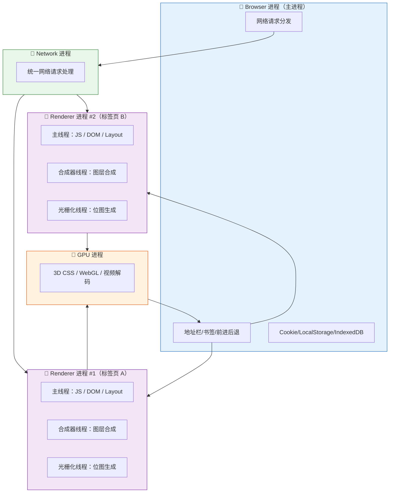

# 浏览器多进程架构

> "为什么一个标签页崩溃不影响其他页面？"——这道题考的是你对浏览器架构的理解，而不仅仅是会用 Chrome。

## 一句话总结

**Chrome 采用多进程架构，将 UI、渲染、网络、GPU、插件等功能拆分为独立进程。每个标签页在独立的 Renderer 进程中运行并通过沙箱隔离，单个页面崩溃不影响其他页面。JS 在 Renderer 进程的主线程中单线程执行，渲染工作由合成器线程并行处理。**

---

## 核心机制

### Chrome 的进程分工

打开 Chrome 的任务管理器（Shift+Esc），你会看到以下进程：

| 进程类型 | 职责 | 数量 |
|----------|------|------|
| **Browser 进程** | 主进程：UI（地址栏、书签栏）、文件存储、网络请求分发 | 1 个 |
| **Renderer 进程** | 每个标签页独立的渲染进程：HTML/CSS 解析、JS 执行、布局绘制 | N 个（每标签页 1 个） |
| **GPU 进程** | 3D CSS 效果、WebGL、视频解码的 GPU 加速 | 1 个 |
| **Network 进程** | 所有网络请求的统一处理（从 Browser 进程拆分出来） | 1 个 |
| **Utility 进程** | 音频播放、视频解码、数据解码等辅助服务 | 按需创建 |
| **Plugin 进程** | 每个插件独立进程（Flash 等，现已基本废弃） | 按需创建 |

### 为什么一个标签页崩溃不影响其他？

早期浏览器是**单进程架构**——一个页面崩溃，整个浏览器挂掉。Chrome 的 **Renderer 进程沙箱隔离** 解决了这个问题：

- 每个标签页（同源站点）运行在独立的 Renderer 进程中
- Renderer 进程被操作系统限制权限：不能直接访问文件系统、不能访问网络（通过 Browser 进程代理）、不能与其他进程通信
- 某个标签页的 JS 死循环不会阻塞其他标签页

即使一个 Renderer 进程 OOM 或崩溃，其他页面正常运行——用户刷新崩溃页面即可恢复。

### Site Isolation（站点隔离）

从 Chrome 67 开始，即使同一个标签页中的不同源 iframe，也可能被分配到**不同的 Renderer 进程**：

- `example.com` 主页面在一个进程
- 嵌入的 `evil.com` iframe 在另一个进程

这防止了 **Spectre/Meltdown** 类 CPU 侧信道攻击——恶意 iframe 无法通过共享进程的内存读取跨源数据。代价是内存开销增加 10-20%。

### 进程 vs 线程

**Renderer 进程内部是多线程的**：

- **主线程（Main Thread）**：执行 JS、处理 DOM、计算样式、布局
- **合成器线程（Compositor Thread）**：负责图层合成，不涉及 JS
- **光栅化线程（Raster Thread）**：将绘制指令转为位图
- **Worker 线程**：Web Worker / Service Worker

**"为什么说 JS 是单线程的？"**——准确的说法是：JS 在 Renderer 进程的**主线程**上单线程执行。同一时间只有一个 JS 调用栈在运行。但这不意味着 Renderer 进程只有一个线程——合成、光栅化、Worker 都在各自的线程中并行工作。

---

## 多进程架构图

---

## 深度拓展

### 追问1：多进程架构的优缺点

**优点**：
- 稳定性：一个页面崩溃不影响其他页面
- 安全性：沙箱隔离 + Site Isolation 防止跨站攻击和 CPU 侧信道漏洞
- 性能：页面可以并行渲染，不相互阻塞

**缺点**：
- 内存开销大：每个 Renderer 进程都有独立的内存空间，Chrome 被称为"内存杀手"的根源
- 进程间通信（IPC）开销：Renderer 进程不能直接访问网络/文件，需要通过 IPC 与 Browser 进程通信
- 启动开销：每个新标签页 fork 一个新进程

### 追问2：为什么 Electron 应用内存消耗大？

Electron 本质是打包了一个精简版 Chromium + Node.js。每个 BrowserWindow 都是一个独立的 Renderer 进程，再加一个主进程（Browser 进程 + Node.js）。所以一个 Electron 应用至少 2 个进程，复杂的应用可能有 5-10 个进程，每个进程都有独立内存空间。

### 追问3：iframe 的进程分配策略

- **同源 iframe**：与父页面共享同一个 Renderer 进程
- **跨源 iframe**（Site Isolation 开启）：分配独立的 Renderer 进程
- **`sandbox` 属性**：限制 iframe 的能力（不能执行脚本、不能提交表单等），但不改变进程分配

### 追问4："JS 是单线程的，所以 JS 慢"这句话对吗？

不完全对。JS 主线程是单线程执行，但**异步 I/O 操作不占用主线程**——网络请求、文件读取由 Browser/Network 进程处理，完成后通过事件循环将回调推入主线程执行。真正的性能瓶颈是**主线程上的长任务**（Long Task，超过 50ms），这会导致页面卡顿。优化方向是把耗时计算放到 Web Worker，让主线程保持响应。

---

## 项目实战

**场景：Chrome 打开 30 个标签页后内存占用 8GB+、风扇狂转。如何优化？**

1. **标签页休眠（Tab Freezing）**：Chrome 会自动冻结后台标签页的 JS 执行，减少 CPU 占用
2. **使用 Chrome 内置工具排查**：`chrome://discards` 查看标签页状态，手动丢弃不活跃页面
3. **减少同一页面的 iframe 数量**：每个跨源 iframe 都是独立进程，叠加内存消耗
4. **按需加载**：使用 Intersection Observer 懒加载图片/组件，减少同时活跃的 DOM 节点
5. **Web Worker 及时 terminate**：用完即释放，避免常驻 Worker 占用内存

---

## 易错点

- **"Chrome 每个标签页都是一个进程"**：大体正确，但不完全精确。同源标签页可能共享进程（不开启 Site Isolation 时），跨源 iframe 也可能在独立进程（开启 Site Isolation 时）。
- **"JS 是单线程的，不能做多线程"**：JS 主线程是单线程，但 Web Worker 可以创建真正的 OS 线程。只是 Worker 不共享内存、不能操作 DOM。
- **"Renderer 进程直接发送网络请求"**：不对。Renderer 进程通过 IPC 将请求发送给 Network 进程，由 Network 进程统一处理。这是沙箱机制的一部分。

---

## 相关阅读

- [渲染流程](./render-process.md) —— Renderer 进程内部的渲染管线详解
- [Web Worker](./web-worker.md) —— 如何在 Worker 线程中执行耗时任务
- [垃圾回收](./gc.md) —— JS 主线程的垃圾回收机制
- [事件循环](../JavaScript/event-loop.md) —— 主线程的事件循环和任务调度

---

## 更新记录

- 2026-07-06：完成完整内容，覆盖多进程架构、沙箱隔离、Site Isolation（Phase 2）
