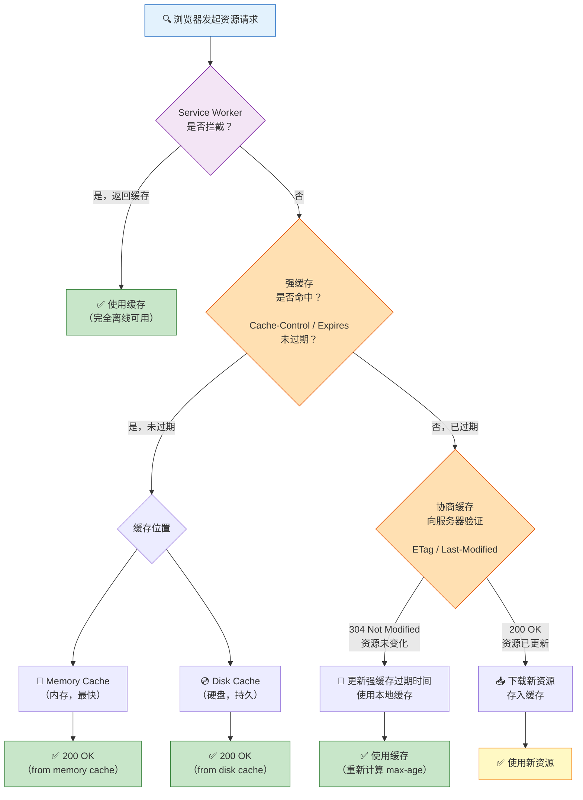

# 浏览器缓存

> 面试官问"你们项目的静态资源怎么缓存"，这一篇让你从 Cache-Control 讲到 contenthash，再到 nginx 配置，一气呵成。

## 一句话总结

**浏览器缓存通过强缓存（直接使用本地副本，不发请求）和协商缓存（向服务器验证副本是否过期）两级策略，减少重复网络请求，是前端性能优化中最廉价但收益最大的手段——不需要改一行代码，配好 HTTP 头就能把重复访问速度提升 50% 以上。**

---

## 核心机制

### 强缓存（Strong Cache）

**不发请求，直接用缓存，HTTP 状态码 200 (from disk/memory cache)。**

由两个 HTTP 响应头控制：

**`Cache-Control`（HTTP/1.1，优先级高于 Expires）：**

| 指令 | 含义 | 典型场景 |
|------|------|---------|
| `max-age=31536000` | 缓存 365 天（秒为单位） | 带 hash 的静态资源（JS/CSS/图片） |
| `public` | 任何中间节点（CDN、代理）都可缓存 | 公开资源 |
| `private` | 仅浏览器缓存，中间节点不缓存 | 用户私有数据 |
| `no-cache` | **可以使用缓存，但每次使用前必须向服务器验证** | 经常变动的 HTML 页面 |
| `no-store` | **完全不缓存** | 敏感数据（银行账户余额） |
| `immutable` | 资源内容永远不会变，即使用户刷新也不验证 | 带 contenthash 的静态资源 |
| `s-maxage=600` | 仅对 CDN 有效，覆盖 max-age | CDN 缓存 10 分钟 |

**`Expires`（HTTP/1.0）：** 指定一个绝对过期时间（GMT 格式）。因为依赖客户端时间，可能不准确，所以现代项目基本只用 `Cache-Control`。如果同时存在，`Cache-Control` 优先级更高。

### 协商缓存（Negotiation Cache）

**发请求到服务器，服务器返回 304（Not Modified）或 200（有新内容）。**

**`ETag` / `If-None-Match`（优先使用）：**

服务器为每个资源生成一个唯一标识（通常是文件内容的哈希值）。浏览器再次请求时带上 `If-None-Match: "etag值"`，服务器比对：相同返回 304（无 body），不同返回 200 + 新内容 + 新 ETag。

**`Last-Modified` / `If-Modified-Since`（备用方案）：**

服务器返回资源时带上 `Last-Modified: 文件修改时间`。浏览器下次请求时带上 `If-Modified-Since: 那个时间`，服务器判断文件在那个时间之后是否有修改。有修改返回 200 + 新内容，无修改返回 304。

**同时存在时，ETag 的优先级高于 Last-Modified**——原因在深度拓展中详细说明。

### 缓存位置优先级

浏览器按以下顺序查找缓存（从上到下，命中即止）：

1. **Service Worker**：完全由开发者控制，可离线使用。PWA 的核心。
2. **Memory Cache**：内存缓存，速度最快，容量最小，标签页关闭即释放。Base64 图片、小 JS/CSS 文件常命中这一层。
3. **Disk Cache**：硬盘缓存，容量大，持久化。大文件、图片通常在这一层。
4. **Push Cache**：HTTP/2 的服务器推送缓存，会话级别，已逐渐被废弃。
5. **网络请求**：以上都没命中，走网络。

### 缓存决策流程图



---

## 深度拓展

### 追问1：为什么 ETag 比 Last-Modified 更可靠？

有三个硬伤导致 Last-Modified 不如 ETag：

1. **秒级精度不够**：`Last-Modified` 的精度是秒。如果文件在 1 秒内被修改两次，时间戳不变，协商缓存返回 304，用户拿到的是过期内容。ETag 用内容哈希，内容变了哈希就变，瞬间失效。

2. **文件内容没变但修改时间变了**：服务器部署时可能批量覆盖文件，文件内容完全一样但修改时间变了。如果用 `Last-Modified`，缓存会失效，触发大量无意义下载。ETag 因为内容不变哈希不变，仍然返回 304。

3. **负载均衡服务器时间不一致**：如果静态资源分布在多台服务器上，各服务器的时钟可能不同步。同一文件在服务器 A 的 `Last-Modified` 是 10:00:00，服务器 B 的是 10:00:05。用户第一次从 A 拿到，第二次请求被路由到 B，时间变了，缓存失效——这完全是误判。ETag 不依赖时间，不存在这个问题。

**结论**：生产环境优先使用 ETag。Nginx 默认同时开启 ETag 和 Last-Modified，但浏览器会优先使用 ETag。

### 追问2：Cache-Control: immutable 的作用

`immutable` 告诉浏览器：**这个资源绝对不会变，你不需要在用户点刷新时重新验证。**

没有 `immutable` 时，用户点 F5 刷新，浏览器会对强缓存中的资源发送协商请求（带 `If-None-Match`）确认版本，每个资源一个请求——页面可能有几十个资源，全部 304 也很耗时。加上 `immutable`，浏览器直接跳过验证，零请求。

**适用场景**：带 contenthash 的 JS/CSS/字体文件。因为文件名已经包含内容哈希，内容变了文件名就变了，旧文件名对应的内容永远不会变。Vite/Webpack 的 `[contenthash]` 就是为了配合 `immutable` 实现完美的长期缓存。

### 追问3：启发式缓存（Heuristic Caching）

如果服务器**没有返回任何缓存头**（没有 `Cache-Control`，没有 `Expires`），浏览器不会完全不缓存——它会根据 `Last-Modified` 自动计算一个过期时间，这叫作**启发式缓存**。通常的算法是 `(Date - Last-Modified) * 10%`，即距离上次修改时间的 10%。比如文件 100 天没改过，浏览器就缓存 10 天。

**关键**：这个行为完全由浏览器决定，不同浏览器的算法不同。**永远不要依赖启发式缓存**——显式设置 `Cache-Control` 是唯一正确的做法。

---

## 项目实战

### 1. SPA 静态资源：强缓存 + contenthash

在 Vue3 + Vite 后台管理系统中，构建产物的缓存策略：

```typescript
// vite.config.ts
export default defineConfig({
  build: {
    rollupOptions: {
      output: {
        chunkFileNames: 'js/[name]-[contenthash:8].js',
        entryFileNames: 'js/[name]-[contenthash:8].js',
        assetFileNames: '[ext]/[name]-[contenthash:8].[ext]',
      },
    },
  },
})
```

**对应的 nginx 缓存策略**：

```nginx
# 带 hash 的静态资源：强缓存 + immutable，365 天
location ~* \.(js|css|woff2?|ttf|png|jpg|jpeg|gif|svg|ico)$ {
    expires 1y;
    add_header Cache-Control "public, immutable";
    add_header ETag off;  # 已经有 contenthash，不需要 ETag
}

# HTML 文件：协商缓存，确保用户拿到最新版本
location / {
    add_header Cache-Control "no-cache";  # 必须每次验证
}
```

**原理**：`app-abc123.js` 文件名包含内容哈希，代码改了哈希就变，文件名就变，HTML 引用新文件名，浏览器自动下载新文件。旧文件的 1 年缓存永远不会被访问到。

### 2. 接口数据：localStorage + 过期时间

对于不常变化的字典数据（部门列表、角色列表），做客户端缓存：

```typescript
function cachedFetch<T>(url: string, maxAge: number): Promise<T> {
  const cached = localStorage.getItem(url);
  if (cached) {
    const { data, timestamp } = JSON.parse(cached);
    if (Date.now() - timestamp < maxAge) {
      return Promise.resolve(data); // 命中缓存，不发起请求
    }
  }
  return fetch(url).then(res => res.json()).then(data => {
    localStorage.setItem(url, JSON.stringify({ data, timestamp: Date.now() }));
    return data;
  });
}
```

注意：这种方式只适合不敏感、允许短时间不一致的数据，且要在适当的时候清理缓存。

### 3. Nginx 完整缓存配置示例

```nginx
server {
    listen 80;
    server_name admin.example.com;
    root /var/www/admin/dist;

    # HTML：协商缓存
    location / {
        try_files $uri $uri/ /index.html;
        add_header Cache-Control "no-cache, must-revalidate";
    }

    # 带 hash 的静态资源：长期强缓存
    location /assets/ {
        expires 1y;
        add_header Cache-Control "public, immutable";
    }

    # API 代理不缓存
    location /api/ {
        proxy_pass http://backend:3000;
        proxy_no_cache 1;  # 代理不缓存 API 响应
    }
}
```

---

## 易错点

- **"`no-cache` 是不缓存"**：**错**。`no-cache` 的意思是**可以使用缓存，但每次使用前必须向服务器验证**（走协商缓存）。`no-store` 才是**完全不缓存**。面试时搞混这两个，直接减分。
- **"强缓存命中时 HTTP 状态码是 304"**：**错**。强缓存命中直接返回 200 (from disk/memory cache)，根本**不发网络请求**。304 是协商缓存的服务端响应，表示"资源没变，用你的缓存吧"。
- **"Expires 和 Cache-Control 一起用更安全"**：没必要。`Cache-Control` 优先级更高，`Expires` 作为降级方案只对 HTTP/1.0 客户端有用——现代浏览器没有不支持 HTTP/1.1 的。
- **"ETag 每次请求都要重新生成，性能差"**：Nginx 默认对静态文件使用"文件最后修改时间 + 文件大小"来生成 ETag，不是内容哈希，性能开销几乎为零。但不同服务器实现不同，CDN 可能需要预计算。

---

## 相关阅读

- [MDN: HTTP caching](https://developer.mozilla.org/en-US/docs/Web/HTTP/Caching)
- [MDN: Cache-Control](https://developer.mozilla.org/en-US/docs/Web/HTTP/Headers/Cache-Control)
- [MDN: ETag](https://developer.mozilla.org/en-US/docs/Web/HTTP/Headers/ETag)
- [storage](./storage) —— Cookie、LocalStorage、IndexedDB 等客户端存储方案
- [性能优化/first-screen](../性能优化/first-screen) —— 首屏加载中缓存策略的应用
- [网络/http-https](../网络/http-https) —— HTTP 协议基础与缓存头的关系

---

## 更新记录

- 2026-07-05：完成完整内容，补充缓存决策 Mermaid 图、immutable 详解、启发式缓存、全量 nginx 配置（Phase 2）
