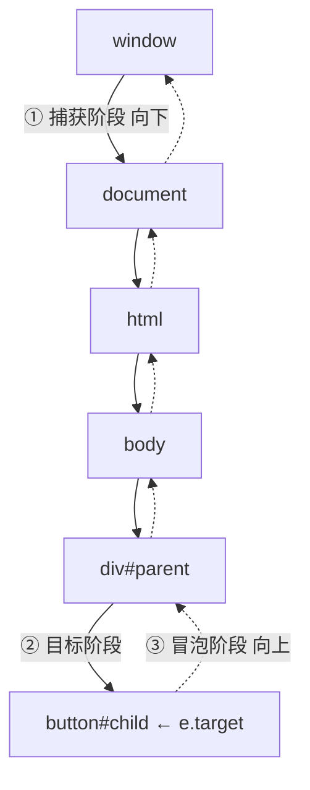

# DOM 事件机制与事件委托

> &#11088;&#11088;&#11088;&#11088;｜难度：中级&#9733;&#9733;&#9733;

## 一句话总结

**DOM 事件按"捕获 → 目标 → 冒泡"三阶段传播，事件委托利用冒泡把子元素的事件统一绑定到父元素上，通过 `e.target` 区分来源**。这是处理大量 DOM 节点的核心性能优化手段，也是理解浏览器交互底层的关键。

## 核心机制

### DOM 事件流：三阶段模型



```js
// 验证三阶段
const parent = document.getElementById('parent')
const child = document.getElementById('child')

// 默认在冒泡阶段触发
child.addEventListener('click', () => console.log('child 冒泡'), false)

// 捕获阶段触发：第三个参数传 true 或用 { capture: true }
parent.addEventListener('click', () => console.log('parent 捕获'), true)
parent.addEventListener('click', () => console.log('parent 冒泡'), false)

// 点击 child 时输出顺序：
// → parent 捕获
// → child 冒泡
// → parent 冒泡
```

### addEventListener 的第三个参数

```js
// 方式一：布尔值（简单场景）
el.addEventListener('click', handler, false)  // false = 冒泡（默认）
el.addEventListener('click', handler, true)   // true  = 捕获

// 方式二：Options 对象（推荐，功能更全）
el.addEventListener('click', handler, {
  capture: false,   // 捕获 or 冒泡
  once: true,       // 触发一次后自动移除
  passive: true,    // 永不调用 preventDefault()，滚动性能优化
  signal: controller.signal  // AbortSignal，统一移除事件
})
```

### e.target vs e.currentTarget

```js
// 点击 btn 时：
parent.addEventListener('click', function(e) {
  e.target         // 实际点击的元素 —— btn
  e.currentTarget  // 绑定事件的元素 —— parent（即 this）
  e.eventPhase     // 1=捕获, 2=目标, 3=冒泡
})
```

**一句话**：`target` 永远是最初触发事件的元素；`currentTarget` 是当前处理事件的元素。

### 阻止传播的三种方式

```js
// ① stopPropagation —— 阻止继续传播（最常用）
e.stopPropagation()     // 阻止冒泡/捕获，当前元素上的其他监听器仍会执行
e.stopImmediatePropagation()  // 立即阻止，当前元素上的其他监听器也不执行

// ② preventDefault —— 阻止默认行为（不阻止传播）
e.preventDefault()      // 阻止 a 标签跳转、form 提交、checkbox 勾选等

// ③ return false —— jQuery 时代的习惯（原生 JS 无效！）
// 原生 addEventListener 中 return false 什么都不阻止
```

### passive: true —— 为什么能提升滚动性能

```js
// passive: true 告诉浏览器：这个事件处理器不会调用 preventDefault()
window.addEventListener('touchmove', handler, { passive: true })
```

**核心问题**：浏览器需要等 JS 事件处理器执行完毕，才能知道是否会调用 `preventDefault()` 取消滚动。在移动端，`touchstart`/`touchmove` 的处理器可能耗时 100-200ms，但每一帧只有 16ms——浏览器干等着 JS 执行完，滚动帧就丢了，用户感知到的就是「卡顿」。

**passive 的解决**：向浏览器承诺「我不会取消默认行为」，浏览器无需等 JS 就可以**并行处理**：

```
无 passive：wheel → 等 JS 执行完 → 检查 defaultPrevented → 合成帧（串行，可能丢帧）
有 passive：wheel → 浏览器直接合成帧（并行），JS 同时执行处理器
```

**Chrome 的默认行为**：Chrome 56+ 将 `document`/`window`/`body` 级别的 `touchstart`/`touchmove` 监听器**默认当作 passive**（`wheel` 从 Chrome 73 起同样处理）。如果代码中写了 `preventDefault()`，浏览器会忽略并打印警告：`Unable to preventDefault inside passive event listener invocation`。

**与 IntersectionObserver 的关系**：滚动性能的最佳实践是**用 IntersectionObserver 替代 scroll 事件**——前者是浏览器原生异步 API（不阻塞主线程），后者需要在回调里反复计算元素位置（`getBoundingClientRect`）并手动节流。监听滚动曝光、图片懒加载、无限滚动——都应该优先用 IntersectionObserver。

## 深度拓展

### 事件委托 —— 10000 个 li 的最优解

```js
// ❌ 错误做法：每个 li 绑定事件 → 10000 个监听器
document.querySelectorAll('li').forEach(li => {
  li.addEventListener('click', () => { /* ... */ })
})
// 问题：内存暴增 + 新 li 还需要重新绑定

// ✅ 事件委托：绑定到父元素 ul 上
const ul = document.querySelector('ul')
ul.addEventListener('click', (e) => {
  // 关键：通过 e.target 找到实际点击的 li
  const li = e.target.closest('li')
  if (!li) return  // 点击的不是 li 或其子元素，忽略
  if (li.classList.contains('disabled')) return  // 按需过滤

  console.log('点击了:', li.dataset.id)
})
```

**委托的判断技巧**：

```js
// 方法一：closest（推荐，自动向上查找直到匹配）
const btn = e.target.closest('.action-btn')

// 方法二：matches + 循环（手动向上查找）
let el = e.target
while (el && el !== container) {
  if (el.matches('.action-btn')) break
  el = el.parentElement
}

// 方法三：matches（仅检查 e.target，不向上查找）
if (e.target.matches('.action-btn')) { /* ... */ }
// ⚠️ 如果 btn 内部有 icon/span，e.target 可能是子元素，会匹配失败
```

### event.target 的坑：点到了子元素

```html
<!-- 常见场景：按钮内有图标 -->
<button class="del-btn">
  <span class="icon">🗑️</span>
  删除
</button>
```

```js
// ❌ 如果点到 .icon 上，e.target = span（不是 button）
document.body.addEventListener('click', (e) => {
  if (e.target.classList.contains('del-btn')) {  // 点到 span 时失败
    deleteItem()
  }
})

// ✅ 用 closest 向上查找
document.body.addEventListener('click', (e) => {
  const btn = e.target.closest('.del-btn')
  if (btn) {
    deleteItem()
  }
})
```

### 什么时候不能用事件委托？

| 场景 | 原因 |
|------|------|
| `focus` / `blur` 事件 | **不冒泡**，无法委托。用 `focusin` / `focusout`（冒泡）代替 |
| `mouseenter` / `mouseleave` | **不冒泡**。用 `mouseover` / `mouseout` 代替 |
| `scroll` | **元素上的 scroll 不冒泡**（只有 `document` 上的 scroll 会传到 window），委托需改用捕获阶段 |
| `touchmove` / `wheel` 需要 `preventDefault()` | 委托到 document/window 时监听器默认 passive，无法取消默认行为（普通事件如 click，在冒泡阶段调用 `preventDefault()` 依然有效——SPA 路由拦截 `<a>` 点击就是这么做的） |

### React/Vue 中的事件委托

```jsx
// React：已在框架层面做了合成事件委托（挂到 root 上）
function List({ items }) {
  return (
    <ul>
      {items.map(item => (
        <li key={item.id} onClick={() => handleClick(item.id)}>
          {/* React 内部把这些 onClick 统一委托到根节点 */}
          {item.name}
        </li>
      ))}
    </ul>
  )
}
// 你看到的每个 li 上的 onClick 并不是真实的 DOM 监听器
// React 17+ 把事件统一委托到应用根节点（此前挂在 document 上）
// React 17 起已移除事件池（event pooling）
```

```vue
<!-- Vue：模板中的 @click 是编译到 DOM 上的，本身不做委托 -->
<!-- 但列表渲染 + 事件委托可以手动优化 -->
<template>
  <ul @click="handleClick">
    <li v-for="item in list" :key="item.id" :data-id="item.id">
      {{ item.name }}
    </li>
  </ul>
</template>

<script setup>
const handleClick = (e) => {
  const li = e.target.closest('li')
  if (!li) return
  const id = li.dataset.id
  // 处理点击...
}
</script>
```

## 项目实战

### 后台管理中的表格操作列委托

```ts
// 表格有 1000 行，每行有 编辑/删除/查看 按钮
// 事件委托到 tbody，只需 1 个监听器
const tbody = document.querySelector('.el-table__body tbody')
tbody?.addEventListener('click', (e) => {
  const row = (e.target as HTMLElement).closest('tr')
  if (!row) return

  const id = row.getAttribute('data-row-key')

  if ((e.target as HTMLElement).matches('.edit-btn')) {
    handleEdit(id)
  } else if ((e.target as HTMLElement).matches('.delete-btn')) {
    handleDelete(id)
  } else if ((e.target as HTMLElement).matches('.view-btn')) {
    handleView(id)
  }
})
```

### 菜单展开/收起委托

```vue
<!-- 侧边栏菜单，上百个菜单项只绑定一个事件 -->
<template>
  <el-menu @select="handleMenuSelect">
    <el-sub-menu index="1">
      <el-menu-item index="1-1">用户管理</el-menu-item>
      <el-menu-item index="1-2">角色管理</el-menu-item>
      <!-- ... -->
    </el-sub-menu>
  </el-menu>
</template>

<script setup lang="ts">
const handleMenuSelect = (index: string) => {
  // Element Plus 内部已做委托，select 事件直接拿到 index
  router.push(menuMap[index])
}
</script>
```

## 易错点

1. **`focus`/`blur` 不冒泡** —— 用 `focusin`/`focusout` 代替才能委托
2. **`e.target` 可能不是期望元素** —— 内部有子节点时，`e.target` 可能是 icon/span，必须用 `closest()`
3. **事件委托默认依赖冒泡** —— 传播路径上任何一层 `stopPropagation` 都会让委托收不到；不冒泡的事件（如 `focus`、元素 `scroll`）可用 `{ capture: true }` 在捕获阶段委托
4. **`removeEventListener` 需要同一个函数引用** —— 匿名函数无法移除，必须保存引用
5. **异步操作 preventDefault 无效** —— `async handler` 中 `e.preventDefault()` 必须在同步代码里调用

## 面试信号表

| 面试官问 | 下一问大概率是 |
|----------|-------------|
| "事件流有哪些阶段" | 追问捕获和冒泡哪个先触发、怎么指定阶段 |
| "10000 个 li 怎么绑定事件" | 追问事件委托 + `e.target.closest()` + 动态增删如何自动处理 |
| "`e.target` 和 `e.currentTarget` 区别" | 追问点到子元素时 `e.target` 是什么 |
| "哪些事件不能委托" | 追问 `focus`/`blur` 为什么不冒泡 + 替代方案 |

## 相关阅读

- [浏览器渲染流程](./render-process.md)
- [重绘 / 回流](./reflow-repaint.md)
- [requestAnimationFrame](./request-animation-frame.md)

## 更新记录

- 2026-07-07：新建（三阶段模型 + 事件委托 + 10000 li 面试题 + closest 防坑 + 项目实战）
