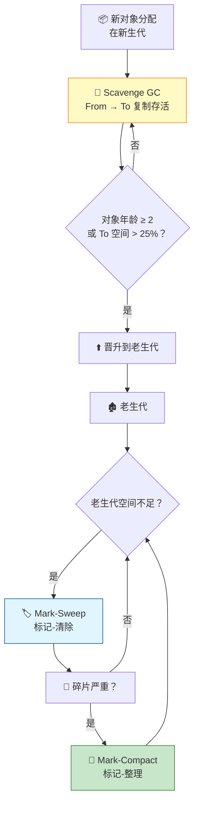
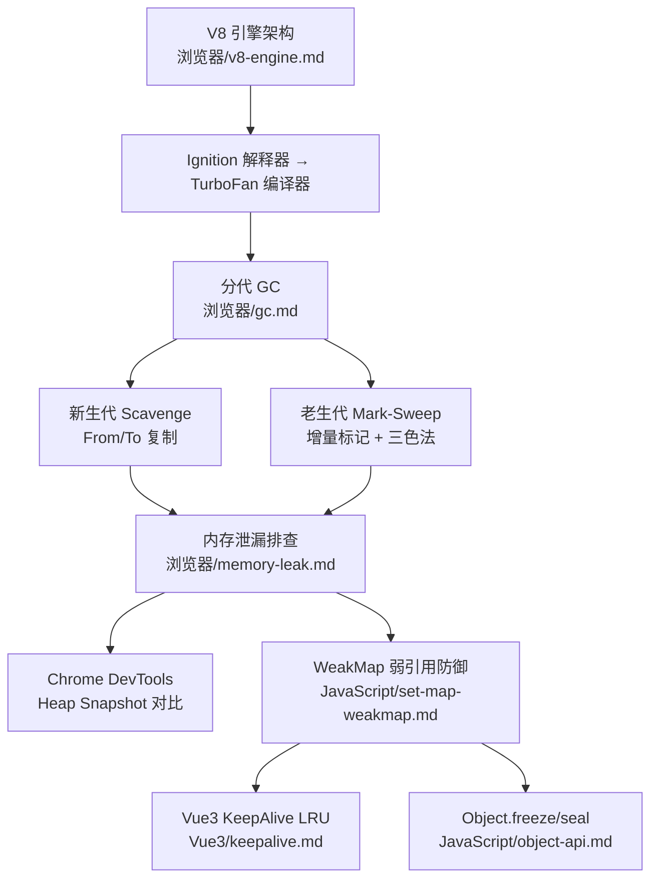

# 垃圾回收

> "你的页面用了 500MB 内存，用户手机直接杀进程了——你能找出是哪段代码在泄漏吗？"垃圾回收的知识，面试里考原理，项目里用工具，缺一不可。

## 一句话总结

**V8 使用分代垃圾回收策略：新生代采用 Scavenge 算法（空间换时间，From 空间 → To 空间复制存活对象），老生代采用 Mark-Sweep（标记-清除）和 Mark-Compact（标记-整理）算法，并通过增量标记和惰性清除减少 Full GC 的停顿时间。三色标记法贯穿整个过程，WeakMap/WeakSet 的弱引用不阻止 GC。**

---

## 核心机制

### 分代回收：为什么新生代和老生代用不同的算法

V8 将堆内存分为两代，基于一个关键假设：**大多数对象"朝生夕死"**——创建后很快就不再需要。两代使用不同的回收策略：

#### 新生代（Young Generation / New Space）

新生代存放生命周期短的小对象。使用 **Scavenge 算法**（一种复制算法）：

```
   From 空间                To 空间
┌─────────────┐        ┌─────────────┐
│ 存活 ✓ → 复制 │ ────→ │ 存活 ✓      │
│ 死对象 ✗     │        │ 空闲        │
│ 存活 ✓ → 复制 │        │ 空闲        │
│ 死对象 ✗     │        │ 空闲        │
└─────────────┘        └─────────────┘

   GC 完成后角色互换：From ↔ To
```

1. 新生代内存分为两个等大的半空间（semi-space）：**From 空间**（当前使用）和 **To 空间**（空闲）。
2. GC 时，从根对象（Root）出发，**把所有存活对象复制到 To 空间**。死对象直接丢弃。
3. 复制完成后，**From 和 To 角色互换**——原来的 To 变成新的 From，原来的 From 被整体清空作为新的 To。
4. 每经历一次 Scavenge 存活下来的对象，其"年龄"+1。当对象的年龄超过阈值（通常是 2 次 GC），或者复制到 To 空间时 To 空间使用率超过 25%，该对象会被**晋升（Promote）到老生代**。

**Scavenge 的特点**：速度极快（只需要复制存活对象，时间复杂度与存活对象数量成正比），但**浪费一半空间**（To 空间始终空闲）。所以新生代空间通常很小（Chrome 默认为 1-8MB）。

#### 老生代（Old Generation / Old Space）

老生代存放生命周期长的大对象。使用**两种算法组合**：

**Mark-Sweep（标记-清除）**：
1. **标记阶段**：从根对象出发，遍历所有可达对象，打上标记。
2. **清除阶段**：遍历整个堆，回收未被标记的对象占用的内存。
3. 缺点：清除后内存碎片化——空闲空间不连续，大对象可能分配失败。

**Mark-Compact（标记-整理）**：
1. 标记阶段和 Mark-Sweep 相同。
2. **整理阶段**：将所有存活对象移动到内存的一端，另一端变成连续的可用空间。
3. 解决了内存碎片问题，但整理过程需要移动对象并更新引用，**开销更大**。
4. V8 通常在空间碎片严重时才触发 Mark-Compact。



### 三色标记法

V8 的标记阶段使用**三色标记法**来追踪对象的访问状态：

| 颜色 | 含义 | 状态 |
|------|------|------|
| **白色** | 未被访问到 | 可能是垃圾（标记结束后仍为白色 = 不可达 = 回收） |
| **灰色** | 已访问，但其子节点（引用字段）尚未全部访问 | 标记队列中等待处理 |
| **黑色** | 已访问，且所有子节点也已访问完毕 | 确认存活 |

标记过程：
1. 初始状态：所有节点都是白色。
2. 从根节点开始，将其标记为灰色。
3. 逐个处理灰色节点：将其子节点标记为灰色，然后将自身变为黑色。
4. 重复步骤 3，直到没有灰色节点。
5. 此时所有白色节点都是不可达的垃圾，可以安全回收。

**三色标记的核心价值**：支持**增量标记**——在标记过程中 JS 可以继续执行（灰色节点表示"正在处理中"）。JS 执行过程中如果修改了引用关系（比如给黑色节点新增了一个白色子节点），需要通过**写屏障（Write Barrier）**把那个白色节点重新标记为灰色，防止被错误回收。

### 增量标记（Incremental Marking）

老生代的对象空间可能是几百 MB，完整的 Mark-Sweep 需要遍历所有对象——如果一次性完成，主线程会长时间阻塞（GC 停顿），用户感知到页面卡顿。

**增量标记**把标记拆成多个小步骤，每步耗时 5-10ms，穿插在 JS 执行和渲染帧之间：

```
帧1: [JS] [增量标记1/5] [渲染]
帧2: [JS] [增量标记2/5] [渲染]
帧3: [JS] [增量标记3/5] [渲染]
帧4: [JS] [增量标记4/5] [渲染]
帧5: [JS] [增量标记5/5] [渲染]
```

最终清除阶段也可以**惰性清除**（Lazy Sweeping）：按需一块一块地清理垃圾页面，而不是一下子清完。**配合写屏障和三色标记法，V8 将一次完整的 Full GC 的最大停顿从几百毫秒降到了几毫秒**。

---

## 深度拓展

### 追问1：哪些操作会触发 GC？

GC 的触发时机主要有以下几种：

1. **新生代空间不足**：新对象无法分配时触发 Scavenge（Minor GC）。
2. **老生代空间不足**：晋升的对象无法放入老生代时触发 Mark-Sweep（Major GC / Full GC）。
3. **增量标记由空闲任务触发**：浏览器在空闲时（requestIdleCallback 类似机制）主动推进增量标记。
4. **显式调用**：虽然 `window.gc()` 通常只暴露给 `--expose-gc` 的 Chrome，但开发者可以通过某些大对象置 null 间接促进回收。

### 追问2：WeakMap / WeakSet 的弱引用是什么意思？

`WeakMap` 的 key 只能是对象（ES2023 起也允许未注册的 Symbol），且 key 的引用是**弱引用**——这意味着：如果对该对象的其他引用都已消失，即使它还在 WeakMap 里作为 key，GC 也会回收它。

```javascript
let obj = { data: 'large' };
const wm = new WeakMap();
wm.set(obj, 'some metadata');

obj = null; // 唯一强引用消失
// GC 时，{ data: 'large' } 和它在 wm 中的 value 都会被回收
// WeakMap 中的这一条会自动消失
```

相比之下，`Map` 的 key 是强引用——只要 key 还在 Map 中，该对象就永远不会被 GC。

**适用场景**：给 DOM 节点或第三方对象附加元数据，当节点/对象本身被移除时，元数据自动清理。

**注意**：WeakMap 的 key 只能是对象，且**不可迭代**（没有 `size`、`keys()`、`forEach()`）——因为 GC 随时可能回收其中的条目，无法提供稳定快照。

### 追问3：常见的内存泄漏场景

| 场景 | 原因 | 修复 |
|------|------|------|
| **全局变量** | `window.foo = hugeArray` 永不回收 | 使用后置 null，或避免挂载到 window |
| **未清除的定时器** | `setInterval` 引用的回调中闭包捕获了大对象 | 组件销毁时 `clearInterval` |
| **游离 DOM 节点** | JS 变量持有已从 DOM 树移除的节点的引用 | 置 null 或使用 WeakRef |
| **闭包引用** | 闭包中无意引用了外部不需要的大变量 | 闭包只捕获必需变量，或手动断开引用 |
| **事件监听未解绑** | `addEventListener` 未配对的 `removeEventListener` | 使用 `{ once: true }` 或在销毁时解绑 |
| **Map 强引用** | 用 Map 做对象 → 数据的映射，对象已无用时 Map 阻止 GC | 改用 WeakMap |
| **console.log** | 开发模式下打印大对象，浏览器保留引用以便 DevTools 查看 | 生产环境移除 `console.log` |

### 追问4：如何用 Chrome DevTools 排查内存泄漏？

1. **Performance 面板**：录制一段时间，观察 JS Heap 曲线——如果呈"锯齿"状（升上去又降下来），说明 GC 正常工作；如果**持续上升不降**，说明有内存泄漏。
2. **Memory 面板 → Heap Snapshot**：在泄漏前后各拍一张快照，对比两次快照的 Delta，按 Shallow Size / Retained Size 排序——泄漏的对象会出现在增量里。
3. **Memory 面板 → Allocation instrumentation on timeline**：实时记录对象分配，可以看到哪个函数在持续分配新对象（而旧对象没有释放）。
4. **Memory 面板 → Allocation sampling**：低开销地采样记录分配栈，适合在已经怀疑某个操作导致泄漏时验证。

---

## 项目实战

### 1. Vue3 组件卸载时清理副作用

```typescript
// composables/usePolling.ts
export function usePolling(fn: () => void, interval: number) {
  let timer: ReturnType<typeof setInterval> | null = null;

  onMounted(() => {
    timer = setInterval(fn, interval);
  });

  onUnmounted(() => {
    if (timer) {
      clearInterval(timer);     // 防止 timer 持有组件闭包导致泄漏
      timer = null;
    }
  });
}
```

### 2. 事件监听器的自动清理

```typescript
// Vue3 推荐：使用 { once: true } 或 onUnmounted 解绑
const handleResize = () => { /* ... */ };

onMounted(() => {
  window.addEventListener('resize', handleResize);
});

onUnmounted(() => {
  window.removeEventListener('resize', handleResize); // 必须解绑
});
```

### 3. 避免闭包无意捕获大对象

```javascript
// 反例：闭包捕获了整个 hugeData
function createHandler(hugeData) {
  return () => {
    console.log(hugeData.summary);   // 只用了 summary，但引用了整个 hugeData
  };
}

// 正例：只捕获需要的部分
function createHandler(hugeData) {
  const { summary } = hugeData;   // 提取需要的字段
  return () => {
    console.log(summary);         // 闭包只捕获 summary
  };
}
```

---

## 易错点

- **"把变量设为 `null` 就能立即释放内存"**：不能。`obj = null` 只是解除了对这个对象的引用，**内存的实际释放要等下一次 GC**。而且如果存在其他变量也引用同一个对象，GC 不会回收它。
- **"WeakMap 可以用来存任意键值对"**：不能。WeakMap 的 key **必须是对象**（ES2023 起也允许未注册的 Symbol），且不可迭代。它的设计初衷是为对象附加元数据，而不是做普通的键值存储。
- **"GC 只回收不再使用的变量"**：不准确。GC 回收的是**不可达（unreachable）**的对象——从根对象（全局对象、执行栈上的局部变量）出发，无法通过任何引用链到达的对象。一个对象即使"不再使用"，只要还有引用指向它，就不会被回收。
- **"JavaScript 不需要关心内存管理"**：在浏览器环境下确实大部分时候不需要手动管理，但当页面涉及大量 DOM 节点、大数组、大量闭包或 WebSocket 长连接时，疏忽的引用很容易导致内存泄漏。Chrome DevTools 的 Memory 面板是最实用的排查工具。
- **"新生代 GC 和老生代 GC 是完全独立的"**：不是。新生代 Scavenge 中存活两轮的对象会被**晋升**到老生代，两代之间有联动。晋升率过高会导致老生代快速膨胀，触发更耗时的 Major GC。

---

## 面试信号表

| 面试官问 | 下一问大概率是 |
|----------|-------------|
| "V8 的 GC 机制是怎样的" | 追问新生代 Scavenge 为什么快、老生代为什么用 Mark-Sweep |
| "增量标记解决了什么问题" | 追问三色标记法的白灰黑状态转换 |
| "引用计数和标记清除的区别" | 追问循环引用为什么引用计数解决不了 |
| "WeakMap 和 GC 有什么关系" | 追问弱引用不阻止 GC 的底层原理 |

## 相关阅读

- [MDN: Memory Management](https://developer.mozilla.org/en-US/docs/Web/JavaScript/Memory_Management)
- [V8 Blog: Trash talk — the Orinoco garbage collector](https://v8.dev/blog/trash-talk)
- [V8 Blog: Concurrent marking in V8](https://v8.dev/blog/concurrent-marking)
- [Chrome DevTools: Fix memory problems](https://developer.chrome.com/docs/devtools/memory-problems/)
- [render-process](./render-process.md) —— GC 停顿如何影响渲染帧
- [性能优化](../性能优化/) —— 前端内存优化的完整方案

---

## 跨模块连线——GC 与内存管理全景



> **面试怎么用**：V8 架构 → 分代 GC → 泄漏排查 → 弱引用防御 → 框架应用。GC 不是孤立的底层知识——它直接决定了你怎么写不泄漏的 Vue 组件。

参见：[V8 引擎](./v8-engine.md) · [内存泄漏](./memory-leak.md) · [WeakMap](../JavaScript/set-map-weakmap.md) · [Object API](../JavaScript/object-api.md) · [KeepAlive](../Vue3/keepalive.md)

---

## 更新记录

- 2026-07-06：完成完整内容，补充分代回收 Mermaid 图、三色标记法详解、内存泄漏场景表和 DevTools 排查方法
