# 浏览器 知识地图

```mermaid
mindmap
  root((浏览器))
    渲染流程
      DOM树
      CSSOM
      布局
      绘制
      合成
    重绘回流
    缓存
      强缓存
      协商缓存
    Web Storage
      Cookie
      LocalStorage
      SessionStorage
      IndexedDB
    Web Worker
```

## 推荐学习顺序

1. ⭐⭐⭐⭐⭐ [渲染流程](./render-process.md)
2. ⭐⭐⭐⭐⭐ [重绘 / 回流](./reflow-repaint.md)
3. ⭐⭐⭐⭐   [浏览器缓存](./cache.md)
4. ⭐⭐⭐⭐   [Web Storage](./storage.md)
5. ⭐⭐⭐     [Web Worker](./web-worker.md)

## 知识点索引

| 知识点 | 频率 | 难度 | 手写 | 状态 |
|--------|------|------|------|------|
| [渲染流程](./render-process.md) | ⭐⭐⭐⭐⭐ | 高级 | — | draft |
| [重绘 / 回流](./reflow-repaint.md) | ⭐⭐⭐⭐⭐ | 中级 | — | draft |
| [浏览器缓存](./cache.md) | ⭐⭐⭐⭐ | 中级 | — | draft |
| [Web Storage](./storage.md) | ⭐⭐⭐⭐ | 初级 | — | draft |
| [Web Worker](./web-worker.md) | ⭐⭐⭐ | 中级 | — | draft |
