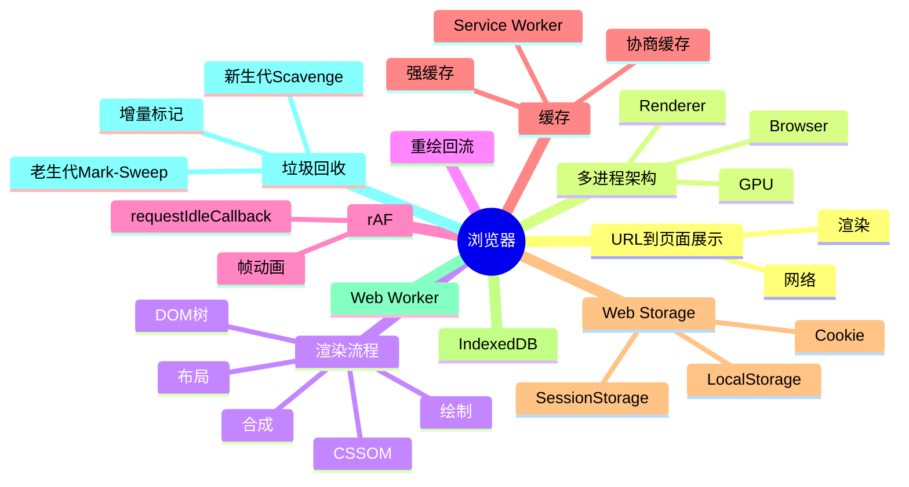

# 浏览器 知识地图

## 推荐学习顺序

1. ⭐⭐⭐⭐⭐ [输入 URL 到页面展示](./url-to-page.md)
2. ⭐⭐⭐⭐⭐ [渲染流程](./render-process.md)
3. ⭐⭐⭐⭐⭐ [重绘 / 回流](./reflow-repaint.md)
4. ⭐⭐⭐⭐   [浏览器多进程架构](./browser-architecture.md)
5. ⭐⭐⭐⭐   [浏览器缓存](./cache.md)
6. ⭐⭐⭐⭐   [requestAnimationFrame](./request-animation-frame.md)
7. ⭐⭐⭐⭐   [Service Worker](./service-worker.md)
8. ⭐⭐⭐⭐   [垃圾回收](./gc.md)
9. ⭐⭐⭐⭐   [Web Storage](./storage.md)
10. ⭐⭐⭐     [IndexedDB](./indexeddb.md)
11. ⭐⭐⭐     [Web Worker](./web-worker.md)

## 知识点索引

| 知识点 | 频率 | 难度 | 手写 | 状态 |
|--------|------|------|------|------|
| [输入 URL 到页面展示](./url-to-page.md) | ⭐⭐⭐⭐⭐ | 高级 | — | filled |
| [渲染流程](./render-process.md) | ⭐⭐⭐⭐⭐ | 高级 | — | draft |
| [重绘 / 回流](./reflow-repaint.md) | ⭐⭐⭐⭐⭐ | 中级 | — | draft |
| [浏览器多进程架构](./browser-architecture.md) | ⭐⭐⭐⭐ | 中级 | — | filled |
| [浏览器缓存](./cache.md) | ⭐⭐⭐⭐ | 中级 | — | draft |
| [requestAnimationFrame](./request-animation-frame.md) | ⭐⭐⭐⭐ | 中级 | — | filled |
| [Service Worker](./service-worker.md) | ⭐⭐⭐⭐ | 高级 | — | filled |
| [垃圾回收](./gc.md) | ⭐⭐⭐⭐ | 高级 | — | filled |
| [Web Storage](./storage.md) | ⭐⭐⭐⭐ | 初级 | — | draft |
| [IndexedDB](./indexeddb.md) | ⭐⭐⭐ | 中级 | — | filled |
| [Web Worker](./web-worker.md) | ⭐⭐⭐ | 中级 | — | draft |
