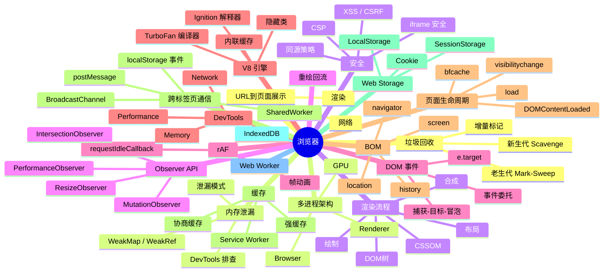

# 浏览器 知识地图

## 推荐学习顺序

### 一、必读（面试极高频，必须掌握）

1. ⭐⭐⭐⭐⭐ [输入 URL 到页面展示](./url-to-page.md)
2. ⭐⭐⭐⭐⭐ [渲染流程](./render-process.md)
3. ⭐⭐⭐⭐⭐ [重绘 / 回流](./reflow-repaint.md)
4. ⭐⭐⭐⭐⭐ [同源策略](./same-origin-policy.md)
5. ⭐⭐⭐⭐⭐ [Web 安全](./安全/index.md)（含 XSS / CSRF / CSP / Clickjacking / HTTPS / Token存储 / 依赖安全 7 篇）
6. ⭐⭐⭐⭐⭐ [Cookie 深度解析](./cookie.md)
7. ⭐⭐⭐⭐⭐ [浏览器缓存](./cache.md)

### 二、重点（面试高频，理解机制）

8. ⭐⭐⭐⭐ [V8 引擎 / JIT 编译](./v8-engine.md)
9. ⭐⭐⭐⭐ [垃圾回收 GC](./gc.md)
10. ⭐⭐⭐⭐ [内存泄漏排查](./memory-leak.md)
11. ⭐⭐⭐⭐ [DOM 事件机制 / 事件委托](./dom-event-delegation.md)
12. ⭐⭐⭐⭐ [Service Worker](./service-worker.md)
13. ⭐⭐⭐⭐ [浏览器多进程架构](./browser-architecture.md)
14. ⭐⭐⭐⭐ [页面生命周期](./page-lifecycle.md)
15. ⭐⭐⭐⭐ [requestAnimationFrame](./request-animation-frame.md)
16. ⭐⭐⭐⭐ [Performance API](./performance-api.md)
17. ⭐⭐⭐⭐ [Web Storage](./storage.md)

### 三、了解（低频，知道概念即可）

18. ⭐⭐⭐ [Observer API](./observer-api.md)
19. ⭐⭐⭐ [BOM 全景](./bom.md)
20. ⭐⭐⭐ [浏览器 DevTools](./devtools.md)
21. ⭐⭐⭐ [Web Worker](./web-worker.md)
22. ⭐⭐⭐ [IndexedDB](./indexeddb.md)
23. ⭐⭐⭐ [跨标签页通信](./cross-tab-communication.md)

## 知识点索引

| 知识点 | 频率 | 难度 | 状态 |
|--------|------|------|------|
| [输入 URL 到页面展示](./url-to-page.md) | &#11088;&#11088;&#11088;&#11088;&#11088; | 高级 | filled |
| [浏览器多进程架构](./browser-architecture.md) | &#11088;&#11088;&#11088;&#11088; | 中级 | filled |
| [渲染流程](./render-process.md) | &#11088;&#11088;&#11088;&#11088;&#11088; | 高级 | draft |
| [重绘 / 回流](./reflow-repaint.md) | &#11088;&#11088;&#11088;&#11088;&#11088; | 中级 | draft |
| [浏览器缓存](./cache.md) | &#11088;&#11088;&#11088;&#11088; | 中级 | draft |
| [同源策略](./same-origin-policy.md) | &#11088;&#11088;&#11088;&#11088;&#11088; | 中级 | drafted |
| [Cookie 深度解析](./cookie.md) | &#11088;&#11088;&#11088;&#11088;&#11088; | 中级 | drafted |
| [Web Storage](./storage.md) | &#11088;&#11088;&#11088;&#11088; | 初级 | draft |
| [Web 安全](./安全/index.md) | &#11088;&#11088;&#11088;&#11088;&#11088; | 中级 | draft |
| [V8 引擎 / JIT 编译](./v8-engine.md) | &#11088;&#11088;&#11088;&#11088; | 高级 | drafted |
| [页面生命周期](./page-lifecycle.md) | &#11088;&#11088;&#11088;&#11088; | 中级 | drafted |
| [Observer API](./observer-api.md) | &#11088;&#11088;&#11088;&#11088; | 中级 | drafted |
| [DOM 事件机制 / 事件委托](./dom-event-delegation.md) | &#11088;&#11088;&#11088;&#11088; | 中级 | draft |
| [requestAnimationFrame](./request-animation-frame.md) | &#11088;&#11088;&#11088;&#11088; | 中级 | filled |
| [内存泄漏排查](./memory-leak.md) | &#11088;&#11088;&#11088;&#11088;&#11088; | 高级 | drafted |
| [垃圾回收 GC](./gc.md) | &#11088;&#11088;&#11088;&#11088; | 高级 | filled |
| [Service Worker](./service-worker.md) | &#11088;&#11088;&#11088;&#11088; | 高级 | filled |
| [浏览器 DevTools](./devtools.md) | &#11088;&#11088;&#11088; | 中级 | drafted |
| [BOM 全景](./bom.md) | &#11088;&#11088;&#11088; | 初级 | drafted |
| [Web Worker](./web-worker.md) | &#11088;&#11088;&#11088; | 中级 | draft |
| [IndexedDB](./indexeddb.md) | ⭐⭐⭐ | 中级 | filled |
| [跨标签页通信](./cross-tab-communication.md) | ⭐⭐⭐ | 中级 | draft |
