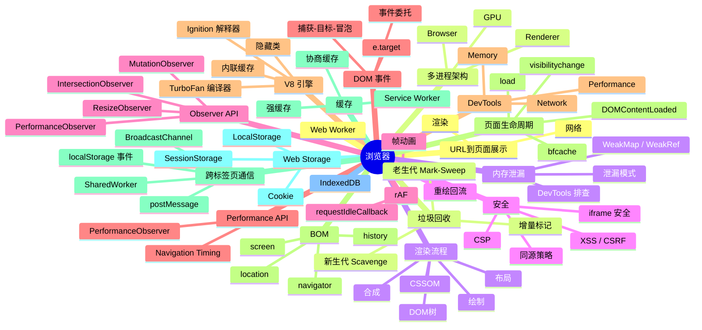

# 浏览器 知识地图

## 推荐学习顺序

### 一、页面加载与渲染（从整体到细节）

1. ⭐⭐⭐⭐⭐ [浏览器多进程架构](./browser-architecture.md) — 先理解浏览器怎么组织
2. ⭐⭐⭐⭐⭐ [输入 URL 到页面展示](./url-to-page.md) — 全景串联
3. ⭐⭐⭐⭐⭐ [渲染流程](./render-process.md) — DOM/CSSOM/Layout/Paint/Composite
4. ⭐⭐⭐⭐⭐ [重绘 / 回流](./reflow-repaint.md) — 渲染的更深一层
5. ⭐⭐⭐⭐ [浏览器缓存](./cache.md) — 加载中的缓存机制
6. ⭐⭐⭐⭐ [页面生命周期](./page-lifecycle.md) — 页面从打开到卸载
7. ⭐⭐⭐⭐ [requestAnimationFrame](./request-animation-frame.md) — 渲染循环中的钩子
8. ⭐⭐⭐⭐ [Performance API](./performance-api.md) — 测量工具

### 二、安全与存储（依赖页面加载基础）

9. ⭐⭐⭐⭐⭐ [同源策略](./same-origin-policy.md) — 安全体系的基石
10. ⭐⭐⭐⭐⭐ [Cookie 深度解析](./cookie.md) — 认证与存储的核心
11. ⭐⭐⭐⭐ [Web Storage](./storage.md) — Cookie 的补充
12. ⭐⭐⭐⭐⭐ [Web 安全](./安全/index.md) — 综合安全体系
13. ⭐⭐⭐⭐ [DOM 事件机制 / 事件委托](./dom-event-delegation.md)
14. ⭐⭐⭐ [跨标签页通信](./cross-tab-communication.md)

### 三、引擎与性能（依赖渲染基础）

15. ⭐⭐⭐⭐ [V8 引擎 / JIT 编译](./v8-engine.md) — JS 怎么跑起来的
16. ⭐⭐⭐⭐ [垃圾回收 GC](./gc.md) — 内存管理
17. ⭐⭐⭐⭐ [内存泄漏排查](./memory-leak.md) — GC 的实践应用
18. ⭐⭐⭐⭐ [Service Worker](./service-worker.md) — 离线与缓存进阶

### 四、工具与扩展（前面模块的补充）

19. ⭐⭐⭐ [浏览器 DevTools](./devtools.md)
20. ⭐⭐⭐ [Observer API](./observer-api.md)
21. ⭐⭐⭐ [BOM 全景](./bom.md)
22. ⭐⭐⭐ [Web Worker](./web-worker.md)
23. ⭐⭐⭐ [IndexedDB](./indexeddb.md)

## 知识点索引

| 知识点 | 频率 | 难度 | 状态 |
|--------|------|------|------|
| [输入 URL 到页面展示](./url-to-page.md) | ⭐⭐⭐⭐⭐ | 高级 | reviewed |
| [浏览器多进程架构](./browser-architecture.md) | ⭐⭐⭐⭐ | 中级 | reviewed |
| [渲染流程](./render-process.md) | ⭐⭐⭐⭐⭐ | 高级 | reviewed |
| [重绘 / 回流](./reflow-repaint.md) | ⭐⭐⭐⭐⭐ | 中级 | reviewed |
| [浏览器缓存](./cache.md) | ⭐⭐⭐⭐ | 中级 | reviewed |
| [同源策略](./same-origin-policy.md) | ⭐⭐⭐⭐⭐ | 中级 | reviewed |
| [Cookie 深度解析](./cookie.md) | ⭐⭐⭐⭐⭐ | 中级 | reviewed |
| [Web Storage](./storage.md) | ⭐⭐⭐⭐ | 初级 | reviewed |
| [Web 安全](./安全/index.md) | ⭐⭐⭐⭐⭐ | 中级 | filled |
| [V8 引擎 / JIT 编译](./v8-engine.md) | ⭐⭐⭐⭐ | 高级 | reviewed |
| [页面生命周期](./page-lifecycle.md) | ⭐⭐⭐⭐ | 中级 | reviewed |
| [Observer API](./observer-api.md) | ⭐⭐⭐⭐ | 中级 | reviewed |
| [DOM 事件机制 / 事件委托](./dom-event-delegation.md) | ⭐⭐⭐⭐ | 中级 | reviewed |
| [requestAnimationFrame](./request-animation-frame.md) | ⭐⭐⭐⭐ | 中级 | reviewed |
| [内存泄漏排查](./memory-leak.md) | ⭐⭐⭐⭐⭐ | 高级 | reviewed |
| [垃圾回收 GC](./gc.md) | ⭐⭐⭐⭐ | 高级 | reviewed |
| [Service Worker](./service-worker.md) | ⭐⭐⭐⭐ | 高级 | reviewed |
| [浏览器 DevTools](./devtools.md) | ⭐⭐⭐ | 中级 | reviewed |
| [BOM 全景](./bom.md) | ⭐⭐⭐ | 初级 | reviewed |
| [Performance API](./performance-api.md) | ⭐⭐⭐⭐ | 中高级 | filled |
| [Web Worker](./web-worker.md) | ⭐⭐⭐ | 中级 | reviewed |
| [IndexedDB](./indexeddb.md) | ⭐⭐⭐ | 中级 | reviewed |
| [跨标签页通信](./cross-tab-communication.md) | ⭐⭐⭐ | 中级 | filled |
