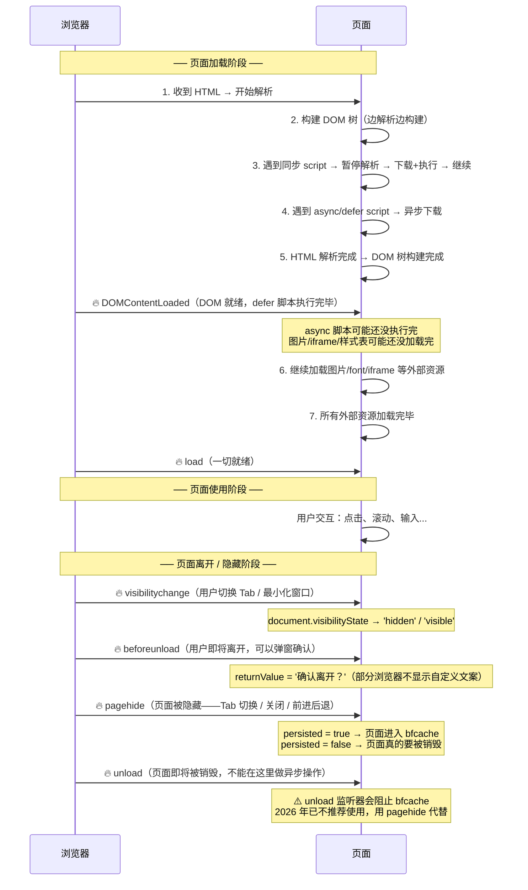

# 页面生命周期

> &#11088;&#11088;&#11088;&#11088;｜难度：中级｜项目：&#9733;&#9733;&#9733;&#9733;

## 一句话总结

**页面从"输入 URL"到"可以交互"经历了 DOMContentLoaded → load 两个关键节点；从"可以交互"到"用户离开"有 beforeunload/visibilitychange/pagehide 等过渡事件。不理解这些事件的触发时序，就无法正确初始化三方 SDK、上报数据、管理资源。**

## 核心机制

### 一张时序图说清所有事件



### 关键事件的精确含义

```javascript
// 1. DOMContentLoaded —— DOM 构建完成
document.addEventListener('DOMContentLoaded', () => {
  // HTML 已完全解析、DOM 树已构建
  // defer 脚本已按顺序执行完毕
  // async 脚本可能还没执行完！
  // 图片/样式表/iframe 可能还没加载完
  // 适用：操作 DOM、初始化组件、绑定事件
  // 不适用：获取图片尺寸（图片可能还没加载）
})

// 2. load —— 一切就绪
window.addEventListener('load', () => {
  // 所有资源（图片/样式/字体/iframe）加载完毕
  // 适用：获取图片真实尺寸、关闭 loading 动画
})

// 3. visibilitychange —— Tab 可见性变化
document.addEventListener('visibilitychange', () => {
  if (document.visibilityState === 'hidden') {
    // 用户切走了 → 暂停动画、暂停轮询、降低 WebSocket 频率
    pauseAnimations()
    slowDownPolling()
  } else {
    // 用户切回来了 → 恢复动画、恢复轮询、重新连接拉数据
    resumeAnimations()
    speedUpPolling()
  }
})

// 4. pagehide —— 页面被隐藏（推荐替代 beforeunload/unload）
window.addEventListener('pagehide', (event) => {
  // event.persisted = true → 页面进入 bfcache（用户点了前进/后退）
  // event.persisted = false → 页面真的要销毁了
  // 适用：保存表单草稿、上报页面离开事件
  // ✅ pagehide 不会阻止 bfcache（不像 unload 会阻止）
})

// 5. beforeunload —— 确认是否离开（慎用）
window.addEventListener('beforeunload', (event) => {
  // 适用场景：用户有未保存的编辑内容
  if (hasUnsavedChanges) {
    event.preventDefault()
    event.returnValue = ''  // Chrome 需要这行才弹确认框
  }
  // ⚠️ 不能在这里做异步请求（fetch 会被取消）
  // 浏览器会在用户确认后立即销毁页面，不给等待时间
})
```

### bfcache（Back-Forward Cache）—— 火狐/Safari/Chrome 的"页面暂停"机制

```
bfcache 的工作原理：
  用户点击链接离开页面 A → 浏览器把页面 A "冻结"（暂停 JS、冻结 DOM）
  → 用户点击后退按钮 → 浏览器从内存中恢复页面 A（恢复 JS 执行、恢复滚动位置）
  → 整个过程不重新加载页面、不走网络请求、不重新解析 HTML
  → 页面恢复时间 < 100ms（vs 完整加载可能需要几秒！）

bfcache 的好处：
  ✅ 回退/前进几乎即时
  ✅ 恢复滚动位置、表单填写内容、JS 状态
  ✅ 节省带宽（不发网络请求）

什么会阻止 bfcache：
  ❌ 监听了 unload 事件（永远不要用 unload，用 pagehide 代替）
  ❌ 有 beforeunload 监听器（系统弹窗无法冻结）
  ❌ 页面有 IndexedDB 事务未完成
  ❌ 页面使用了 window.opener 引用
  ❌ Cache-Control: no-store

检测是否命中了 bfcache：
  window.addEventListener('pageshow', (event) => {
    if (event.persisted) {
      console.log('从 bfcache 恢复！无需重新初始化')
      // ⚠️ 不要重复创建已存在的 DOM/定时器
    } else {
      console.log('全新加载，需要初始化')
    }
  })
```

## 深度拓展

### 实际项目的生命周期管理

```javascript
// 企业级后台管理系统的生命周期管理器
class AppLifecycle {
  constructor() {
    this._handlers = new Map()
    this._init()
  }

  _init() {
    // 页面加载
    document.addEventListener('DOMContentLoaded', () => this._run('ready'))

    // Tab 可见性变化
    document.addEventListener('visibilitychange', () => {
      const state = document.visibilityState  // 'visible' | 'hidden'
      this._run(state)
    })

    // 页面即将被隐藏（Tab 切换 或 页面离开）
    window.addEventListener('pagehide', (e) => {
      this._run(e.persisted ? 'frozen' : 'terminated')
    })
  }

  on(event, handler) {
    if (!this._handlers.has(event)) this._handlers.set(event, [])
    this._handlers.get(event).push(handler)
  }

  _run(event) {
    (this._handlers.get(event) || []).forEach(fn => fn())
  }
}

// 使用
const lifecycle = new AppLifecycle()

lifecycle.on('hidden', () => {
  stopPolling()        // 暂停轮询
  pauseVideo()         // 暂停视频
  throttleWebSocket()  // 降低 WS 频率
})

lifecycle.on('visible', () => {
  startPolling()       // 恢复轮询
  refreshData()        // 刷新数据
})

lifecycle.on('terminated', () => {
  navigator.sendBeacon('/api/analytics', JSON.stringify({
    event: 'page_leave',
    duration: Date.now() - pageStartTime,
  }))
})
```

## 项目实战

### 后台管理系统中的生命周期应用

1. **实时数据大屏**：Tab 切走后（`visibilitychange: hidden`）降低轮询频率从 3s → 30s；切回来立刻刷新
2. **未保存表单提示**：`beforeunload` 检测表单 `dirty` 状态，阻止意外离开
3. **页面停留时长上报**：`pagehide` 中用 `navigator.sendBeacon` 上报（比 fetch 更可靠——`sendBeacon` 在页面卸载后仍能完成）
4. **WebSocket 重连**：从 bfcache 恢复时（`pageshow.persisted`），重新建立可能已断开的 WebSocket 连接

## 易错点

1. **`DOMContentLoaded` 不是"页面渲染完成"** —— 它只表示 DOM 构建完成。图片、CSS 可能还没加载完。初学者常在这里获取图片宽高（结果是 0）
2. **`unload` 中不能用 `fetch`** —— 浏览器在 unload 阶段会直接取消 fetch 请求。正确做法是用 `pagehide` + `sendBeacon`
3. **`beforeunload` 不能做异步操作** —— `event.preventDefault()` 弹出确认框是同步行为，不能用 `await`、不能发 `fetch`
4. **bfcache 恢复时不会重新触发 `DOMContentLoaded` 和 `load`** —— 如果初始化逻辑只绑定在这两个事件上，bfcache 恢复的页面不会执行初始化 → 页面状态不正确
5. **`unload` 监听会阻止 bfcache** —— 没有任何理由使用 `unload`，全部改用 `pagehide`

## 面试信号表

| 面试官问 | 下一问大概率是 |
|----------|-------------|
| "DOMContentLoaded 和 load 有什么区别" | 追问 defer 脚本在哪个事件之前执行完 |
| "页面切到后台怎么暂停轮询" | 追问 visibilitychange 和 pagehide 的选择 |
| "你怎么确保离开页面的数据上报不丢失" | 追问 sendBeacon 和 fetch keepalive 的区别 |
| "from bfcache 时怎么恢复状态" | 追问 pageshow.persisted 和哪些行为会阻止 bfcache |

## 相关阅读

- [渲染流程](./render-process.md)
- [浏览器 DevTools](./devtools.md)
- [Web Storage](./storage.md)

## 更新记录

- 2026-07-10：新建（页面生命周期时序 + bfcache 机制 + visibilitychange/pagehide/beforeunload 详解 + 生命周期管理器实战）
